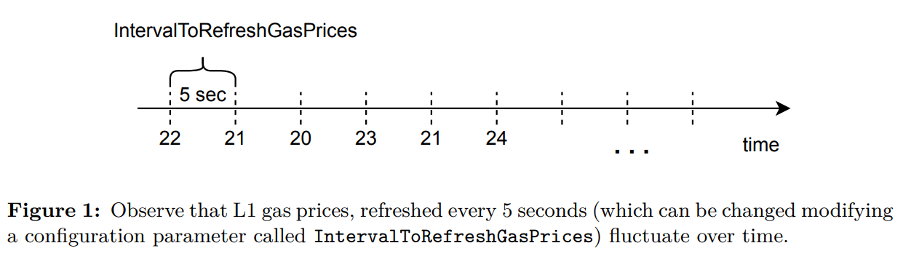
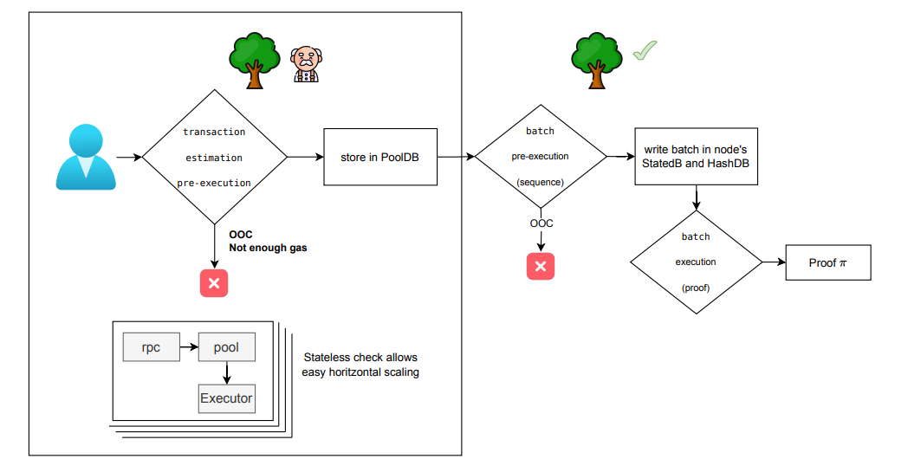
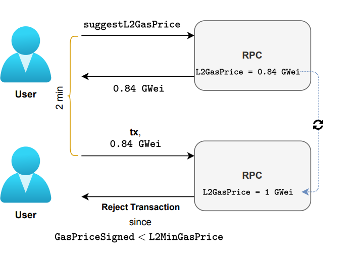
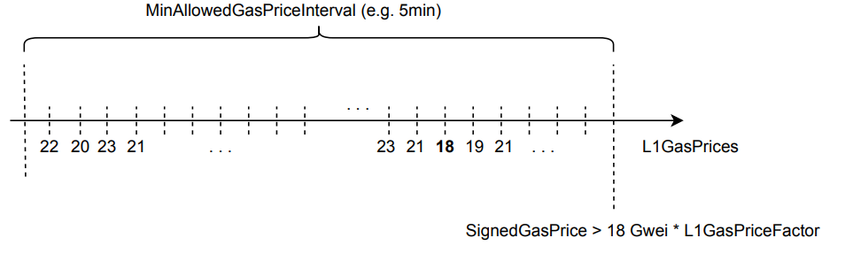
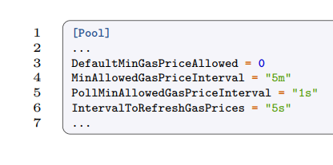

In general, Layer 2 solutions adopt a fee strategy wherein the L2 gas price is a percentage
of the L1 gas price. This approach aligns with the goal of making transactions less costly
for the user. Using this approach, we can define L2GasPrice as follows:

L2GasPrice = L1GasPrice · L1GasPriceFactor.

where L1GasPrice denotes the network variable indicating the minimum gas price required
to sign a transaction, and 0 < L1GasPriceFactor < 1 defines the reduction factor. For
example, let us suppose that Layer 1 is accepting transactions having a signed gas price
of 20 GWei, so L1GasPrice = 20 and that L2 gas price is reduced a 96%.

L1GasPrice = 20 GWei and L1GasPriceFactor = 0.04 (4% of L1 gasPrice)

therefore, L2GasPrice = 20 GWei · 0.04 = 0.8 GWei
You can check the current fees at https://l2fees.info. However, this is not as easy
as it may seem and there are additional aspects to consider:

a) The gas price on L1 is subject to fluctuations over time (See Figure 1). How does the
zkEVM transaction processing mechanism account for these variations?

b) As we have said before, when initiating a transaction on Layer 1, increasing the gas
price can serve to prioritize transactions. How does the Layer 2 solution effectively
manage these priorities?

c) The Gas schema on Layer 1 may not necessarily align with the actual resources expended by the Layer 2 solution. How does the L2 solution address and reconcile any
discrepancies between the L1 gas schema and the real resource utilization on L2?

In the following sections, we will thoroughly examine the significance of fees in Layer
2 and provide detailed answers to the previously mentioned questions.
We will now delve into the initial phase of the process (see Figure 2), which involves
the RPC component of zkEVM. This phase spans from the moment the user submits the
transaction, the price is estimated through a pre-execution of the transaction, to the final
decision of storing it in the Pool or rejecting it based on a set of conditions

## Gas Price Suggester

 has a limitation as there is a time gap between
asking for a suggested gas price and sending the transaction in which the gas price can
fluctuate. This fact leads the unwanted situation depicted in Figure 5:

The user asks for a suggested price, the current suggested gas price is of 20 GWei and
decides to sign 20 GWei, but when he sends the transaction the suggested gas price has increased
to 30 GWei and the transaction is rejected.
In Figure 5 we can observe that although the user has sent a gas price according to
the suggested price, after the time lapse between one step and the other, the price has
increased and the transaction is rejected.

## Solution 
The solution is to give a user some period of time in order to make the choice
and sending the transaction. More specifically, we give a margin of 5 minutes (controlled
by the MinAllowedGasPriceInterval parameter). The **MinL2GasPrice** is defined as the
minumum suggested gas price of 5 minutes before sending the transaction refreshed every
5 seconds (controlled by the IntervalToRefreshGasPrices parameter). If the signed gas
price does not strictly exceed MinL2GasPrice,

- GasPriceSigned > L2MinGasPrice,
- 
we automatically reject the transaction, since it will not be possible to cover costs. Figure
6 depicts an example on how MinL2GasPrice is computed, which in this precise case is
18 GWei.

----
This previous parameters can be configured in the Polygon zkEVM node configuration
files. More specifically, it can be configures in the [Pool] section of the configuration
TOML, which can be found here

## Final Approach
**Problematic** However, in the previous design, the zkEVM endpoint responsible for offering a gas price suggestion to the user, known as L2 Gas Price Suggester, faces a
significant problem design. The price of posting transactional data to L1 is charged to
the zkEVM network to the full L1 price. Therefore, if we propose a gas price using
L1GasPriceFactor, representing the measure of computational reduction in L2, there is
a risk of running out of Wei reserves for posting data to L1.

Solution In order to solve the previous situation, we will recommend a slightly higher
percentage of the gas price to the user, employing a **SuggesterFactor** of 0.15 ≈ 4 ·
L1GasPriceFactor:
GasPriceSuggested = L1GasPrice · SuggestedFactor

## Cost Discrepancies Challenges

As we have said before, in Ethereum, gas accounts for the resources used by a transaction.
In particular, it takes into account two elements in particular: the data availability,
that is, the transactions bytes and the processing resources, like CPU, Memory and
Storage. A notable challenge arises when certain operations consume low gas in Layer 1
but represent a major cost in Layer 2. In other words, the reduction factor expressed in

- L2GasPrice = L1GasPrice · L1GasPriceFactor

may not be constant among all the computational resources, introducing a problem.
L2 execution costs are variable, depending on the state of the transaction and typically
offer a smaller cost per gas. However, the costs associated with data availability are fixed
once the transaction is known, and they are directly proportional to L1 data availability
costs. Consequently, in our pricing schema, L2 transactions with high **data availability**
costs and small execution costs are a significant challenge. This presents another pricing
misalignment issue we need to face.
---
giving us two ways of solving the misalignment problem between costs in L1 and L2:

- (A) Arbitrum Approach. Increase gasUsed. This approach involves modifying
the gas schema to elevate the Gas costs associated with data availability. While this
strategy is relatively straightforward to implement and comprehend, it comes with
a notable implication: it changes the Ethereum protocol. An L1 Ethereum
transaction may execute different when compared to the same transaction executed
in L2.
- (B) Effective Gas Price Approach. Increase gasPrice. If we aim to avoid modifying the gas, the alternative is to increase the gas price to cover the costs. Unlike
the previous approach, this doesn’t alter the Ethereum specifications. However, determining a fair gas price becomes a complex task. Moreover, we have to take into
account that L2 users should be able to prioritize its transactions also increasing gas
price, as they are used to. This is actually our approach.

## Effective Gas Price Approach
