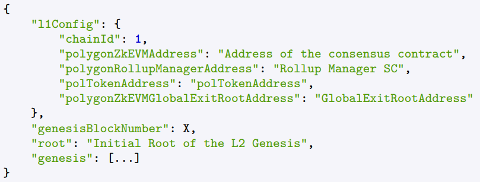

Node configuration for a **rollup/validium** network typically involves specifying various
parameters and addresses crucial for its operation. Figure 9 provides a detailed breakdown
of the parameters within the provided TOML configuration snippet

The chainId is the chain identifier of the base layer (Ethereum mainnet in this case).
The genesisBlockNumber is the L1 block number in which the rollup/validium is created.

