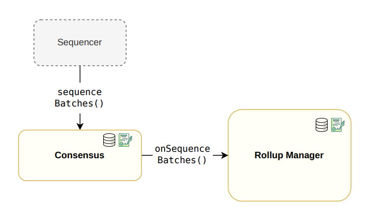

## Sequencing and Verifying Flow

## Sequencing Flow
First of all, the Sequencer invokes the **sequenceBatches**() function within the Consensus contract to send the batches to be sequenced. Additionally, because the state information must be stored within the **RollupManager** contract, a callback function called
**onSequenceBatches**() is triggered to store this data in the corresponding RollupData
struct. An illustration of the sequencing flow can be found in Figure 5.

## Verifying Flow
Once the **Aggregator** has constructed the corresponding proof to validate the processing of
a specific set of batches, it transmits the proof for verification to the RollupManager by invoking the verifyBatches() function. Then, the RollupManager invokes the veriftyProof()
function at the verifier’s contract. The previous function, either validates the proof or reverts if the proof is invalid. Upon successful verification of a proof, a callback function
called **onVerifyBatches**() is called in the Consensus contract. The previous function
emits the **VerifyBatches** event containing important details of the processed batch such
as the last verified batch. An illustration of the verifying flow can be found in Figure 6

## Updating a Rollup

This functionality provides upgradeability to the rollups. More specifically, a user with
correct rights can change the consensus implementation and the rollup type of a certain
rollup to modify its sequencing and/or verification procedures. In order to change the
consensus, the function **UpdateRollup**() needs to change the transparent proxy implementation. In the upgrading procedure the rollupCompatibilityID comes into play:
 in order to avoid errors, we can only upgrade to a rollup type having the same
compatibility identifier as the original one. If this is not the case, the transaction
is reverted rising the UpdateNotCompatible error.

## Adding Existing Rollups
Rollups that are already deployed and already working does not follow any rollup type
and are added to the RollupManager via the addExistingRollup function, specifying
its current address. Meanwhile the verifier implements the IVerifierRollup interface
we only request the raw consensus contract address, as it will not be used directly, but
through a proxy to allow upgradeability options. As we have said before, we can add
rollups that are deployed and already working to the RollupManager to allow unified
management. In this case, we must call the function addExistingRollup.
Since the rollup has been previously initialized, we should only provide the following
information:
- The consensus contract, implementing the IPolygonRollupBase interface.
- The verifier contract, implementing the IVerifierRollup interface.
- The forkID of the existent rollup.
- The chainID of the existent rollup.
- The genesis block of the rollup.
- The **rollupCompatibilityID**.
Observe that most of these parameters were actually provided by the RollupType, but
existent rollups RollupData is constructed by hand, since they do not follow any rollup
type.