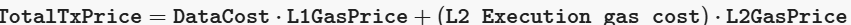

## Effective gas price
Here’s how you can accurately determine the gas price to sign your transactions with when submitting transactions to the Polygon zkEVM network.

Polygon zkEVM implements a mechanism called the Effective Gas Price (EGP) that guarantees fair gas fees in the interest of both the user and the network.

The actual amount spent for the transaction is given by:

* gasUsed⋅gasPrice

And thus, any refund to the user is simply:

* gasLimit⋅gasPrice−gasUsed⋅gasPrice

Transactions get reverted if the  gasUsed  is greater than the  gasLimit. Otherwise, the transaction is successful.

## Computing L2 gas fees

The L2 gas price cannot simply be set to be the same as the L1 gas price (especially in the case of rollups where the goal is to reduce gas fees).

Hence, we make the distinction between the two gas prices, and denote them as  L2GasPrice  and  L1GasPrice  respectively.

It is important to calculate the appropriate L2 gas price while ensuring that transactions are successfully executed.

Although the same formula is used, that is,

 - gasLimit⋅gasPrice

and success is guaranteed if  gasLimit  is greater than  gasUsed, the gas used is determined by the gas cost for **data availability** plus the gas cost for **transaction execution in L2**.

That is,

gasUsed=DataCost+(L2 Execution gas cost)

The total fees paid by the user is given by:

Note that data availability is charged in L1 using the **prevailing L1 gas price** at the time of posting data.

The main challenge is adjusting  L2GasPrice  in terms of the  L1GasPrice  to account for L2 resources spent when processing transactions.

The general strategy is to use an  L1GasPriceFactor  such that

- L2GasPrice=L1GasPrice⋅L1GasPriceFactor

### Example (L1 gas price factor)

For a transaction with an L1 gas price of 20 Gwei, the L2 gas price in the Polygon zkEVM network is calculated using a 4% factor as follows:

L2GasPrice = 20 Gwei⋅0.04=0.8 Gwei

Current L2 fees can be viewed here  [https://l2fees.info](https://l2fees.info/).

The  L1GasPriceFactor  is used in the Polygon zkEVM network and is set to  0.04​.

There are a few complications that need to be carefully considered.

There are 3 scenarios we aim to avoid when determining the  L2GasPrice  to sign transactions with:

-   Transactions getting rejected due to the  SignedGasPrice  being less than L2’s minimum expected gas price (L2MinGasPrice).
-   Incurring losses in the L2 network because of high transaction gas costs.
-   Transactions receiving the least priority for sequencing.
