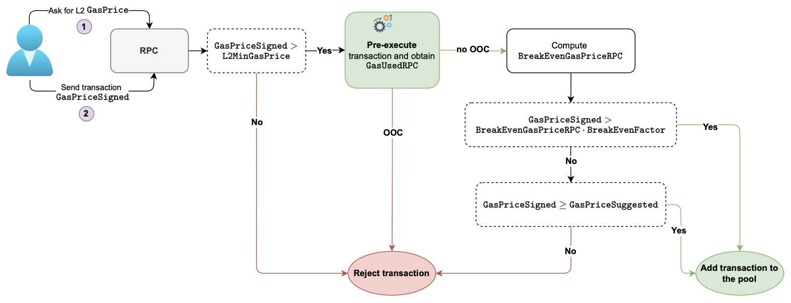
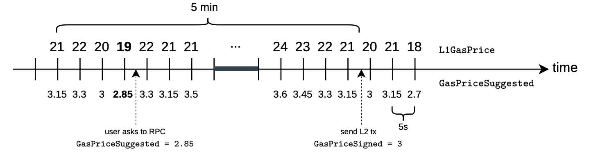

# RPC transaction flow

The RPC flow phase of transactions consists of two stages:

-   The gas price suggestion.
-   Pre-execution of transactions.

This flow ends with transactions being stored in a pool waiting to be executed by the sequencer.

## Gas price suggestion

The L2 network (the zkEVM) polls for L1 gas price values and uses them to:

-   Suggest L2 gas price to users as per user requests.
-   Sets the minimum acceptable L2 gas price, denoted by  L2MinGasPrice.

The user then signs transactions with the appropriate gas price, called  GasPriceSigned, based on the suggested L2 gas price,  GasPriceSuggested.

Transactions are accepted for pre-execution only if

GasPriceSigned>L2MinGasPrice

## Example (RPC tx flow)

Consider a scenario where a user sends a query for a suggested gas price during a 5-minute interval, as shown in the figure below.

Values of L1 gas prices, polled every 5 seconds, are displayed above the timeline, while the corresponding L2 gas prices are depicted below the timeline. See the figure below.

1.  Observe that, in the above timeline, the user sends a query at the time indicated by the dotted-arrow on the left. And that’s when  L1GasPrice  is  19.
    
    The RPC node responds with a  2.85 GWei/Gas, as the value of the suggested L2 gas price.
    
    This value is obtained as follows:
    
    GasPriceSuggested=0.15⋅19=2.85 GWei/Gas
    
    where  0.15  is the zkEVM’s suggested factor.
    
2.  Let’s suppose the user sends a transaction signed with a gas price of  3. That is,  SignedGasPrice=3.
    
    However, by the time the user sends the signed transaction, the L1 gas price is no longer  19  but  21. And its correponding suggested gas price is  3.15=21⋅0.15.
    
    Note that the minimum suggested L2 gas price, in the 5-min time interval, is  2.85. And since
    
    SignedGasPrice=3>2.85=L2MinGasPrice
    
    the transaction gets accepted for pre-execution.
    
3.  At this point, the RPC makes a request for pre-execution. That is, getting an estimation for the gas used, computed with a state root that differs from the one used when the transaction is sequenced.
    
    In this case, suppose an estimation of gas used is  GasUsedRPC=60,000, without an out of counters (OOC) error.
    
4.  Since there’s no out of counters (OOC) error, the next step is to compute the  BreakEvenGasPriceRPC.
    
    Suppose it works out to be:
    
    BreakEvenGasPriceRPC=2.52 GWei/Gas
    

    
5.  As noted in the outline of the RPC transaction flow, one more check needs to be done. That is, testing whether:
    
    SignedGasPrice>BreakEvenGasPriceRPC⋅BreakEvenFactor
    
    Using the  BreakEvenFactor=1.3  yields:
    
    BreakEvenGasPrice⋅BreakEvenFactor=2.52⋅1.3=3.276
    
    And since  SignedGasPrice=3<3.276, the transaction is not immediately stored in the transaction pool.
    
6.  However, since
    
    SignedGasPrice=3≥2.85=GasPriceSuggested
    
    and despite the risk of the network sponsoring the transaction, it is included in the transaction pool.