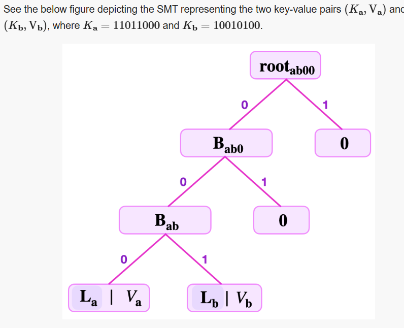

# Constructing simple SMTs

https://docs.polygon.technology/zkEVM/concepts/sparse-merkle-trees/simple-smt/

Understanding the finer details of how the Storage state machine operates requires a good grasp of the way the zkProver’s sparse Merkle trees (SMTs) are constructed. This document explains how these SMTs are built.

Consider key-value pair based binary SMTs. The focus here is on explaining how to construct an SMT that represents a given set of key-value pairs. And, for the sake of simplicity, we assume 8-bit key-lengths.

A NULL or empty SMT has a zero root. That is, it has no key and no value recorded in it. Similarly, a zero node or NULL node refers to a node that carries no value.

## Solution to the Fake-leaf attack

https://docs.polygon.technology/zkEVM/concepts/sparse-merkle-trees/detailed-smt/#scenario-fake-smt-leaf

https://docs.polygon.technology/zkEVM/concepts/sparse-merkle-trees/basic-smt-ops/#delete-leaves-with-zero-siblings

The operations discussed in this document are in fact the very actions the main state machine instructs the storage state machine to perform.

The **prover and the verifier**, as used in the above explanations, can loosely be interpreted as the executor of the **storage state machine** and the **storage SM’s PIL** code, respectively. The zero-knowledge Assembly (zkASM) of the storage state machine plays the facilitator’s role.

The zkASM is the **interpreter between** the storage state machine and the main state machine, also between the storage state machine and the Poseidon state machine. The two hash functions used in building the storage binary SMTs, are special versions of the Poseidon family of hash functions.