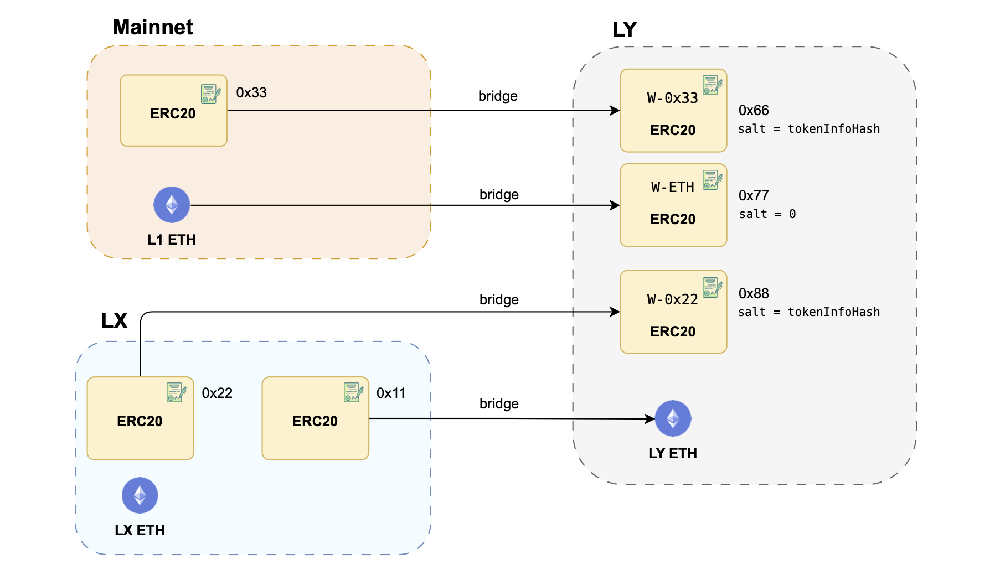

### Node configuration

The node configuration for a rollup (or validium) network typically involves specifying various parameters and addresses that are crucial for its operation.

The figure below provides a detailed breakdown of network parameters, which are given here as a snippet of node configuration within a TOML file.

The  chainId  is the chain identifier of the base layer (i.e., The Ethereum mainnet in this case).

The  genesisBlockNumber  is the L1 block number in which the rollup or validium is created.

## Gas tokens and inter-layer exchanges

The native currency for paying gas at a certain layer can be:

-   Any ERC-20 token instance on any other layer, or
-   L1 ETH.

If a token is used for paying gas in a network, it is referred to as the  **gas token**  for the layer.

If we are using a gas token at a layer, it is still possible to send  **L1 ETH**  to the layer.

In this case, the ETH gets accounted for in an ERC-20 contract called wrapped ETH (or W-ETH), which is just another ERC-20 instance.

Note that W-ETH is different from the contract W-ETH (a contract for converting ETH into an ERC-20 token that runs on L1 at this address  0xC02aaA39b223FE8D0A0e5C4F27eAD9083C756Cc2.)

Regarding the creation of the ERC-20 tokens with CREATE2:

-   Use  salt = 0  to create the W-ETH contract.
-   Use  salt = tokenInfoHash  for the rest of the wrapped tokens of the layer with tokenInfoHash defined as the following hash:

tokenInfoHash = keccak256(originNetwork, originTokenAddress)

As a final remark, note that L1 ETH is the only native currency that can be used as a native currency in another layer.

The figure below, illustrates various scenarios of inter-layer exchanges that can occur within the system.

With focus on  **LY**  as a layer of interest, the diagram depicts several scenarios, such as

-   Bridging an ERC-20 token from mainnet to LY
-   Bridging L1 ETH to LY gas token, or
-   Bridging a wrapped ERC-20 token living on LX to LY ETH.

## Upgradable CREATE2 factory issue

Note that the bridge contract is a factory of ERC-20 token instances created with  CREATE2.

Recall that  CREATE2  uses the following formula to compute the address of the instances:

instance_address=hash(0xFF,sender,salt,creationBytecode,[args])

Recall also that in the bridge contract, the mapping  tokenInfoToWrappedToken  stores the addresses of all the wrapped ERC-20 tokens of the layer.

The problem is that if we change the  creationBytecode  of the ERC-20 token contract, this will change all the addresses of the contract instances and breaks the data of the mapping.

The  creationBytecode  will change with high probability if we compile the factory (in our case the bridge) with another version of the Solidity compiler. In this case, we had to options:

(a) Freeze the Solidity compiler version for the development of the whole bridge contract.

(b) Freeze the  creationBytecode  of the ERC20 token contract.

We opted for the second solution because the ERC20 code is not prone to change so much, while freezing the compiler (and the language) for the whole bridge could constrain its future development. Taking this approach, in the  BASE_INIT_BYTECODE_WRAPPED_TOKEN  variable of the bridge contract you can find the pre-compiled  creationBytecode  of our ERC20 token contract.