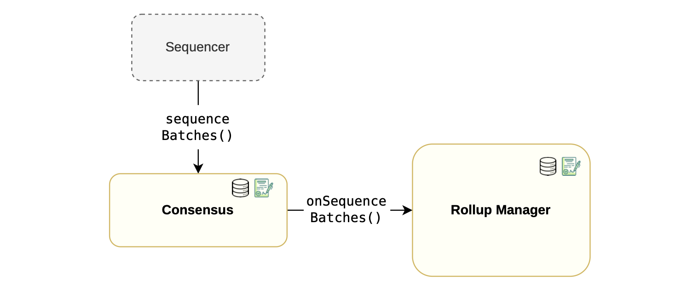
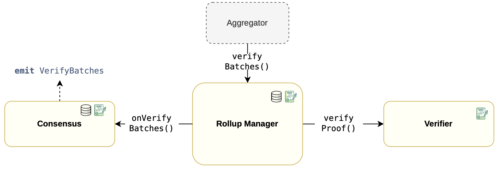

### Sequencing flow

The sequencing flow starts with the sequencer invoking the  sequenceBatches()  function, which is within the consensus contract, to send batches that are to be sequenced.

Since state information must be stored within the  RollupManager  contract, a callback function called  onSequenceBatches()  is triggered to store this data in the corresponding  RollupData  struct.

The figure below depicts a simplified sequencing flow within the rollup manager component:

-   It starts when the sequencer calls the  sequenceBatches()  function,
-   Which in turn invokes a callback function  onSequenceBatches(),
-   Followed by the rollup manager storing the sequence data in the  RollupData  struct.

### Verification flow

Recall that the aggregator is responsible for constructing proofs that validate correct processing of batches.

Once a proof is constructed, the Aggregator transmits it to the  RollupManager  for verification, by invoking the  verifyBatches()  function.

The  RollupManager  calls the  verifyProof()  function in the verifier contract, which either validates the proof or reverts if the proof is invalid.

If verification of the proof is successful, a callback function  onVerifyBatches()  in the consensus contract is called.

The  **onVerifyBatches**()  function emits the  VerifyBatches  event, containing important details of the processed batches, such as the last verified batch.

The figure below depicts the verification flow within the rollup manager component:

-   It starts when the aggregator calls  verifyBatches()  function.
-   Then the rollup manager invokes the  verifyProof()  function, which involves a secondary stateless  Verifier  contract.
-   Successful verification of a proof is followed by a call to the  onVerifyBatches()  function.
-   At the end of the process, the consensus contract emits the  verifyBatches  event.

