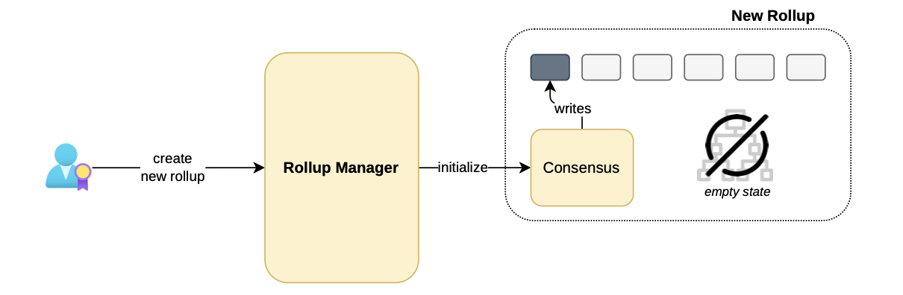
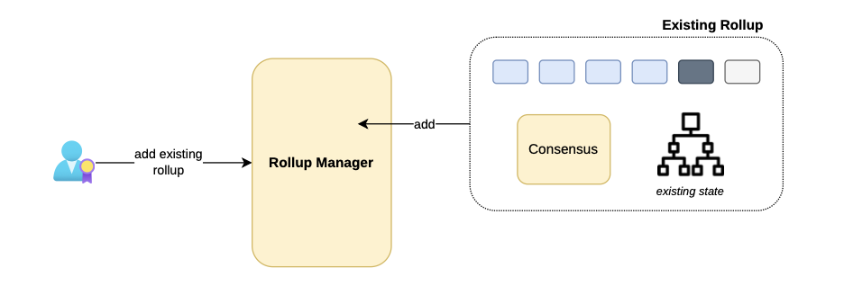
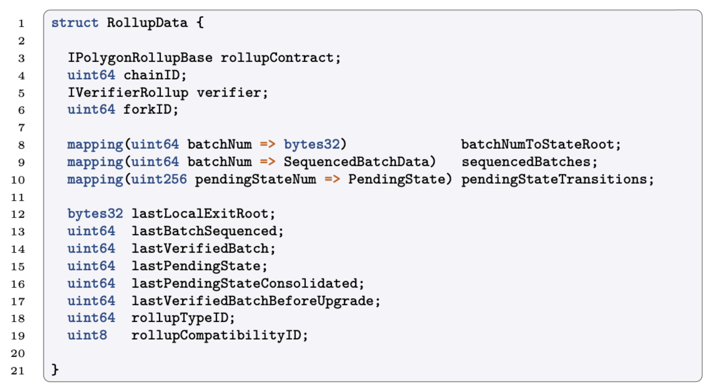
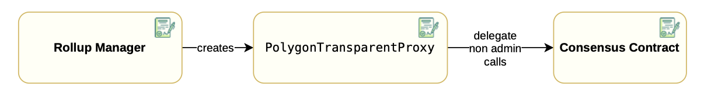

## The rollup manager

In order to achieve the afore-mentioned goal, a new smart contract called  RollupManager  has been written for the purposes of managing creation of rollups and verification of their batches.

Creation of a rollup could mean one of two things:

-   Creating and initializing a brand new rollup.
-   Incorporating an already existing rollup under the management of the  RollupManager.

## Creating new rollups

The first scenario involves newly created rollups, which have not yet been initialized, and therefore have an empty state.

When a user triggers the rollup manager’s function to create a new rollup, the  RollupManager  should

-   Populate the configuration parameters,
-   Initialize the rollup by generating and writing the genesis block,
-   Sequence transactions for initializing the bridge contract attached to the rollup.

The figure below depicts the process of creating and initializing a new rollup instance.

Observe that the state tree is empty in this situation.

## Incorporating existing rollups

When an operational rollup is already present on the Ethereum network, a user with the necessary rights can incorporate it into the Rollup Manager for centralized management.

In this scenario, the consensus **needs no initialization** because the rollup, its genesis block, and corresponding Bridge, have already been established.

The diagram below depicts integration of an existing and operational rollup into the  RollupManager, and showcases the process which needs no initialization because the rollup is already established.

In this case, the state tree has information, and this is simply added to the manager.

## Rollup types

Each new rollup has a  RollupType  attribute attached to it. And it specifies the following parameters:

-   The  **consensus implementation address**, which is the address of the contract responsible for sequencing batches.
-   The  **verifier address**  which implements the  IVerifierRollup  interface. The interface enables verification of each proof sent by the aggregator.
-   The  forkID, for tracking changes in the rollup processing.
-   A  **rollup compatibility identifier**, which is used to prevent compatibility errors when the rollup needs an  _upgrade_.
-   The  **obsolete flag**, which is a flag for indicating whether the rollup is obsolete or not.
-   The  **genesis block**, which is the rollup’s initial block and can include a small initial state.

Note that several rollups can be of the same  RollupType​, which means they all share consensus and batch verification smart contracts.

The  RollupManager  contract has functions;  addNewRollupType()  and  obsoleteRollupType()  for adding or obsoleting a rollup type.

It is not possible to create a new rollup of an obsolete rollup type.

## Rollup data

Although several rollups can be of the same  RollupType, it’s important for each rollup store its state data. This state data is included in a structure called  RollupData{}.

The  RollupData{}  struct contains;

-   Information about the current state of the rollup (e.g., The current batch being sequenced or verified, the states root for each batch, etc.)
-   Information about the bridge within the rollup, such as the current local exit root.
-   Data about forced batches, which is documented  [here](https://docs.polygon.technology/zkEVM/architecture/protocol/malfunction-resistance/sequencer-resistance/?h=forced+batches)  in the Polygon Knowledge Layer.

## Creating a rollup

Each rollup is associated with either a single rollup type or none.

In order to create a rollup of a certain rollup type, we can use the  createNewRollup()  function by specifying:

-   The associated non-obsolete rollup type identifier, which should be existing.
-   The  chainID  of the rollup, which should be new among the Polygon network’s rollup chain IDs.
-   The address of the rollup admin, who is able to update several parameters of the consensus contract. For instance, setting a trusted sequencer or a force batches address.
-   The address of the trusted sequencer, which is the node responsible for sending the transaction for executing the  sequenceBatches()  function.
-   The address of the token address used to pay gas fees, in the newly created rollup.

When creating a new rollup, OpenZeppelin’s  [transparent proxy pattern](https://blog.openzeppelin.com/the-transparent-proxy-pattern)  is employed by generating an instance of the  PolygonTransparentProxy  contract.

During this process, the consensus contract is specified by the rollup type serving as its implementation.

Since the rollup is currently not initialized, the  RollupData  is partially filled, and stored in the  rollupIDToRollupData​ mapping within the contract’s storage.

The rollup creation process is concluded by calling the  initialize()​ function of the consensus, which is in charge of setting previously specified addresses in the consensus contract.

Below is a schematic representation of the transparent proxy pattern within the Rollup Manager context.

