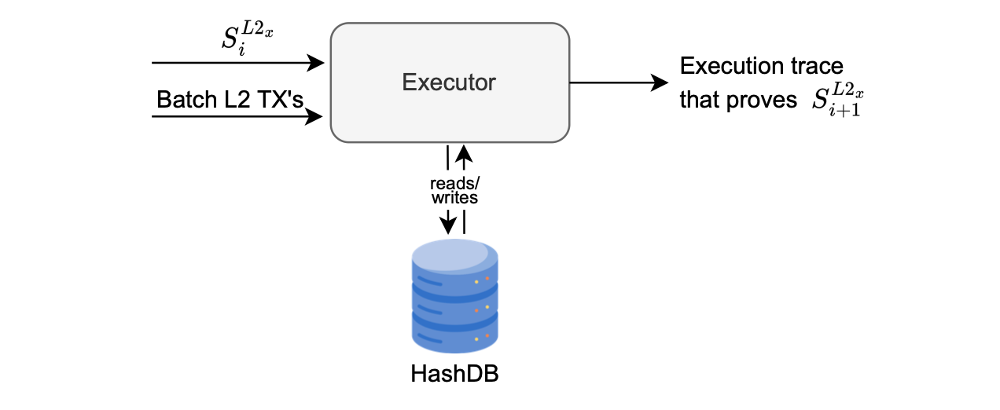

zkEVM ROM
-------------------------------------------------------------------------------------------------------------------------------

The zkEVM ROM, written in zero-knowledge assembly (zkASM), is a program designed to prove computations related to correct L2 state transitions resulting from L2 transactions in a given batch.

Often, multiple zkASM instructions are used to implement a single zkEVM opcode.

The L2 state is captured in the form of a Merkle tree, and its Merkle root, referred to as the *state root*, uniquely represents the summary of the current state data.

The zkEVM ROM must, therefore, have the capability to correctly execute the `CREATE`, `READ`, `UPDATE`, and `DELETE` (CRUD) operations on the Merkle tree

The storage state machine
---------------------------------------------------------------------------------------------------------------------------------------------------------------

The zkEVM implements a secondary state machine, known as the *storage state machine*, specifically for generating an *execution trace*.

The execution trace provides evidence for any creation, reading, updating, or deletion of L2 state data.

Any operation applied to the Merkle tree must be evidenced with proof, attesting that the tree modification was executed correctly.

Such a proof consists of the sibling node and other relevant hash nodes sufficient for verification purposes. This is called a Merkle proof.

An example of a Merkle proof can be found in the [Concepts section](https://docs.polygon.technology/zkEVM/concepts/sparse-merkle-trees/sparse-merkle-tree/).

Verifying a Merkle proof involves using the given information to compute the Merkle root and checking if it matches the actual Merkle root.

After processing the last L2 transaction in a batch, the resulting root becomes the *new state root*.

The storage state machine's executor and HashDB
----------------------------------------------------------------------------------------------------------------------------------------------------------------------------------------------------------

All essential hashes required for computing execution traces are stored in the HashDB.

During the execution of the L2 state's related zkEVM opcodes, such as `SSTORE` or `SLOAD`, the storage state machine's executor consistently retrieves values from the HashDB and uses them to construct the corresponding execution traces.

The HashDB contains all the hashes, which are all the nodes of the Merkle tree of the L2 state.

