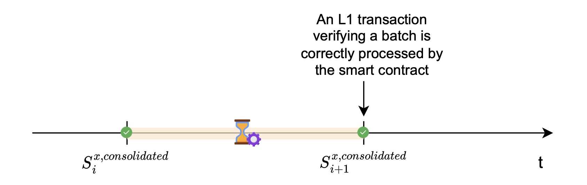
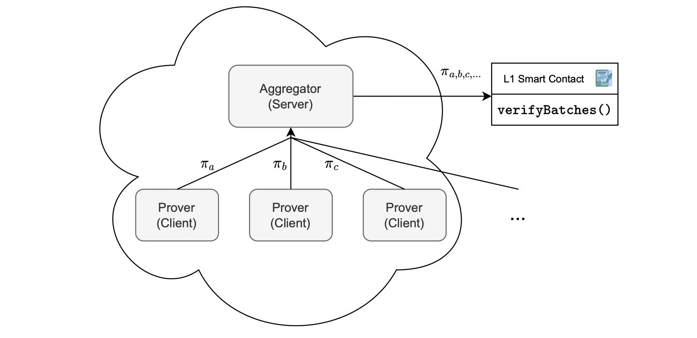

Central to the zkEVM architecture are the verifier smart contract, the prover, the aggregator, and sequencer.

## Typical state transition

Recall that, a proof of correct execution of transactions in a batch is generated, and the proof needs to be verified by the verifier smart contract.

A new L2 state is reached, and it is dubbed the  _consolidated state_.

The processed batch is referred to as a ‘consolidated batch’. That is, it has been verified by the L1 smart contract.

Submitting the proof  π​, together with the corresponding publics, for verification of correct execution, is an L1 transaction.

Once the smart contract successfully verifies this L1 transaction, this proves that the L2 state has correctly evolved from the old state  SiL2x  to a new state  Si+1L2x  according to the processed batch.

#### Proof aggregation in horizontal scaling

Another option is to scale the system horizontally with proof aggregation, as shown in Figure 6.

Here’s how it works:

1.  Parallelized proof generation, by instantiating multiple provers.
2.  Proof reception, where each prover individually sends the proof it generated to the aggregator.
3.  Proof aggregation, where proofs are aggregated into a single proof.
4.  Proof verification here means encapsulating only one proof, the aggregated proof, in an L1 transaction. And hence transmitting it to the smart contract for batch verification.

The foundation of this approach rests on zkEVM’s custom cryptographic backend, designed specifically to support proof aggregation.

It allows multiple proofs to be combined into a single verifiable proof.

As depicted in the figure below, the proofs  πa,  πb  and  πc  are aggregated into a single proof  πa,b,c,....

The key advantage is constant verification costs on L1, regardless of the number of proofs being aggregated.

Below, we present several advantages of decoupling batch sequencing from batch proving:

-   Queue management: This approach enables effective management of the queue for sequenced batches that await consolidation.
-   Flexibility in delay and prover resources: It becomes possible to adjust the amount of delay by adjusting the number of provers in operation.
-   User perception: Decoupling allows for adjustments in delay and resource alloca- tion without impacting the perceived delay experienced by users.