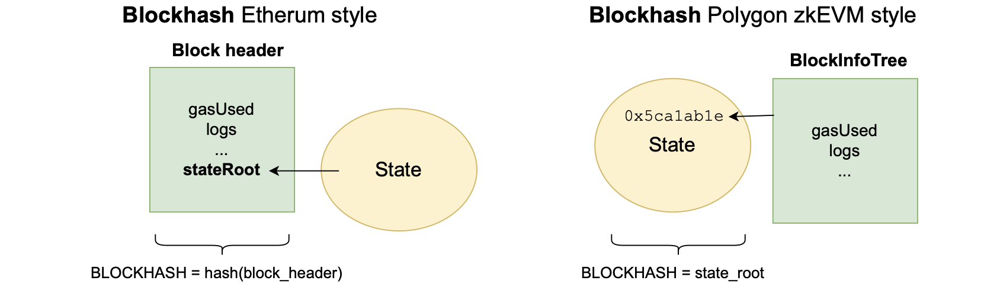
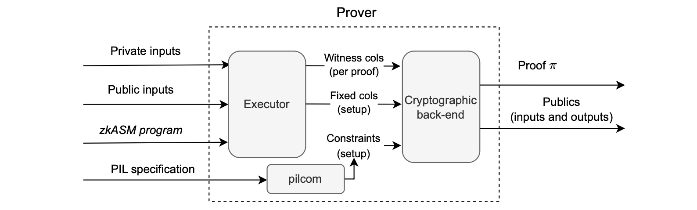

Processing L2 blocks
====================

In this document we discuss the differences between the Dragonfruit upgrade, which comes with the executor fork-ID 5, and the [Etrog upgrade](https://docs.polygon.technology/zkEVM/architecture/protocol/etrog-upgrade/) associated with fork-ID 6.

The key differences between the two Polygon zkEVM upgrades are mainly related to the definition of the L2 block and timestamps.

In the Dragonfruit upgrade,

-   An L2 block is defined to contain only one transaction, resulting in as many blocks per batch as there are transactions.

-   Timestamps are not assigned to blocks but to batches, which means each batch typically contains more than one block.

Since the timestamp is part of batch data instead of block data, it is shared among all the blocks within the batch.

Although the Dragonfruit approach minimizes delay, it has the following drawbacks:

-   It leads to a bloated database due to the large number of L2 blocks created.
-   It causes breaks in dApps that are configured with block-per-timestamp settings, as they rely on timestamps for proper timing of smart contract actions.

The Etrog upgrade addresses these two issues by allowing multiple transactions per block and assigning a unique timestamp to each block rather than to each batch.

It also introduces a timeout of a few seconds or milliseconds, during which the sequencer waits for transactions while creating a block.

To change the timestamp from one block to the next, the sequencer uses a special transaction as a new block marker, called `changeL2Block`.

## The 0x5ca1ab1e smart contract

The answer is: This information is included within the L2 state.

Specifically, the data is held in the storage slot 0 of an L2 system smart contract, which is deployed at the address `0x5ca1ab1e`.

After processing a transaction, the ROM writes the current block number into this specific storage location.

As depicted in the figure below, the L2 system smart contract deployed at address `0x5ca1ab1e` stores the number of the last processed block at slot 0.

Henceforth, during each batch processing, the system records all block numbers it contains.

The `BLOCKHASH` opcode
--------------------------------------------------------------------------------------------------------------------------------------------------------------

In the EVM, the BLOCKHASH Opcode provides the keccak-256 digest of the Ethereum L1 block header, which includes: root of the state trie, root of transactions trie, root of receipt trie, logs, gas used, gas limit, block number, timestamp, etc.

A complete list of all parameters stored in an Ethereum block and block header is given in the [Ethereum organisation documentation](https://ethereum.org/en/developers/docs/blocks/#block-anatomy).

You can use the [Geth library](https://github.com/ethereum/go-ethereum/blob/407f779c8ef6fe662d723e95b2ae1c72756b97b2/core/types/block.go#L65C21-L65C21) to compute an Ethereum block hash.

See the figure below for an example of an Ethereum L1 block header reflecting some of these parameters
L2 native vs. L2 RPC Ethereum-like `BLOCKHASH`
-------------------------------------------------------------------------------------------------------------------------------------------------------------------------------------------------------------

In Ethereum, the block header is secure because it is computed and validated by all the nodes within the network.

However, in the Polygon zkEVM, the prover is the only entity responsible for proving that the parameters related to block execution are correct, and these parameters form part of the state.

Ethereum takes the approach that block parameters, providing information about execution of transactions in each block, are hashed to obtain the block hash.

And, the resulting state root is one of these parameters.

Since the aim is to prove that the block hash computation and its parameters are correct, the native block hash in the Polygon zkEVM context has to be the L2 state root.

The zkEVM prover is in charge of proving that the changes in the L2 state root are correctly performed.

So, if we want to provide a verifiable proof of the execution parameters of a block (such as `gasUsed`, transaction logs, etc.,) we have to work these parameters into the Polygon zkEVM processing, including them in the L2 state.

Incorporating block execution parameters into the L2 state is facilitated through the `0x5ca1ab1e` smart contract.

Thus, the L2 state root is a hash that contains all the parameters that provide information about block execution.

The figure below depicts the differences.

Recapitulation
==============

The Prover, shown in the figure below, is the component within the Proving System which is in charge of generating a proof for the correct execution of some program.

The program, which takes care of the computational aspect of the computation, is written in a language called **zkASM**, developed by the Polygon team.

Providing also the private and the public inputs, the **Executor** component within the Prover is able to generate the execution traces designed to model the willing computation.

The executor produces two binary files: one containing the **fixed columns**, which should only be generated once if we do not change the computation itself, and the other containing the **witness columns**, which vary with inputs and thus need to be generated anew for each proof.

The files containing the pre- processed fixed columns and the processed witness columns for the zkEVM are temporary stored in binary files and are quite large, consisting on more than 100Gb.

Subsequently, the cryptographic backend of the prover, in conjunction with the compiled PIL constraints through pilcom and the execution trace binary files generated earlier, can produce the proof and provide the public values, both inputs and outputs, for the verifier.

The Prover component has 3 subcomponents:

-   The Executor, which is in charge of populating the execution trace based on some computation with values depending on some inputs.
-   The PIL compiler or pilcom, which compiles PIL files into JSON files prepared to be consumed by the Prover.
-   The cryptographic backend, which takes the output of both the Executor and the pilcom and generates the proof and the publics for the verifier.