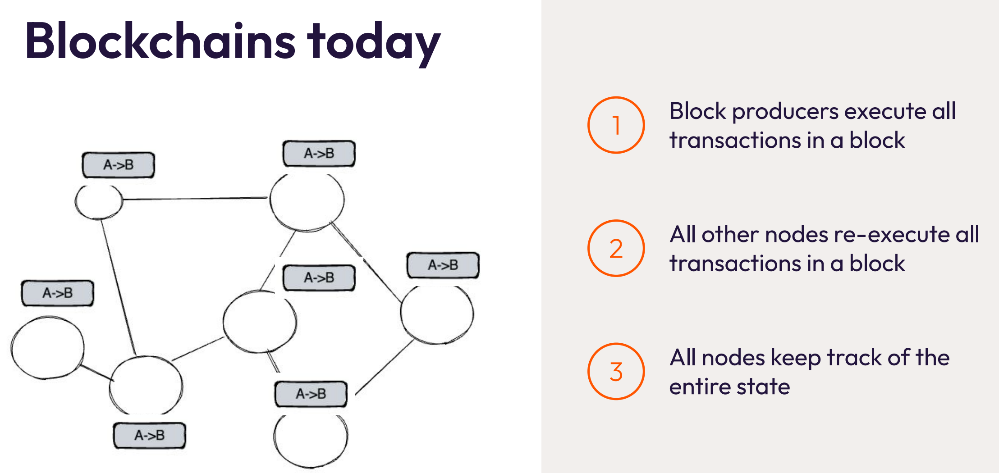

# 🚀 Miden: Unbounded Scalability, Privacy, and Safety

---

## 🌍 The Problem with Current Blockchains

* **Transparency Limits Adoption**

  * Every transaction is re-executed by all nodes
  * Leads to **execution bloat** and **state bloat**
  * Privacy is nearly impossible → activities are traceable

* **Scalability Bottlenecks**

  * Sequential execution (Ethereum) = low throughput
  * Parallel execution (Solana, SUI) = faster, but centralized risks
  * Still bound by **verification by re-execution**

* **Privacy Concerns**

  * Transparent blockchains → complete activity traceability
  * Tools like Chainalysis make it trivial to map identities
  * *Unsafe environment*: visible smart contract states & honeypots

---

## 🛠 Miden’s Core Solution

**👉 Push State & Execution to the Edge (Client-Side)**

* Users execute their own transactions
* Generate **Zero-Knowledge Proofs (ZKPs)** locally
* Network only **verifies proofs**, doesn’t re-execute

🔑 *Hard to create proofs, easy to verify them → exponential efficiency gain*

---

## 🔑 Key Innovations

### 1. Client-Side Zero Knowledge Proofs

* User computes → Network verifies
* Parallel execution possible → millions of users can transact independently

### 2. Actor Model + zkVM

* Accounts = Actors (state machines with inbox/outbox)
* Messages (Nodes) sent asynchronously between actors
* Transactions = **state change of a single account**
* Every transaction → automatically produces a **ZKP**

### 3. Privacy by Default

* Public vs Private Accounts & Nodes
* Commitments replace raw data on-chain
* **Privacy becomes cheaper** (opposite of Ethereum, where privacy costs more)

---

## 📊 Scalability Requirements

* **Mass Adoption Assumptions**

  * 10B accounts 🌐
  * 100K TPS ⚡
  * Non-trivial smart contract execution

* **Resource Projections**

  * State size: 4 TB → 40 TB depending on storage model
  * Gas/sec: Need \~10B (vs. 100M achieved today across ETH + L2s)
  * Bandwidth: \~10–60 MB/s needed (ETH today \~2.5 MB/s)

---

## 🔒 Privacy Model

* **Account Types**

  * Public Accounts → full state visible
  * Private Accounts → only commitments visible

* **Node Types**

  * Public Nodes → visible content (still enforce conditions)
  * Private Nodes → hidden content (Zcash-like commitments)

* **Nullifier Database**

  * Prevents double spending
  * Uses unlinkable hashes of node data
  * Inspired by Zcash’s **commitment + nullifier** system

---

## ⚙️ Architecture Flow

1. **Transaction Execution**

   * User executes transaction locally
   * zkVM produces **proof** of correct execution

2. **Proof Submission**

   * User sends proof + commitments to network
   * Network **does not need transaction details**

3. **Recursive Verification**

   * Proofs batched → aggregated into single block proof
   * Efficiently verified on Ethereum

---

## 🧩 Data Structures

* **Account Database**

  * Stores public accounts fully or private commitments

* **Node Database**

  * Append-only structure (Merkle Mountain Range)
  * Stores public or private nodes

* **Nullifier Database**

  * Tracks consumed nodes
  * Breaks linkability between spend & creation

---

## 💡 Execution Paradigms

* **Local Execution**

  * User handles proving
  * Cheap, private, massively parallel

* **Network Execution**

  * Used for shared contracts (e.g., AMMs, DEXes)
  * Functions like Ethereum’s current model
  * Necessary when multiple actors access shared state

---

## 📐 Example: Asset Transfer

1. Account A creates Node carrying **3 Miden tokens**
2. Node stored in Node DB
3. Account B receives node data off-chain
4. Account B consumes Node → generates **Nullifier**
5. Network verifies proof + nullifier → prevents double-spend

---

## 📦 Storage Modes

* **Public Mode**

  * More data stored on-chain
  * Transparency, easier interoperability

* **Private Mode**

  * Only commitments stored
  * Requires local storage (e.g., Google Drive, IPFS, Arweave)
  * Backup responsibility on user/app developer

---

## 🔧 Developer Model

* **Accounts contain**:

  * ID, nonce, storage, code, assets
  * Similar to Ethereum contracts

* **Nodes contain**:

  * Executable scripts (spend conditions)
  * Inputs, serial numbers, assets

* **Transaction Kernel**

  * Stateless program executed in zkVM
  * Inputs: account state + nodes
  * Outputs: new account state + new nodes

```rust
// Simplified Miden-style Transaction
transaction {
    input: Account(A), Node(X)
    action: consume Node(X)
    output: Account(A’), Node(Y)
    proof: ZK-Proof(TransactionKernel)
}
```

---

## 🏗 Trade-Offs

* **Pros**

  * Massive scalability (parallelism)
  * Privacy by default
  * Efficient proof verification

* **Cons**

  * Users must manage **state storage** themselves
  * Proof generation latency (goal: \~1s)
  * Shared contracts require fallback to network execution

---
