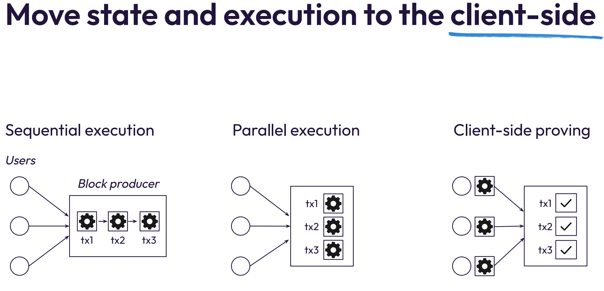

Miden Miden is a next-generation blockchain protocol designed to address the limitations of current web3/crypto solutions, specifically focusing on scalability, privacy, and safety.

The core problems Miden aims to solve are:

-   **Limited scalability:** Existing blockchains suffer from transaction re-execution and state bloat.
-   **Lack of privacy:** Activities on transparent blockchains are easily traceable.
-   **Unsafe environment:** Bugs in smart contracts are common and exploitable.

Miden's solution involves moving state and execution to the client-side, enabling:

-   **Unbounded scalability:** No transaction re-execution, unlimited contract complexity, and minimized/off-chain state.
-   **Privacy by default:** Users can choose public, private, or encrypted state, and privacy is the cheaper option.
-   **Safe development:** Smart contracts in Rust, native assets, account abstraction, and recallable transactions.

**Key Architectural Concepts:**

-   **Actor Model:** Accounts are state machines that communicate asynchronously via message passing.
-   **Accounts:** Smart contracts with code and storage, holding all assets locally. Can be public (fully on-chain) or private (ID + hash on-chain).
-   **Notes:** Carry assets and define "spend scripts." Can be public (fully on-chain) or private (hash + metadata on-chain).
-   **Transactions:** Executed against a single account, consuming and producing notes.
-   **ZK-centric Design:** Every transaction has a STARK proof. Proofs are aggregated recursively into block proofs.
-   **Local vs. Network Transactions:** Users can prepare, execute, and prove local transactions, while block producers handle network transactions.
-   **Global State:** Managed through an Account DB (Sparse Merkle tree), Notes DB (Merkle Mountain Range), and Nullifier DB (Sparse Merkle tree).

**Privacy Levels:** Miden aims to gradually increase privacy from "No privacy" (Level 0) to "Absolute privacy" (Level 3) where users only see their own data.

**Roadmap:**

-   Development started in 2022.
-   Mainnet launch expected in 2025/2026.
-   Aiming for 100+ high-usage applications by 2027 and mass adoption by 2030.

**Potential Applications:**

-   **Trading and DeFi:** CLOBs, perps, intent-based trading, native atomic swaps (e.g., sub-second order execution, trader anonymity).
-   **Payments:** P2P payments, PoS payments, one-to-n payments (e.g., user privacy, recallable transactions, easy onboarding).
-   **Programmable Assets:** Multi-owner assets, conditional ownership, RWA, identity (e.g., per-asset ownership conditions, provable compliance).

**Go-to-Market Strategy:**

-   **Phase I (Current):** Build infrastructure, tooling, and excitement (e.g., partnerships for wallet, block explorer, dev playground, Rust compiler, SDK).
-   **Phase II:** Attract developers and applications, build community.
-   **Phase III:** Attract liquidity and users (e.g., token airdrop, focus on high-profile DeFi, integrate fast bridges).

Miden aims to provide unbounded scalability, privacy, and safety without compromising web3 principles of censorship-resistance and self-custody.