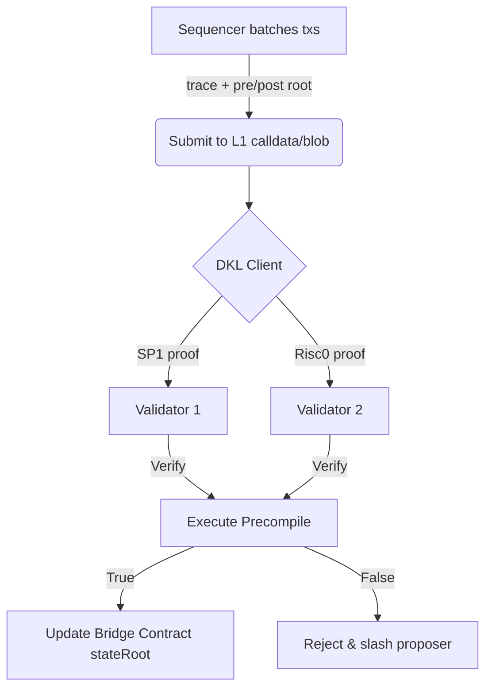

## 🎯 **Native Rollups: Architecture & Vision**

### 🔍 **Current Rollup Landscape – Key Pain Points**
- **Fragmented Trust Models**
  - Each L2 maintains its own security council, upgrade keys, fraud-proof circuits  
  - 🚨 **Risk**: Bugs in custom circuits → existential threat to user funds  
- **Heavy Custom Verification**
  - Thousands of lines of **ZK-SNARK** / **Fraud-Proof** code per rollup  
  - 🛠️ **Maintenance Burden**: Manual EVM upgrades (e.g., Pectra, EIP-7702) lag L1 by weeks/months  
- **Centralized Safeguards**
  - Security councils & multi-sig **upgradeability** → departure from **permissionless** ethos  
- **Costly On-Chain Verification**
  - Calldata & proof verification drive L1 gas fees  
  - 📊 **Table – Comparative Settlement Cost (2024 Estimates)**
    | Rollup Type | Gas/Proof | USD @ 20 gwei | Notes |
    |-------------|-----------|---------------|-------|
    | Optimistic (OP) | ~300k | $12 | 7-day finality |
    | ZK (STARK) | ~500k | $20 | 1–2 slot finality |
    | Native (Future) | ~100k | $4 | Shared L1 circuits |

---

### 🌱 **Native Rollups – Core Idea**
> *“Move rollup verification into Ethereum’s own consensus layer.”*

#### 🧩 **Execute Precompile (EIP Draft)**
- **Address**: `0x0E` (placeholder)  
- **Interface**  
  ```solidity
  function execute(
      bytes32 preStateRoot,
      bytes32 postStateRoot,
      bytes calldata trace,      // RLP-encoded txs + state access proofs
      uint256 gasUsed
  ) external view returns (bool);
  ```
- **Execution Paths**  
  1. **Naïve Re-execution** – Every validator replays trace (bootstrapping)  
  2. **ZK-SNARK Verification** – Validator runs its preferred ZK-EVM client  
  3. **Optimistic Mode** – Trace accepted unless disputed within challenge window  

---

### 🛡️ **Security & Trust Model**
- **Inherits Ethereum’s Cryptoeconomic Security**
  - No separate fraud-proof token or governance multisig  
- **Client Diversity Preserved**
  - ✅ Multiple ZK-VMs (SP1, Risc0, Jolt, Cairo)  
  - ✅ Same diversity incentives as today’s EL/CL clients  
- **Bonded Execution Proposers**
  - Proposer locks ETH bond ➝ slashed if proof missing/invalid  

---

### ⚙️ **Validator Workflow (ZK Path)**


---

### 📈 **Scalability Roadmap**
| Phase | Milestone | Verification Mode | DA Overhead | Target Date |
|-------|-----------|-------------------|-------------|-------------|
| 0 | Research & EIP finalization | — | — | 2024 Q4 |
| 1 | Re-execution Canary | Naïve replay | High (full trace) | 2025 H2 |
| 2 | ZK-SNARK Rollout | Multi-proof | Medium (snark-friendly trace) | 2026 |
| 3 | Blob Scaling + Delayed Execution | Snark + 1-slot delay | Low (EIP-4844 + Peer-DAS) | 2027+ |

---

### 🔗 **Cross-Rollup Composability Upgrade**
- **Trustless Message Passing**
  - Native rollups share **same state root format** → merkle proofs verified on L1  
- **Atomic Cross-Rollup Swaps**
  - Example:  
    - Alice on Rollup-A swaps DAI → Rollup-B wETH in a single L1 transaction  
    - Relayer submits proof of inclusion for both rollups’ state roots  

---

### 🧪 **Developer Experience**
- **EVM Equivalence = Zero Porting**
  - Rollup inherits new opcodes (e.g., `AUTHCALL` 7702) **immediately** post-L1 upgrade  
- **Tooling**
  - **Hardhat/Foundry** plugins auto-generate trace format  
  - **Gelato SDK** – one-click deploy native rollup with built-in prover market  

---

### 🌐 **Ecosystem Impact Scenarios**
- **DeFi Liquidity**
  - Unified bridge reduces fragmentation → deeper TVL per $ of capital  
- **Enterprise Chains**
  - Reg-compliant rollups leverage L1 security without custom audits  
- **Restaking & MEV**
  - EigenLayer operators offer **ZK proving as a service** for additional yield  

---

### 📅 **Key Open Research Threads**
- **Multi-Proof Economics**  
  - Cost of generating 3–5 distinct ZK proofs vs. single enshrined circuit  
- **Delayed Execution Interaction**  
  - How 1-slot delay affects **MEV auctions** & **pre-confirmations UX**  
- **Stateless Validation**  
  - EIP-7612 (Verkle) + state access proofs → **constant-time validation**  

---

### 🗂️ **Supplementary Concepts Cheat-Sheet**
- **Base Sequencing** – L1 is sequencer; native rollups still need proofs  
- **Beam Chain** – Justin Drake’s future consensus layer; integrates native rollup proofs  
- **Peer-DAS** – Post-EIP-4844 data availability sampling → ~16 MB/slot  

---

### 🖼️ **Visual Analogy**
> Think of Ethereum L1 as **iOS** and native rollups as **App Store apps**  
> – Apple provides the secure enclave (ZK verification)  
> – Developers just ship EVM bytecode, no custom firmware needed