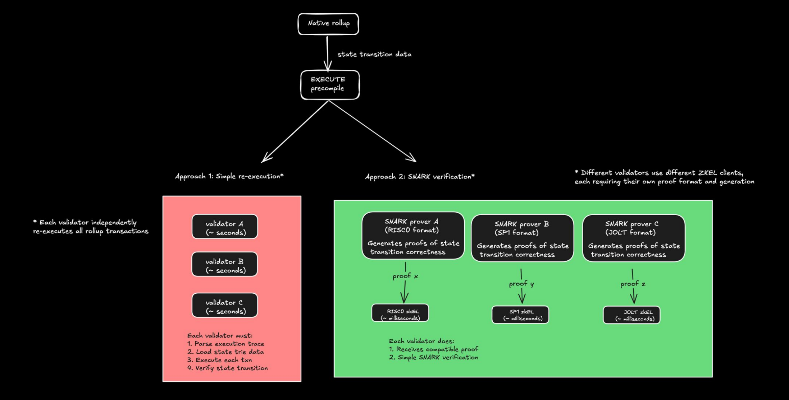
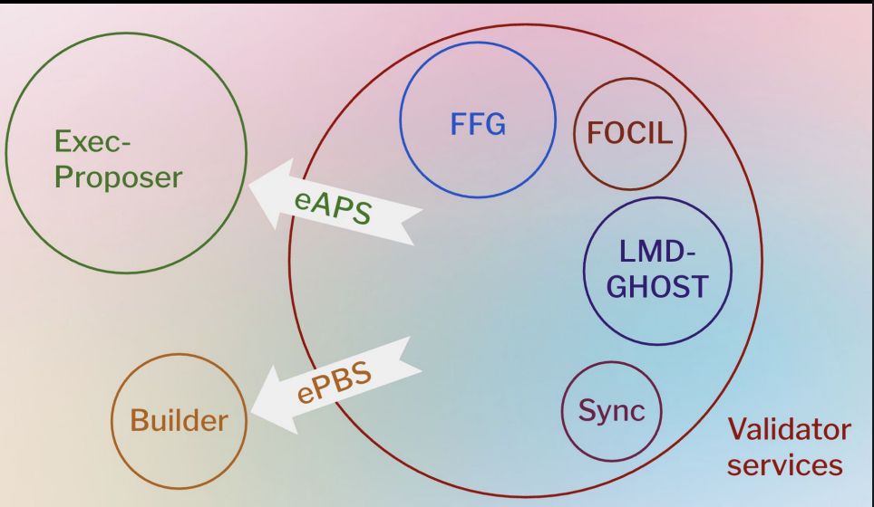

### Native Rollup Verification Approaches

**Current rollups face significant challenges:**
➔ Complex custom verification: Thousands of lines of fraud proof games or SNARK verifiers with high
vulnerability risk
➔ Proving circuit vulnerabilities: Incorrect opcode implementations can validate invalid state
transitions as cryptographically correct
➔ Centralized fallbacks: Security councils and centralized sequencing as safeguards
➔ Manual EVM upgrades: Governance required, breaking true EVM equivalence
➔ Expensive onchain verification: Forces infrequent settlement
Current rollups are separate systems with their own trust assumptions

**What are Native Rollups?**

Native Rollups use Ethereum's native execution engine directly

**The EXECUTE Precompile:**

* Exposes Ethereum's built-in EVM execution engine to rollups
* Rollups call precompile with transaction traces instead of building custom verification
* Ethereum validators re-execute or verify proofs offchain using diverse zkEL clients

Key Benefits:

* Eliminates complex custom verification systems
* Enables trustless rollups through L1 security inheritance
* Cost benefits from batching efficiencies, not computational efficiency

"Programmable execution shards that wrap the precompile" - Justin Drake

# EXECUTE Precompile

## Function Specification
`EXECUTE(pre_state_root, post_state_root, trace, gas_used) → boolean`

## Validation Process
1. Process `trace` from `pre_state_root`
2. Confirm execution produces exact `post_state_root`
3. Verify precise gas consumption

## Resource Management
- EIP-1559-style metering of cumulative gas across all `EXECUTE` calls
- `EXECUTE_CUMULATIVE_GAS_LIMIT` prevents denial-of-service (DOS) attacks
- Batching multiple `EXECUTE` calls for efficiency

# Stateless Verification

## Core Concept
- Verifiers confirm state transitions **without storing full blockchain state**
- Use **state access proofs** (Merkle proofs) to reconstruct needed state data
- Shift validation from **storage-intensive** to **computation-focused**

---

## Rollup Implications

### 1. Vanilla – Re-execution
- Verifiers temporarily hold complete execution traces  
- Blob data only sampled via **Data Availability (DA)**
- Use trace to **re-execute computation directly**

### 2. Phys/Zero-Knowledge – SNARK verification
- Use trace to verify formatting
- Rely on **cryptographic proofs** for correctness

### 3. Tradeoff
- ~10× DA overhead vs current optimistic rollups

------------

# Verification Approaches

## Phase 1: Re-execution (Launch)
- Validators directly rerun transactions using provided trace  
- Simple but **computationally intensive**  
- Limited by validator resources

---

## Phase 2: SNARK Verification (Long-term)
- Validators verify **compact mathematical proofs**  
- Enables **higher throughput**  
- Reduces computational overhead

---

## ZK Architecture
- No standardized format: Each validator uses preferred ZK system (e.g., Succinct, Risc0)  
- Multiple proofs: Same trace may require different formats for different zkE clients  
- Consensus standardizes **state access proof format only**, not ZK implementation

----

## 🌐 Rollup Comparison: Optimistic vs ZK Native

| Feature       | Optimistic Native Rollups                                                                 | ZK Native Rollups                                                                 |
|--------------|--------------------------------------------------------------------------------------------|-----------------------------------------------------------------------------------|
| **Data Availability (DA)** | - Normally cheap (Alt-DA possible)    - Ethereum DA only during disputes                  | - All data on Ethereum    - Validators need immediate access                   |
| **Batches**   | - Arbitrarily large    - `EXECUTE` verifies disputed segments only                      | - Constrained by `EXECUTE_CUMULATIVE_GAS_LIMIT`                                   |
| **Finality**  | - Challenge period delays                                                                 | - Real-time settlement    - One-slot delayed execution                         |
| **Economics** | *(Not specified)*                                                                         | - ZK often more economical due to capital efficiency gains from fast finality     |

## ⚙️ Current Ethereum Consensus Limitations

### 🧑‍💻 Current Roles
- **Proposers**
  - Handle consensus and execution
  - Receive all rewards
- **Attesters**
  - Vote on block validity for finalization

---

### 🚧 Problems
- Single proposer must do both jobs in a 12-second slot
- Insufficient time for complex cryptographic operations
- PBS (Proposer-Builder Separation) helps but doesn’t solve timing constraints

---

### ⏱️ Need
- Separate timing for consensus vs execution work

### Attester-Proposer Separation (APS)

## 🧱 Role & Timing Structure in Decentralized Protocols

### 🔄 Role Separation
- ➔ **Beacon proposers**:  
  - Handle consensus only  
  - Receive beacon rewards  
  - Selected by protocol

- ➔ **Execution proposers**:  
  - Handle block execution  
  - Receive execution rewards  
  - Determined by market

- ➔ **Builders**:  
  - Construct blocks  
  - Compatible with both proposer roles

---

### ⏱️ Timing Structure
- ➔ **Slot N**: Beacon proposer handles consensus
- ➔ **Slot N+1**: Execution proposer handles execution for Slot N

---

### ⚠️ Critical for Native Rollups
- Execution proposers get full 12 seconds for SNARK generation  
  *(instead of just milliseconds)*

---

### 🧩 Compatibility Note
- APS and PBS are **compatible**, not mutually exclusive