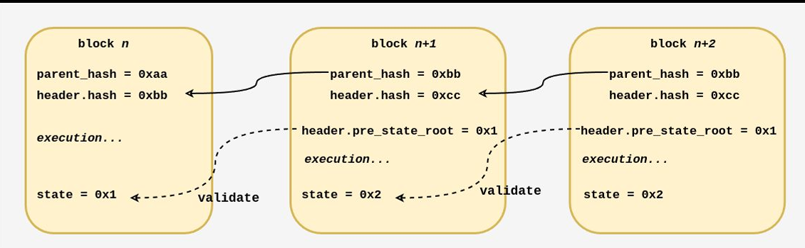
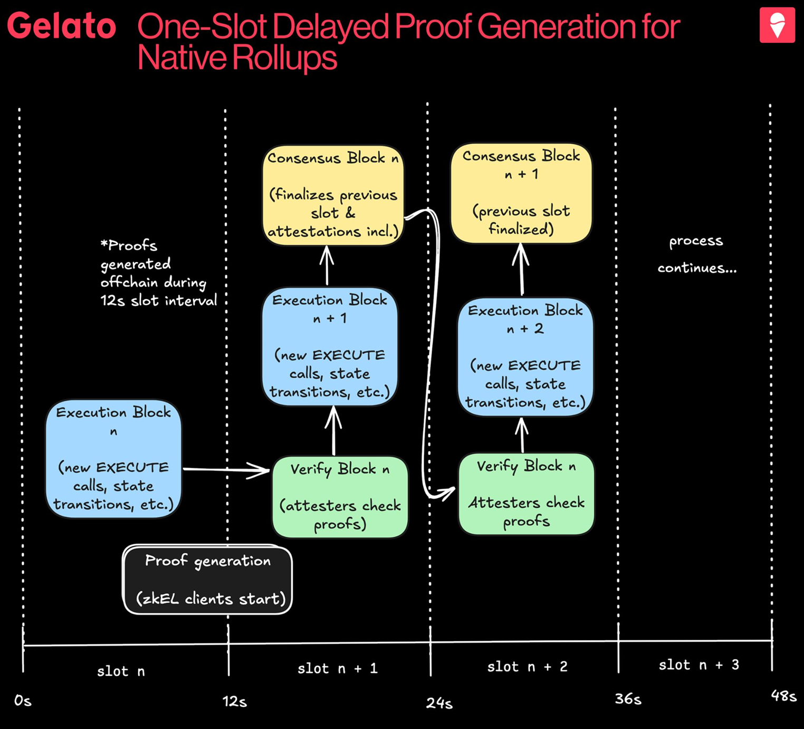

### Native Rollup Verification Approaches

## ⚠️ The Problem with Current Rollups

### 🔧 Key Issues
1. **Complex Custom Verification**  
   - Thousands of lines of fraud-proof logic or SNARK verifiers  
   - High vulnerability risk

2. **Proving Circuit Vulnerabilities**  
   - Incorrect opcode implementations can falsely validate state transitions

3. **Centralized Fallbacks**  
   - Reliance on security councils and centralized sequencers

4. **Manual EVM Upgrades**  
   - Requires governance intervention  
   - Breaks true EVM equivalence

5. **Expensive Onchain Verification**  
   - High costs force infrequent settlement

---

> *Current rollups are separate systems with their own trust assumptions.*

# What are Native Rollups?

Native Rollups use Ethereum's native execution engine directly

## The EXECUTE Precompile:

- → Exposes Ethereum's built-in EVM execution engine to rollups  
- → Rollups call precompile with transaction traces instead of building custom verification  
- → Ethereum validators re-execute or verify proofs offchain using diverse zkEL clients  

## Key Benefits:

- → Eliminates complex custom verification systems  
- → Enables trustless rollups through L1 security inheritance  
- → Cost benefits from batching efficiencies, not computational efficiency  

> "Programmable execution shards that wrap the precompile" - Justin Drake
"Programmable execution shards that wrap the precompile" - Justin Drake

# EXECUTE Precompile

## Function Specification
`EXECUTE(pre_state_root, post_state_root, trace, gas_used) → boolean`

## Validation Process
1. Process `trace` from `pre_state_root`
2. Confirm execution produces exact `post_state_root`
3. Verify precise gas consumption

## Resource Management
- EIP-1559-style metering of cumulative gas across all `EXECUTE` calls
- `EXECUTE_CUMULATIVE_GAS_LIMIT` prevents denial-of-service (DOS) attacks
- Batching multiple `EXECUTE` calls for efficiency

# Stateless Verification

## Core Concept
- Verifiers confirm state transitions **without storing full blockchain state**
- Use **state access proofs** (Merkle proofs) to reconstruct needed state data
- Shift validation from **storage-intensive** to **computation-focused**

---

## Rollup Implications

### 1. Vanilla – Re-execution
- Verifiers temporarily hold complete execution traces  
- Blob data only sampled via **Data Availability (DA)**
- Use trace to **re-execute computation directly**

### 2. Phys/Zero-Knowledge – SNARK verification
- Use trace to verify formatting
- Rely on **cryptographic proofs** for correctness

### 3. Tradeoff
- ~10× DA overhead vs current optimistic rollups

------------

# Verification Approaches

## Phase 1: Re-execution (Launch)
- Validators directly rerun transactions using provided trace  
- Simple but **computationally intensive**  
- Limited by validator resources

---

## Phase 2: SNARK Verification (Long-term)
- Validators verify **compact mathematical proofs**  
- Enables **higher throughput**  
- Reduces computational overhead

---

## ZK Architecture
- No standardized format: Each validator uses preferred ZK system (e.g., Succinct, Risc0)  
- Multiple proofs: Same trace may require different formats for different zkE clients  
- Consensus standardizes **state access proof format only**, not ZK implementation

----

## 🌐 Rollup Comparison: Optimistic vs ZK Native

| Feature       | Optimistic Native Rollups                                                                 | ZK Native Rollups                                                                 |
|--------------|--------------------------------------------------------------------------------------------|-----------------------------------------------------------------------------------|
| **Data Availability (DA)** | - Normally cheap (Alt-DA possible)    - Ethereum DA only during disputes                  | - All data on Ethereum    - Validators need immediate access                   |
| **Batches**   | - Arbitrarily large    - `EXECUTE` verifies disputed segments only                      | - Constrained by `EXECUTE_CUMULATIVE_GAS_LIMIT`                                   |
| **Finality**  | - Challenge period delays                                                                 | - Real-time settlement    - One-slot delayed execution                         |
| **Economics** | *(Not specified)*                                                                         | - ZK often more economical due to capital efficiency gains from fast finality     |

## ⚙️ Current Ethereum Consensus Limitations

### 🧑‍💻 Current Roles
- **Proposers**
  - Handle consensus and execution
  - Receive all rewards
- **Attesters**
  - Vote on block validity for finalization

---

### 🚧 Problems
- Single proposer must do both jobs in a 12-second slot
- Insufficient time for complex cryptographic operations
- PBS (Proposer-Builder Separation) helps but doesn’t solve timing constraints

---

### ⏱️ Need
- Separate timing for consensus vs execution work

### Attester-Proposer Separation (APS)

## 🧱 Role & Timing Structure in Decentralized Protocols

### 🔄 Role Separation
- ➔ **Beacon proposers**:  
  - Handle consensus only  
  - Receive beacon rewards  
  - Selected by protocol

- ➔ **Execution proposers**:  
  - Handle block execution  
  - Receive execution rewards  
  - Determined by market

- ➔ **Builders**:  
  - Construct blocks  
  - Compatible with both proposer roles

---

### ⏱️ Timing Structure
- ➔ **Slot N**: Beacon proposer handles consensus
- ➔ **Slot N+1**: Execution proposer handles execution for Slot N

---

### ⚠️ Critical for Native Rollups
- Execution proposers get full 12 seconds for SNARK generation  
  *(instead of just milliseconds)*

---

### 🧩 Compatibility Note
- APS and PBS are **compatible**, not mutually exclusive

----

## ⏳ Delayed Execution & Proof Generation

### 🕒 1. Delayed Execution
- Validators approve blocks *before* executing transactions  
- Makes Ethereum **5× faster**  
- Maintains security via **economic incentives**

---

### 🔁 2. One-Slot Delayed Proofs
- Block executed in **Slot N**, proof generated in **Slot N+1**  
- Attesters attest to **Slot N+1** only if proofs exist for **Slot N**

---

### ⚡ 3. Same-Slot Proof Solution (Latest)
- Builders prove their own blocks to claim rewards  
- If proofs are missing → automatic **“no-op” execution**  
  *(pre-state carries forward)*
- Eliminates altruistic prover 
dependencies

## 🛠️ Technical Benefits

### 🔐 Security & Trust
- Direct **Layer 1 (L1)** security inheritance  
- No additional trust assumptions  
- Eliminates fraud-proof games & custom SNARK verifiers

---

### ⚙️ EVM Equivalence
- Automatic inheritance of Ethereum upgrades  
- No governance overhead  
- Perfect alignment between **L1 and L2 execution**

---

### 🔗 Cross-Rollup Composability
- Trustless state verification between rollups  
- Direct **ZK interoperability**  
- Seamless cross-rollup transactions

---

### 🧹 Operational Simplification
- Rollups act as **Ethereum extensions**, not separate systems  
- Unified security model reduces ecosystem fragmentation

## 🧩 Implementation Challenges & Timeline

### ⚠️ Technical Challenges
- **Data Constraints**:  
  Witness data requirements cause a **5–10× increase** in data availability (DA) needs  
- **Gas Constraints**:  
  Initial `EXECUTE_CUMULATIVE_GAS_LIMIT` will **limit throughput**  
- **Migration Complexity**:  
  Existing rollups require **extensive refactoring**  
- **Standardization**:  
  Deposit/withdrawal interfaces need to be **developed and unified**

---

### 🗓️ Roadmap
- **EIPs Needed**:  
  - `EXECUTE` precompile  
  - One-slot delayed execution  
- **Timeline**:  
  - **Not expected before 2026**  
- **Phases**:  
  - Re-execution → Hybrid → Full SNARK verification

  ## 🌐 Native Rollup Vision & Upcoming Infrastructure

### 🚀 Native Rollup Vision
- **Unified Security**:  
  All rollups inherit Ethereum’s guarantees  
- **Seamless Interoperability**:  
  Cross-rollup transactions without trust assumptions  
- **Capital Efficiency**:  
  Fast finality enables efficient bridging protocols  
- **Simplified Development**:  
  No custom verification, automatic upgrades

---

### 🏗️ Upcoming Infrastructure
- **Shared Sequencers**:  
  Enable cross-rollup coordination  
- **zkVM Infrastructure**:  
  Practical real-time proving  
- **Settlement Layers**:  
  Provide advanced security

---

> **"The endgame for Ethereum's L2 scaling—blurring lines between L1 and L2."**