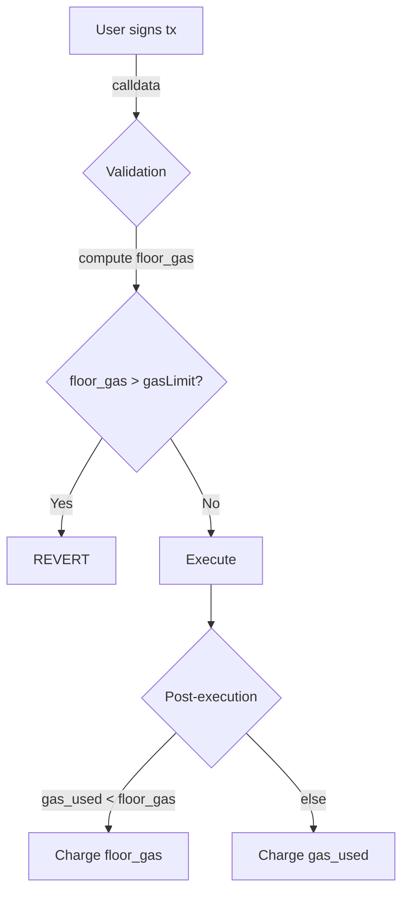

---

## 🚀 EIP-7623: Dynamic Call Data Pricing in Ethereum

---

### 🗓️ Context: Petra Upgrade & EIP Landscape

- **Petra Upgrade** is set to hit Ethereum mainnet in under 2 months
- EIP-7623 is part of a broader set of changes including:
  - EIP-7702: Temporary account abstraction
  - EIP-4844: Proto-danksharding (blob transactions)
  - EIP-772: Execution model updates

---

### 📦 What is Call Data?

- **Call Data** is the payload in a transaction's `data` field
  - Contains:
    - Function selector (which function to call)
    - Input parameters for the function
- Used in two major contexts:
  - **Smart Contract Invocation**
  - **Layer 2 (L2) Data Availability**

---

### 🧠 L2s and Data Availability

- L2s (e.g., Optimism, Arbitrum) scale Ethereum by outsourcing execution
- L2 sequencers:
  - Aggregate user transactions
  - Post them to Ethereum for **data availability**
- Two posting methods:
  - 🧾 **Call Data** (traditional, bloats Ethereum state)
  - 🫧 **Blob Data** (introduced in EIP-4844, ephemeral)

---

### ⚠️ Problem: Block Size Variance

- L2s **opportunistically switch** between blob and call data
  - Driven by **fee market dynamics**
- Consequences:
  - 📈 Sudden spikes in block size
  - 🐢 Slower propagation across the network
  - 💾 Increased resource requirements for nodes

---

### 💡 Solution: EIP-7623

- Introduces **Dynamic Call Data Pricing**
- Goal: Disincentivize excessive use of call data for data availability

---

### 🔧 New Pricing Model

| Byte Type     | Old Cost (Gas) | New Cost (Gas) |
|---------------|----------------|----------------|
| Zero Byte     | 4              | 10             |
| Non-Zero Byte | 16             | 40             |

- Applies **only** to transactions using call data for **data availability**
- Regular smart contract calls remain unaffected

---

### 🧮 New Gas Calculation Formula

```text
Total Gas Used = 21,000 + max(
  Old Call Data Cost + Execution Cost + Deployment Cost,
  New Call Data Cost Only
)
```

- **Key Insight**:
  - For **data availability transactions**, execution cost is minimal
    - → New call data cost dominates
  - For **computational transactions**, execution cost dominates
    - → Old pricing remains effective

---

### 🧱 Floor Gas Concept

- The second term in the `max()` acts as a **floor gas price**
- Ensures minimum gas payment for data-heavy transactions
- Prevents L2s from exploiting low-cost call data during blob fee spikes

---

### 🧑‍💻 EVM Implementation: REVM (Rust EVM)

---

#### 🧪 Validation Phase

- Function: `validate_initial_transaction_gas`
  - Checks if **user-specified gas limit** ≥ **floor gas**
  - If not → ❌ Transaction rejected

- Floor Gas Calculation:
  - Uses `calculate_transaction_floor_cost`
  - Input: `tokens_in_call_data`
    - Standardized metric:
      - Zero byte = 1 token
      - Non-zero byte = 4 tokens
  - Formula:
    ```text
    Floor Gas = tokens_in_call_data × 10
    ```

---

#### ⚙️ Execution Flow in REVM

1. **Validation**
   - Compute initial and floor gas
   - Reject if gas limit < floor
2. **Pre-Execution**
   - No changes from EIP-7623
3. **Execution**
   - No changes from EIP-7623
4. **Post-Execution**
   - Function: `eip_7623_check_gas_floor`
     - If actual gas spent < floor → enforce floor
     - Refunds cleared
     - Floor becomes binding

---

### 🧠 Practical Implications

- Transactions with **high call data, low computation**:
  - Pay **higher gas fees**
  - Discourages use of call data for data availability
- Transactions with **normal smart contract logic**:
  - Unaffected by new pricing

---

### 📊 Strategic Impact on L2s

- L2s must now **optimize**:
  - When to use blob vs call data
  - Consider **floor gas costs** in fee estimation
- Encourages **more consistent block sizes**
- Reduces **network congestion**

---

### 🔍 Related Concepts

- **Blob Transactions (EIP-4844)**:
  - Temporary data storage
  - Lower cost, but volatile fee market
- **Fee Market Dynamics**:
  - Blob base fee can spike
  - L2s must adapt in real-time
- **State Bloat**:
  - Permanent call data increases Ethereum’s historical state
  - Makes node operation more expensive

---

### 🛠️ Developer Considerations

- Update gas estimators to reflect new floor pricing
- Monitor blob fee market to avoid overpaying
- Use REVM or similar tools to simulate transaction costs

---

### 🧬 Ethereum Evolution

- EIP-7623 is part of Ethereum’s broader scalability roadmap
- Aligns with goals of:
  - **Efficient data availability**
  - **Predictable block sizes**
  - **Sustainable node operation**

---


# 🚀 EIP-7623 – Dynamic Call-Data Pricing (Prague Upgrade)

---

## 📋 **One-Slide “TL;DR”**
- 🛠️ **What:** Adds a *floor gas* for heavy call-data transactions  
- 🎯 **Goal:** Tame L2-driven block-size variance  
- 🧠 **How:** `gasUsed = max(oldCost, newFloor)`  
- 🚦 **Who:** Pure data-availability txs pay more, smart-contract txs stay unchanged  
- 🔧 **Where:** Validation stage & post-execution check in revm

---

## 🧩 **Context: Why Now?**

| Layer 2 Landscape | Pain Points |
|-------------------|-------------|
| 🌐 Rollups post DA via • **calldata** (4 gwei/zero, 16 gwei/non-zero) • **blobs** (EIP-4844) | • Blobs may spike → rollups pivot to calldata → **sudden megablocks**<br>• Megablocks ➜ long propagation, node strain, DoS risk |

---

## 🧮 **Old vs New Gas Schema**

| Byte Type | Pre-7623 | Post-7623 |
|-----------|----------|-----------|
| Zero byte | 4 gas | 10 gas |
| Non-zero byte | 16 gas | 40 gas |
| *but only if the tx is a “data-availability” tx* |

---

## 🧑‍💻 **Transaction Categories**

- **🔀 Computational Tx**  
  - Smart-contract calls, DeFi swaps, NFT mints, etc.  
  - Execution gas ≫ calldata → *old pricing wins* → **unaffected**

- **📦 Data-Availability Tx**  
  - L2 batches, bridges, merkle proofs, etc.  
  - Execution gas ≈ 0 → *new floor wins* → **pays higher**

---

## 🔍 **Gas Formula Deep-Dive**

```
gasUsed = 21000   // base
          + max(
              old_cost + exec_gas + create_gas,
              floor_gas
            )
```

- **floor_gas = tokens_in_calldata × 10 gas/token**
- **tokens_in_calldata = zero_bytes + 4×non_zero_bytes**

---

## 🛡️ Validation Stage (revm)

1. **calculate_initial_tx_gas()**
   - ➕ returns struct `{initial_gas, floor_gas}`
   - ➕ early revert if `tx.gasLimit < floor_gas`

---

## ⚖️ Post-Execution Stage (revm)

1. **EIP-7623_check_gas_floor()**
   - 🏁 If `gas_spent < floor_gas`
     - Force charge `floor_gas`
     - 🔥 Zero-out any gas refund

---

## 🗺️ Visual Flow: How a Transaction Travels



---

## 🧪 Concrete Example

| Scenario | Zero bytes | Non-zero bytes | old_cost | floor_gas | Final charge |
|----------|------------|----------------|----------|-----------|--------------|
| ERC-20 transfer | 0 | 68 | ~2 900 | 680 | **2 900** (old) |
| L2 batch | 50 000 | 12 000 | 392 000 | 980 000 | **980 000** (floor) |

---

## 🔗 Related Prague EIPs

- **EIP-7702** – Set EOA code for one tx (account abstraction lite)  
- **EIP-4844** – Blob-carrying transactions (proto-danksharding)  
- **EIP-7623** – *this one* – Dynamic calldata pricing

---

## 🛠️ Dev Toolkit Quick-Start

- **revm feature flag**  
  `cargo build --features "prague"`  
- **Hardhat patch**  
  - Add `prague: true` to hardhat.config networks  
- **Forge cheat-codes**  
  - `vm.expectRevert("FloorGasTooLow");`

---

## 🧭 Cheat-Sheet: Spotting a Floor-Gas Tx

```rust
// pseudo-rust
let tokens = tx.calldata.iter()
              .map(|b| if *b == 0 { 1 } else { 4 })
              .sum::<u64>();
let floor = tokens * 10;
floor > 21000 + old_calldata_cost + exec_gas_estimate * 0.1
```

---

## 🌈 UX Impact Map

| Stakeholder | Change | Mitigation |
|-------------|--------|------------|
| Rollup operators | 3-5× calldata cost | • Auto-switch to blobs<br>• Data-compression |
| DeFi users | 0% change | – |
| Node runners | Stable block size | – |
| Wallets | Need accurate gas estimations | Upgrade gas-oracle |

---

## 📚 Bonus Nuggets

- **Token trick**: 1 non-zero byte ≈ 4 zero bytes under *tokens* metric  
- **Compression angle**: Brotli/LZ4 on L2 batches can drop *tokens* by 30-40 %  
- **Future synergy**: EIP-7691 (PeerDAS) will further reduce DA costs  
- **Fork timeline**: Prague on mainnet ~ Oct 2025 (subject to client releases)

---

## 🎛️ Quick CLI One-Liner

```bash
cast estimate --prague --from $L2_ADDR --data 0x<heavy_batch> \
| jq '.gasUsed, .floorGas'
```

---

## 🧩 Micro-Glossary

| Term | Emoji | Meaning |
|------|-------|---------|
| DA | 🗃️ Data Availability – guarantee that L2 data can be challenged |
| blob | 🍥 Binary Large OBject – EIP-4844 side-car data |
| floor_gas | 🪙 Minimum gas charge enforced by EIP-7623 |
| token | 🎫 Unit that weights zero/non-zero bytes (1 vs 4) |

---

## 🚀 End-to-End Animated Stack

1. 🖱️ User clicks “Bridge to L2”  
2. 🧮 Wallet computes `floor_gas`  
3. ✍️ Tx signed & broadcast  
4. ⚙️ revm validates  
5. 🧾 Miner/validator charges fair gas  
6. 🎉 Block size stays predictable 🎯