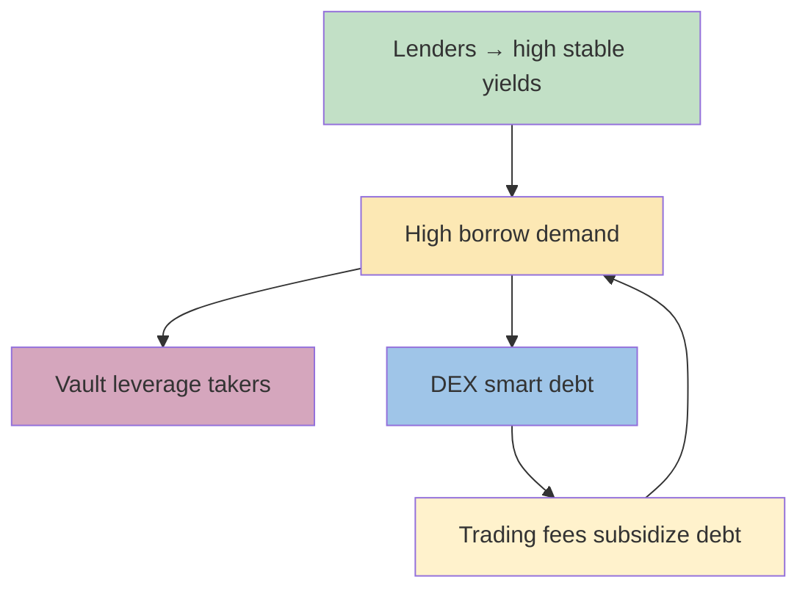

# 🌊 **Fluid Protocol Deep-Dive**  
#### The Architecture That Topped Ethereum DEX Volume Charts

---

## 1️⃣ **Foundational Liquidity Layer** 🏗️  
> One smart contract that rules them all  

- **Custodies every token** in a single vault  
- **Sets algorithmic interest rates** based on global utilization  
- **Down-stream “spokes”** plug-in and share the same liquidity  
  - 🔄 No cold-start problem for new protocols  
  - 🔄 Instant TVL for any approved app  
- **Risk-managed**  
  - 🔒 Per-app credit caps (≈ $20 M default)  
  - ⚖️ Governance whitelist (only in-house apps today)

---

## 2️⃣ **Fluid Lending** 💸  
> Deposit-and-forget money market  

| Asset Supplied | Receipt Token | Current Typical APY |
|----------------|---------------|----------------------|
| USDC           | fUSDC         | **≈ 8–12 %**         |
| ETH            | fETH          | **≈ 4–7 %**          |
| wBTC           | fWBTC         | **≈ 3–5 %**          |

- **Yield source** = aggregated borrow demand from  
  - Vault protocol  
  - Fluid DEX (smart debt)  
- **No migration needed** when new apps launch → existing suppliers instantly earn higher rates.

---

## 3️⃣ **Fluid Vault (Borrowing Protocol)** 🏛️  
> Maker-style isolated vaults, but with superpowers  

### 🎯 **Key Differentiators**  

- **95 % max LTV** vs industry 80-85 %  
- **Ultra-low liquidation penalty** → as little as **1 %**  
- **Gas-efficient liquidations**  
  - Positions bucketed into **ticks**  
  - Whole tick liquidated in **1 tx**  
  - External aggregators (1inch, Paraswap) can liquidate unknowingly → better prices for users

### 🌀 **One-Click Leverage Loop**  
```text
Deposit ETH → Borrow USDC → Swap to ETH → Redeposit ETH  
Auto-repeat until desired leverage (up to 20×+ achievable)
```

---

## 4️⃣ **Fluid DEX – Smart Collateral & Smart Debt** 🔄  

### 🧠 **Smart Collateral**  
> Your collateral doubles as concentrated liquidity  

- Deposit **ETH + stETH** → actually a **ETH/stETH liquidity range**  
- Earn **trading fees + lending yield simultaneously**  
- Position auto-rebalances; no manual LP management  

### 🧾 **Smart Debt**  
> Borrowed dollars that are *also* liquidity  

- Withdraw **USDC**, but protocol holds **USDC/USDT pair**  
- External traders swap against it → fees offset borrow rate  
- Result: **1–2 % cheaper debt vs Aave/Compound**  

### ☯️ **Symbiotic Safety Loop**  
| Market Crash Event | Money-Market Flow | DEX Flow | Net Effect |
|--------------------|-------------------|----------|------------|
| ETH dumps 20 %     | Sells ETH for USDC (liquidation) | Buys ETH, sells USDC | **Flows cancel → lower slippage & bad-debt risk** |

---

## 5️⃣ **Capital Efficiency Cheat-Sheet** 📊  

| Metric                        | Fluid | Nearest Competitor |
|-------------------------------|-------|--------------------|
| Max LTV                       | **95 %** | 85 % (Maker) |
| Liquidation Penalty           | **1 %**  | 10–13 % (Aave v3) |
| Borrow Rate Discount (packed pairs) | **1–2 %** | 0 % |
| Gas per Liquidation           | **~70 k** | >300 k (auctions) |

---

## 6️⃣ **Roadmap Sneak Peek** 🗓️  

- **Jupiter-Fluid (Solana)**  
  - 🪐 50/50 revenue share  
  - 🪄 Solana’s first unified liquidity layer clone  
  - 📈 Potential to **double TVL overnight**  

- **DEX V2 (Sept target)**  
  - 🎣 Tick-based, Uniswap V3-style ranges for **volatile pairs**  
  - 🪝 Hooks & permissionless pool creation  

- **Fixed-Rate Lending & Borrowing**  
  - ⏳ Zero-coupon fTokens  
  - 🎯 Perfect for DAO treasury planning  

- **USD Light Vault**  
  - 🔁 Carry-trade engine for stables (mirror of 250 M ETH strategy)

---

## 7️⃣ **Ecosystem Flywheel** 🔁  



---

## 8️⃣ **Quick Start Toolkit** 🧰  

- **Lend**: app.fluid.io/lend  
- **Leverage loop**: app.fluid.io/vault → choose ETH/USDC 95 % LTV → click “Loop”  
- **LP & Borrow**: app.fluid.io/dex → deposit ETH/stETH → borrow USDC/USDT smart debt  

---

## 9️⃣ **Key Risks & Mitigations** ⚠️  

- **Oracle risk** → dual oracles + fallback  
- **Governance centralization** → multi-sig → on-chain voting (timeline TBA)  
- **Smart-contract risk** → 4 audits (Quantstamp, Trail of Bits, Spearbit, Statemind)  

---

## 🔟 **Mind-Bending Edge Cases**  

- **Liquidations via memecoin swaps**  
  - Trader dumps PEPE → aggregator routes through Fluid → accidentally repays someone’s USDC debt  
- **Negative net borrow rate**  
  - If trading fees > interest, smart debt **pays you to borrow** (observed on packed USDC/USDT for 18 hrs in July)