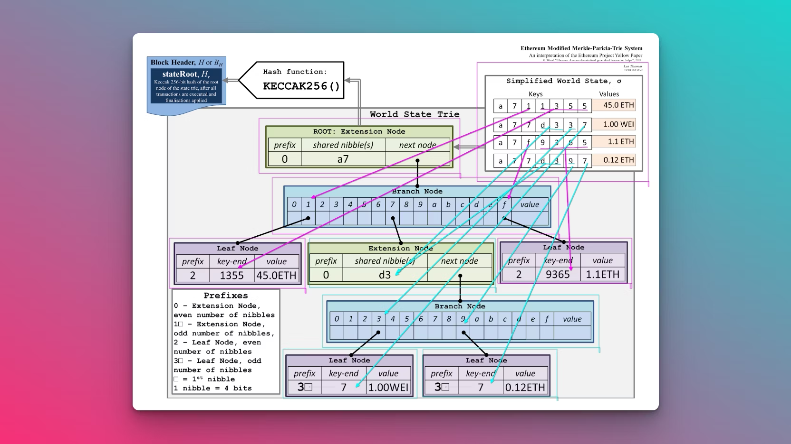

Whenever a new item is added to the trie the algorithm can decide whether to insert a branch, a leaf or an extension. Let's say you need to insert 3 key-value pairs:

```
"0x01": 1
"0x01234": 2
"0x01235": 3

```

After "0x01" is inserted the trie will look like this (`hash0` is root):

```
<hash0> leaf ["0x01", 1]

```

After "0x01234" is inserted (`hash1` is root):

```
<hash1> extension ["0x01", <hash2>]
<hash2> branch [NULL,NULL,<hash3>,..<13 NULLs>.., 1]
<hash3> leaf ["0x34", 2]

```

After "0x01235" is inserted (`hash4` is root):

```
<hash4> extension ["0x01", <hash5>]
<hash5> branch [NULL,NULL,<hash6>,..<13 NULLs>.., 1]
<hash6> extension ["0x3", <hash7>]
<hash7> branch [NULL,NULL,NULL,NULL,<hash8>,<hash9>..<10 NULLs>.., NULL]
<hash8> leaf ["", 2]
<hash9> leaf ["", 3]

```

Generally, while inserting a key-value pair:

*   if you stopped at a NULL node, you add a new leaf node with the remaining path and replace NULL with the hash of the new leaf.
*   if you stopped at a leaf node, you need to convert it to an extension node and add a new branch and 1 or 2 leafs.
*   if you stopped at an extension node, you convert it to another extension with shorter path and create a new branch and 1 or 2 leafs. If the new path turns out to be empty you convert it to a branch instead.

When deleting a key-value pair:

*   if there is a branch that has a single non NULL nibble and NULL value, this branch can be replaced with a leaf or an extension.
*   if there is an extension that points to another extension or a leaf, it can be collapsed into a single extension/leaf.
*   if there is branch with all NULL nibbles and non NULL value, it can be converted into a leaf.

I most likely missed a few cases but I hope the general idea is clear. When adding/deleting key-value pairs the algorithm can make the decision locally at the current node, there is no need to create an unpacked version of the trie first and then pack it