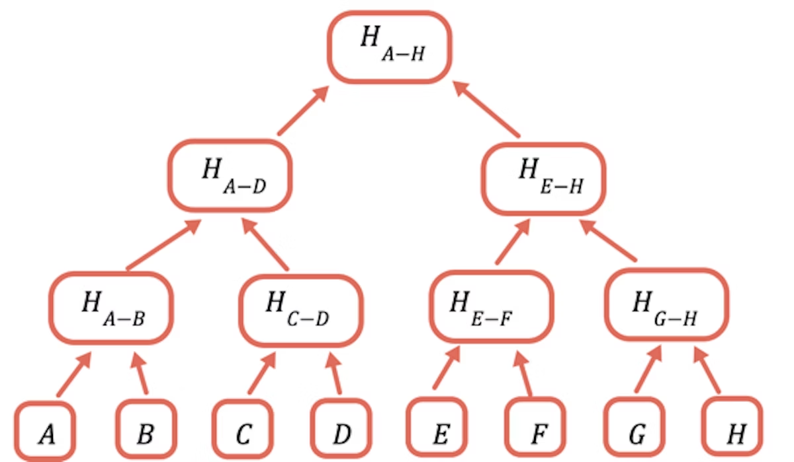
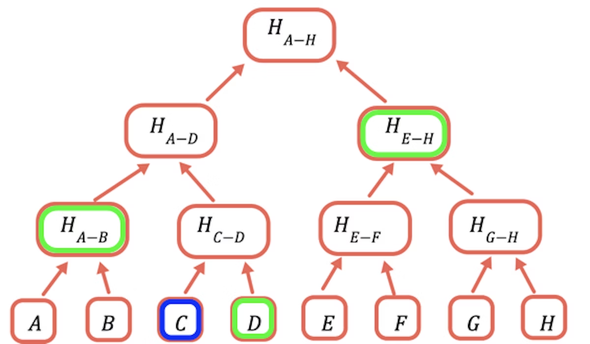

Ideally we'd like to store everything in Ethereum storage, which is stored across thousands of computers and has extremely high availability (the data cannot be censored) and integrity (the data cannot be modified in an unauthorized manner), but storing a 32-byte word typically costs 20,000 gas. As I'm writing this, that cost is equivalent to $6.60. At 21 cents per byte this is too expensive for many uses.

To solve this problem the Ethereum ecosystem developed [many alternative ways to store data in a decentralized fashion](/en/developers/docs/storage/). Usually they involve a tradeoff between availability and price. However, integrity is usually assured.

In this article you learn **how** to ensure data integrity without storing the data on the blockchain, using [Merkle proofs(opens in a new tab)](https://computersciencewiki.org/index.php/Merkle_proof)


How does it work?
-----------------

In theory we could just store the hash of the data on chain, and send all the data in transactions that require it. However, this is still too expensive. A byte of data to a transaction costs about 16 gas, currently about half a cent, or about $5 per kilobyte. At $5000 per megabyte, this is still too expensive for many uses, even without the added cost of hashing the data.

The solution is to repeatedly hash different subsets of the data, so for the data that you don't need to send you can just send a hash. You do this using a Merkle tree, a tree data structure where each node is a hash of the nodes below it:


The root hash is the only part that needs to be stored on chain. To prove a certain value, you provide all the hashes that need to be combined with it to obtain the root. For example, to prove `C` you provide `D`, `H(A-B)`, and `H(E-H)`.



[](#implementation)Implementation
---------------------------------

[The sample code is provided here(opens in a new tab)](https://github.com/qbzzt/merkle-proofs-for-offline-data-integrity).

### [](#off-chain-code)Off-chain code

In this article we use JavaScript for the off-chain computations. Most decentralized applications have their off-chain component in JavaScript.

#### [](#creating-the-merkle-root)Creating the Merkle root

First we need to provide the Merkle root to the chain.

const ethers = require("ethers")

[We use the hash function from the ethers package(opens in a new tab)](https://docs.ethers.io/v5/api/utils/hashing/#utils-keccak256).

```
// The raw data whose integrity we have to verify. The first two bytes a
// are a user identifier, and the last two bytes the amount of tokens the
// user owns at present.
const dataArray = [
  0x0bad0010, 0x60a70020, 0xbeef0030, 0xdead0040, 0xca110050, 0x0e660060,
  0xface0070, 0xbad00080, 0x060d0091,
]
```

Encoding each entry into a single 256-bit integer results in less readable code than using JSON, for example. However, this means significantly less processing to retrieve the data in the contract, so much lower gas costs. [You can read JSON on chain(opens in a new tab)](https://github.com/chrisdotn/jsmnSol), it's just a bad idea if avoidable.

// The array of hash values, as BigInts

2const hashArray = dataArray

In this case our data is 256-bit values to begin with, so no processing is needed. If we use a more complicated data structure, such as strings, we need to make sure we hash the data first to get an array of hashes. Note that this is also because we don't care if users know other users' information. Otherwise we would have had to hash so user 1 won't know the value for user 0, user 2 won't know the value for user 3, etc.

1// Convert between the string the hash function expects and the

2// BigInt we use everywhere else.

3const hash = (x) =>

4  BigInt(ethers.utils.keccak256("0x" + x.toString(16).padStart(64, 0)))

The ethers hash function expects to get a JavaScript string with a hexadecimal number, such as `0x60A7`, and responds with another string with the same structure. However, for the rest of the code it's easier to use `BigInt`, so we convert to a hexadecimal string and back again.

1// Symmetrical hash of a pair so we won't care if the order is reversed.

2const pairHash = (a, b) => hash(hash(a) ^ hash(b))

This function is symmetrical (hash of a [xor(opens in a new tab)](https://en.wikipedia.org/wiki/Exclusive_or) b). This means that when we check the Merkle proof we don't need to worry about whether to put the value from the proof before or after the calculated value. Merkle proof checking is done on chain, so the less we need to do there the better.

Warning: Cryptography is harder than it looks. The initial version of this article had the hash function `hash(a^b)`. That was a **bad** idea because it meant that if you knew the legitimate values of `a` and `b` you could use `b' = a^b^a'` to prove any desired `a'` value. With this function you'd have to calculate `b'` such that `hash(a') ^ hash(b')` is equal to a known value (the next branch on the way to root), which is a lot harder.

1// The value to denote that a certain branch is empty, doesn't

2// have a value

3const empty = 0n

When the number of values is not an integer power of two we need to handle empty branches. The way this program does it is to put zero as a place holder.

1// Calculate one level up the tree of a hash array by taking the hash of

2// each pair in sequence

3const oneLevelUp = (inputArray) => {

4  var result = \[\]

5  var inp = \[...inputArray\] // To avoid over writing the input // Add an empty value if necessary (we need all the leaves to be // paired)

6

7  if (inp.length % 2 === 1) inp.push(empty)

8

9  for (var i = 0; i < inp.length; i += 2)

10    result.push(pairHash(inp\[i\], inp\[i + 1\]))

11

12  return result

13} // oneLevelUp

Show all

This function "climbs" one level in the Merkle tree by hashing the pairs of values at the current layer. Note that this is not the most efficient implementation, we could have avoided copying the input and just added `hashEmpty` when appropriate in the loop, but this code is optimized for readability.

1const getMerkleRoot = (inputArray) => {

2  var result

3

4  result = \[...inputArray\] // Climb up the tree until there is only one value, that is the // root. // // If a layer has an odd number of entries the // code in oneLevelUp adds an empty value, so if we have, for example, // 10 leaves we'll have 5 branches in the second layer, 3 // branches in the third, 2 in the fourth and the root is the fifth

5

6  while (result.length > 1) result = oneLevelUp(result)

7

8  return result\[0\]

9}

Show all

To get the root, climb until there is only one value left.

#### [](#creating-a-merkle-proof)Creating a Merkle proof

A Merkle proof is the values to hash together with the value being proved to get back the Merkle root. The value to prove is often available from other data, so I prefer to provide it separately rather than as part of the code.

1// A merkle proof consists of the value of the list of entries to

2// hash with. Because we use a symmetrical hash function, we don't

3// need the item's location to verify the proof, only to create it

4const getMerkleProof = (inputArray, n) => {

5  var result = \[\], currentLayer = \[...inputArray\], currentN = n

6

7  // Until we reach the top

8  while (currentLayer.length > 1) {

9    // No odd length layers

10    if (currentLayer.length % 2)

11      currentLayer.push(empty)

12

13    result.push(currentN % 2

14       // If currentN is odd, add with the value before it to the proof

15      ? currentLayer\[currentN-1\]

16       // If it is even, add the value after it

17      : currentLayer\[currentN+1\])

18

Show all

We hash `(v[0],v[1])`, `(v[2],v[3])`, etc. So for even values we need the next one, for odd values the previous one.

1    // Move to the next layer up

2    currentN = Math.floor(currentN/2)

3    currentLayer = oneLevelUp(currentLayer)

4  }  // while currentLayer.length > 1

5

6  return result

7}  // getMerkleProof

### [](#on-chain-code)On-chain code

Finally we have the code that checks the proof. The on-chain code is written in [Solidity(opens in a new tab)](https://docs.soliditylang.org/en/v0.8.11/). Optimization is a lot more important here because gas is relatively expensive.

//SPDX-License-Identifier: Public Domain
pragma solidity ^0.8.0;

import "hardhat/console.sol";

I wrote this using the [Hardhat development environment(opens in a new tab)](https://hardhat.org/), which allows us to have [console output from Solidity(opens in a new tab)](https://hardhat.org/tutorial/debugging-with-hardhat-network.html) while developing.


contract MerkleProof {
    uint merkleRoot;

    function getRoot() public view returns (uint) {
      return merkleRoot;
    }

    // Extremely insecure, in production code access to
    // this function MUST BE strictly limited, probably to an
    // owner
    function setRoot(uint _merkleRoot) external {
      merkleRoot = _merkleRoot;
    }   // setRoot

Set and get functions for the Merkle root. Letting everybody update the Merkle root is an _extremely bad idea_ in a production system. I do it here for the sake of simplicity for sample code. **Don't do it on a system where data integrity actually matters**.

    function hash(uint _a) internal pure returns(uint) {
      return uint(keccak256(abi.encode(_a)));
    }

    function pairHash(uint _a, uint _b) internal pure returns(uint) {
      return hash(hash(_a) ^ hash(_b));
    }

This function generates a pair hash. It is just the Solidity translation of the JavaScript code for `hash` and `pairHash`.

**Note:** This is another case of optimization for readability. Based on [the function definition(opens in a new tab)](https://www.tutorialspoint.com/solidity/solidity_cryptographic_functions.htm), it might be possible to store the data as a [`bytes32`(opens in a new tab)](https://docs.soliditylang.org/en/v0.5.3/types.html#fixed-size-byte-arrays) value and avoid the conversions.

    // Verify a Merkle proof
    function verifyProof(uint _value, uint[] calldata _proof)
        public view returns (bool) {
      uint temp = _value;
      uint i;

      for(i=0; i<_proof.length; i++) {
        temp = pairHash(temp, _proof[i]);
      }

      return temp == merkleRoot;
    }

}  // MarkleProof

In mathematical notation Merkle proof verification looks like this: `H(proof_n, H(proof_n-1, H(proof_n-2, ... H(proof_1, H(proof_0, value))...)))`. This code implements it.

[](#merkle-proofs-and-rollups)Merkle proofs and rollups don't mix
-----------------------------------------------------------------

Merkle proofs don't work well with [rollups](/en/developers/docs/scaling/#rollups). The reason is that rollups write all the transaction data on L1, but process on L2. The cost to send a Merkle proof with a transaction averages to 638 gas per layer (currently a byte in call data costs 16 gas if it isn't zero, and 4 if it is zero). If we have 1024 words of data, a Merkle proof requires ten layers, or a total of 6380 gas.

Looking for example at [Optimism(opens in a new tab)](https://public-grafana.optimism.io/d/9hkhMxn7z/public-dashboard?orgId=1&refresh=5m), writing L1 gas costs about 100 gwei and L2 gas costs 0.001 gwei (that is the normal price, it can rise with congestion). So for the cost of one L1 gas we can spend a hundred thousand gas on L2 processing. Assuming we don't overwrite storage, this means that we can write about five words to storage on L2 for the price of one L1 gas. For a single Merkle proof we can write the entire 1024 words to storage (assuming they can be calculated on chain to begin with, rather than provided in a transaction) and still have most of the gas left over.

[](#conclusion)Conclusion
-------------------------

In real life you might never implement Merkle trees on your own. There are well known and audited libraries you can use and generally speaking it is best not to implement cryptographic primitives on your own. But I hope that now you understand Merkle proofs better and can decide when they are worth using.

Note that while Merkle proofs preserve _integrity_, they do not preserve _availability_. Knowing that nobody else can take your assets is small consolation if the data storage decides to disallow access and you can't construct a Merkle tree to access them either. So Merkle trees are best used with some kind of decentralized storage, such as IPFS.