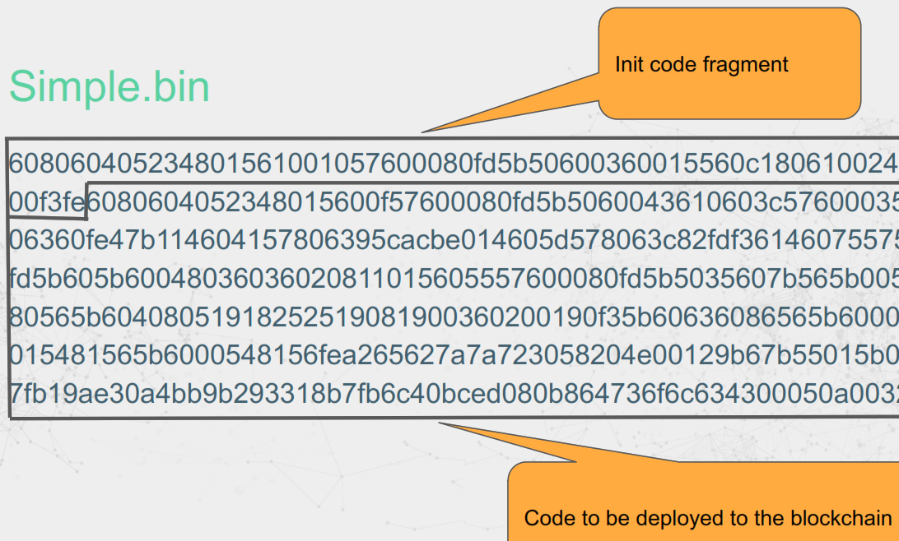
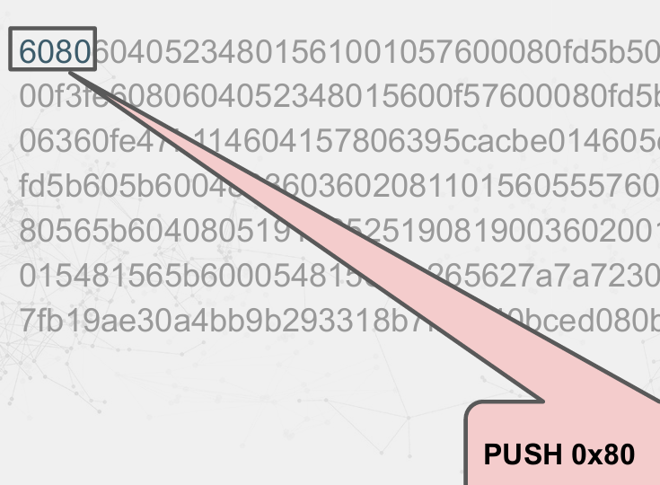

Contracts are deployed using transactions where:


●   **To** address is not specified.

●   **Data** is the init code fragment. This includes the contract binary. This is the compiler output in the *.bin file.


Note:


●   The **init** function is NOT stored on the blockchain.
●   The Data of the transaction is treated as code for contract deployment.




##  public storage variables automatically have “getter” view calls created.

```
contract 
Simple {
 uint256 public val1;
 uint256 public val2;
 constructor() 
     val2 = 3;
   }
 function public {
   }
 }
 set(
 uint256 
     val1 = _param;
 _param) 
external {
```
