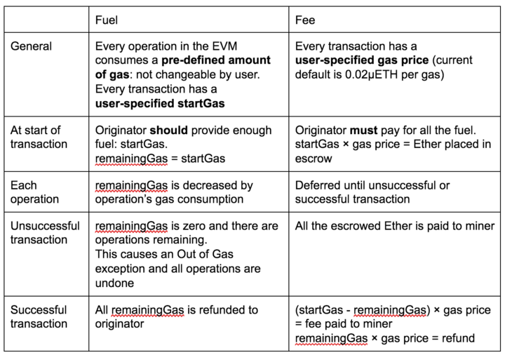
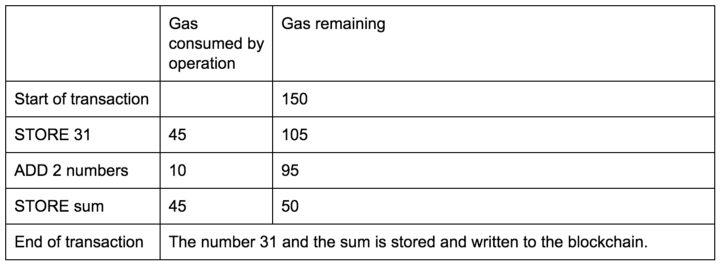
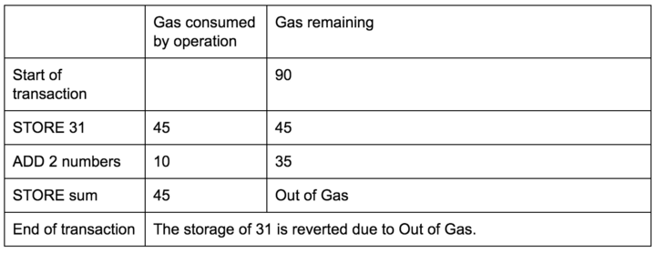

# Detailed Breakdown of Ethereum Gas Fees

## **Overview**
Ethereum gas fees are payments made by users to execute transactions or smart contracts on the Ethereum network. These fees compensate miners (or validators post-Merge) for computational resources and secure the network. Gas fees are denominated in **gwei** (1 gwei = 0.000000001 ETH) and fluctuate based on demand, network congestion, and transaction complexity.

---

## **Key Concepts**

### **1. Gas**
- **Definition**: A unit measuring computational effort required for operations (e.g., simple transfers, smart contract interactions).
- **Examples**:
  - Basic ETH transfer: **21,000 gas**.
  - ERC-20 token transfer: **~65,000 gas**.
  - Complex DeFi interaction: **200,000+ gas**.

### **2. Gas Limit**
- **Definition**: The maximum gas a user is willing to spend on a transaction.
- **Purpose**: Prevents runaway costs from code errors. Unused gas is refunded.

### **3. Gas Price**
- **Definition**: The amount of gwei a user pays per unit of gas.
- **Determined by**: Market dynamics (users bid for block space).

### **4. Total Fee**
- **Formula**: `Total Fee = Gas Used × Gas Price`
- **Example**: A transaction using 50,000 gas at 50 gwei costs **0.0025 ETH** (50,000 × 50 gwei = 2,500,000 gwei).

---

## **Factors Influencing Gas Fees**

### **1. Network Congestion**
- High demand → Users bid higher gas prices to prioritize transactions.
- **Peak Times**: During popular NFT drops, DeFi launches, or market volatility.

### **2. Transaction Complexity**
- **Simple transfers** (e.g., ETH) cost less than **smart contract interactions** (e.g., Uniswap swaps, staking).

### **3. Gas Price Volatility**
- Users can manually set gas prices or rely on wallets for estimates (e.g., "Low," "Medium," "High" settings).

### **4. EIP-1559 (London Upgrade)**
- **Base Fee**: Algorithmically determined fee burned (not paid to miners), adjusting per block.
- **Priority Fee (Tip)**: Optional tip to incentivize validators.
- **Max Fee**: User’s maximum willingness to pay (`Base Fee + Priority Fee`).

---

## **Strategies to Minimize Gas Fees**

### **1. Timing Transactions**
- Use tools like [Etherscan Gas Tracker](https://etherscan.io/gastracker) to submit transactions during **off-peak hours** (e.g., weekends, UTC late-night).

### **2. Gas Price Adjustment**
- Set a **custom gas price** slightly above the current base fee to avoid delays.

### **3. Layer 2 Solutions**
- **Optimistic Rollups** (Optimism, Arbitrum): Batch transactions off-chain.
- **ZK-Rollups** (zkSync, StarkNet): Use zero-knowledge proofs for validation.
- **Sidechains** (Polygon): Ethereum-compatible independent chains.

### **4. Gas Tokens (Deprecated)**
- *Note*: Gas tokens like CHI and GST2 were disabled post-EIP-1559.

### **5. Wallet Optimization**
- Wallets like MetaMask and Rabby offer **fee estimation tools** and **pre-signed transactions**.

---

## **Impact of EIP-1559**
- **Fee Predictability**: Base fee adjusts by ±12.5% per block, reducing volatility.
- **ETH Burn Mechanism**: Over 3 million ETH burned since implementation, creating deflationary pressure.
- **User Experience**: Simplified fee estimation with "Max Fee" and "Priority Fee" fields.

---

## **Future Developments**

### **1. Ethereum 2.0 (The Merge and Beyond)**
- **Proof-of-Stake**: Reduces energy use but not directly gas fees.
- **Sharding**: Splits the network into 64 chains (2023–2024) to increase throughput.

### **2. Layer 2 Adoption**
- Projects like Optimism and Arbitrum aim to reduce mainnet load by **100–1000x**.

### **3. Proto-Danksharding (EIP-4844)**
- Introduces **blob transactions** to lower Layer 2 costs.

### **4. Statelessness & State Expiry**
- Long-term solutions to reduce blockchain bloat and improve efficiency.

---

