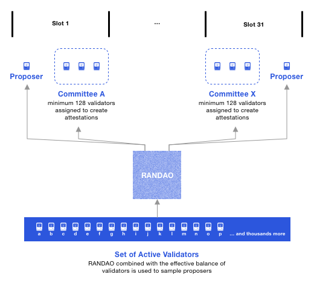
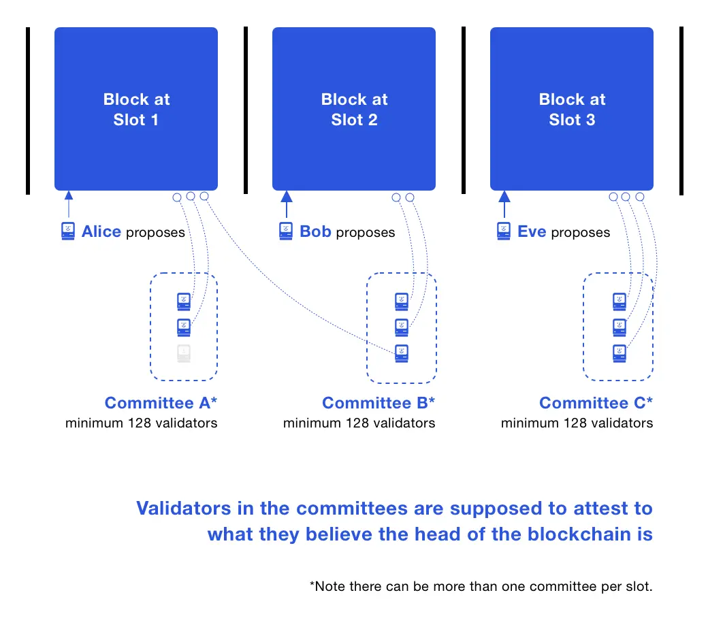
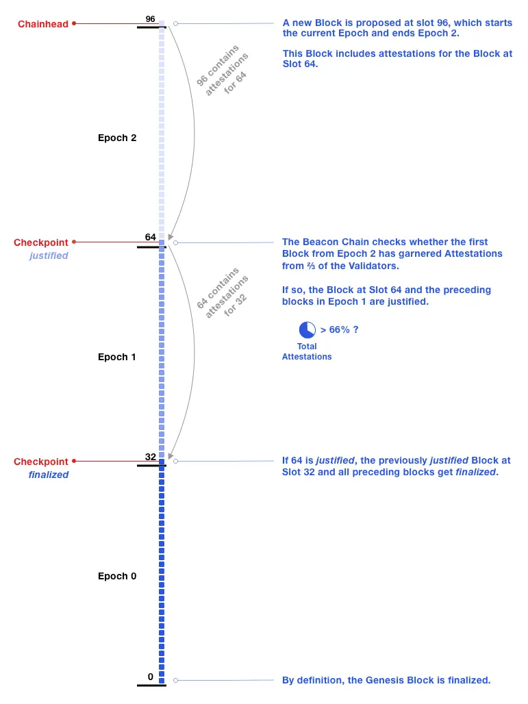
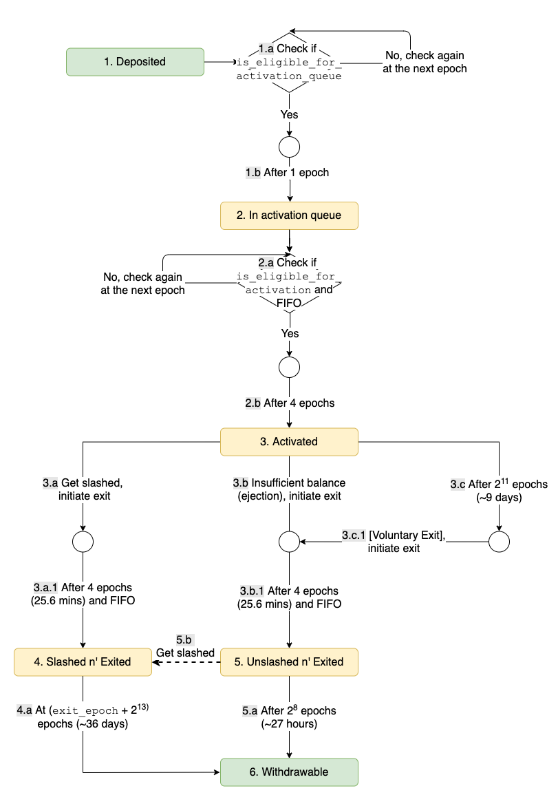

**Slots and Epochs**
--------------------
https://ethos.dev/beacon-chain

The Beacon Chain provides the heartbeat to Ethereum's consensus. Each slot is 12 seconds and an epoch is 32 slots: 6.4 minutes.

A slot is a chance for a block to be added to the Beacon Chain. Every 12 seconds, one block is added when the system is running optimally. Validators do need to be roughly [synchronized with time.](https://ethresear.ch/t/network-adjusted-timestamps/4187)

A slot is like the block time, but slots can be empty. The Beacon Chain genesis block is at Slot 0.

**Validators and Attestations**
-------------------------------

While proof-of-work is associated with miners, Ethereum's validators are proof-of-stake "virtual miners". Validators run Ethereum's consensus.

A block **proposer** is a validator that has been pseudorandomly selected to build a block.

Most of the time, validators are **attesters** that vote on blocks.  These votes are recorded in the Beacon Chain and determine the head of the Beacon Chain.

At every epoch, a validator is pseudorandomly assigned to a slot.

### Staking validators: semantics

Validators are *virtual* and are activated by stakers.  In PoW, users buy hardware to become miners. In Ethereum, users stake ETH to activate and control validators.

Validators are executed by ***validator clients*** that make use of a beacon (chain) node.  A **beacon node** has the functionality of following and reading the Beacon Chain. A validator client can implement beacon node functionality or make calls into beacon nodes. One validator client can execute many validators.

**Committees**
--------------

A committee is a group of validators.  For security, each slot has committees of at least 128 validators.  An attacker has less than a [one in a trillion](https://medium.com/@chihchengliang/minimum-committee-size-explained-67047111fa20) probability of controlling ⅔ of a committee.

The concept of a randomness beacon that emits random numbers for the public, lends its name to the Ethereum Beacon Chain. The Beacon Chain enforces consensus on a pseudorandom process called RANDAO.

At every epoch, validators are evenly divided across slots and then subdivided into committees of appropriate size. All of the validators from that slot attest to the Beacon Chain head. A shuffling algorithm scales up or down the number of committees per slot to get at least 128 validators per committee.

**Finality**
------------

When an epoch ends, if its checkpoint has garnered a ⅔ supermajority, the checkpoint gets justified.

If a checkpoint B is justified and the checkpoint in the immediate next epoch becomes justified, then B becomes finalized.  Typically, a checkpoint is finalized in two epochs, 12.8 minutes.

On average, a user transaction would be in a block in the middle of an epoch. It's half an epoch until the next checkpoint, suggesting transaction finality of 2.5 epochs: 16 minutes.  Optimally, more than ⅔ of attestations will have been included by the 22nd slot of an epoch. Thus, transaction finality is an average of 14 minutes (16+32+22 slots). Block confirmations emerge from a block's attestations, to its justification, to its finality.  Use cases can decide whether they need finality or an earlier safety threshold is sufficient.

**Beacon Chain Validator Activation and Lifecycle**
---------------------------------------------------

Each validator needs a balance of 32 ETH to get activated.  A user staking 32 ETH into a deposit contract on Ethereum mainnet, will activate one validator.

**Wrapping Up**
---------------

At every epoch, validators are evenly divided across slots and then subdivided into committees of appropriate size. Validators can only be in one slot, and in one committee. Collectively:

-   all validators in an epoch attempt to finalize the same checkpoint: FFG vote
-   all validators assigned to a slot attempt to vote on the same Beacon Chain head: LMD GHOST vote

Optimal behavior rewards validators the most.

The Beacon Chain genesis was on December 1 2020 with 21,063 validators. The number of validators can decrease with slashings or voluntary exits, or stakers can activate more. Approaching 2 years, there are over 400,000 validators.

The world's never had a scalable platform for *decentralized* systems and applications before.  If you're inspired to dive deeper, authoritative references are in [Ethereum Proof-of-Stake Consensus Specifications](https://github.com/ethereum/consensus-specs).