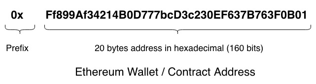
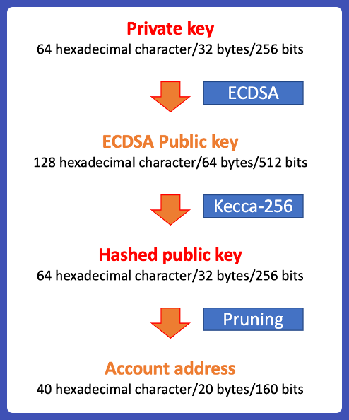

### Ethereum, Accounts, Addresses, and Private Keys

**Topics to Cover:**
1. **Private Key Generation**
2. **Deriving an Ethereum Address from the Private Key**
3. **Using the Private Key and Digital Signatures**
4. **Hardware Wallets and Their Role**
5. **MetaMask and Transaction Propagation**
6. **Technical Details**

---

### **Private Key Generation**
- **Private Key**: A private key is a randomly generated large number. This number is the fundamental security backbone of Ethereum accounts.
- **Importance**: If your private key is exposed, anyone can access your account and steal your funds.
- **Example**: In Python, you can generate a random 256-bit integer as a private key.
  
**Key points**:
- Private keys are typically 256 bits long.
- It's crucial to generate private keys securely to avoid leaks.

---

### **Deriving an Ethereum Address**
- **Process**: The Ethereum address is derived from the private key through the following steps:
    1. **Private Key to Public Key**: Apply the elliptic curve algorithm (ECDSA) to generate the public key from the private key.
    2. **Public Key to Address**: Hash the public key using Keccak-256 and take the last 20 bytes (160 bits) to form the Ethereum address.
  
**Key Information**:
- Addresses are 160 bits (20 bytes) long and represented in hexadecimal.
- The prefix "0x" is commonly added to signify that the address is in hexadecimal form.

---

### **Using Private Key and Digital Signatures**
- **Digital Signature**: You can digitally sign any data (a message or transaction) using your private key.
- **Verification**: Anyone with your public key can verify that the signature was created using your private key without knowing the private key itself.

**Important Concepts**:
- If even one bit of the data changes, the signature will no longer be valid.
- The public key is recoverable from the signature, even though it isn’t strictly included in the data.

---

### **Hardware Wallets and Their Role**
- **Hardware Wallet**: A hardware wallet like Ledger generates and stores the private key securely on the device.
- **Seed Phrase**: Instead of showing you the private key directly, the hardware wallet provides a seed phrase that can regenerate the private key.
  
**Security Advantage**:
- The private key never leaves the hardware wallet, ensuring better protection.
- The hardware wallet signs transactions and sends the signature to the computer, without exposing the private key.

---

### **MetaMask and Transaction Propagation**
- **MetaMask Role**:
    - MetaMask constructs a transaction and sends it to the hardware wallet for signing.
    - It can also generate and hold private keys locally, but this is less secure.

**Potential Issue**:
- Private keys stored locally in MetaMask are encrypted but still vulnerable to hacks.
- MetaMask should ideally only handle transaction broadcasting, not key storage.

---

### **Technical Details**
- **Address Representation**:
    - Ethereum addresses are represented in hexadecimal, 40 characters long (160 bits).
- **Private Key Size**:
    - Private keys are 256 bits long, which is why brute-forcing them is practically impossible.

---

### **Tools and Resources**
- **Etherscan**: A crucial tool for viewing transactions, balances, and account details.
    - Acts as a reliable source of truth for checking transaction statuses.
- **Ethereum Accounts**: Similar to bank accounts but with ETH, tokens, and NFTs instead of fiat currency.

**Example**:
- Vitalik.eth (Vitalik Buterin's account) is an example of an Ethereum address shown on Etherscan.

---

### **Miscellaneous Insights**
- **Ethereum Addresses**: 
    - You can generate a random hex string resembling an Ethereum address, but it only becomes "real" when a transaction or asset is linked to it on-chain.
- **Future Topics**:
    - Explanation of token balances and why they sometimes don't appear in MetaMask.

