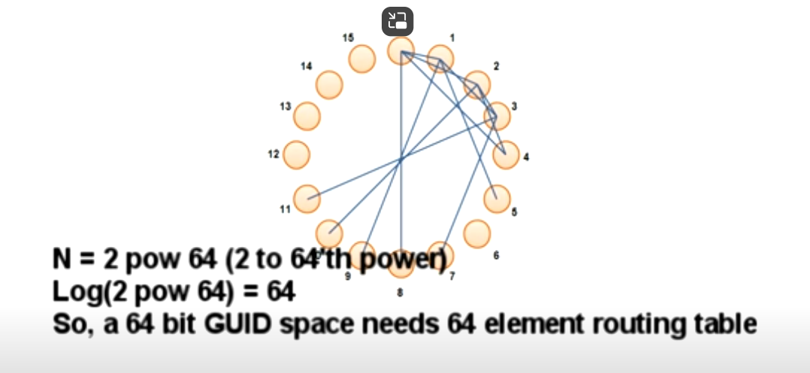

### **Examples of P2P Systems**

-   **Popular Systems**:
    -   **Kazaa**
    -   **Napster**
    -   **Gnutella**
    -   **BitTorrent**
    -   **Skype**
    -   **Hamachi (LogMeIn)**

These systems allow **thousands** or even **millions of peers (computers)** to communicate without relying on a **central server**.

* * * *

### **Communication in Peer-to-Peer Networks**

-   The challenge:
    **How do thousands or millions of peers communicate** and cooperate without a central server?

* * * *

### **Steps in Peer-to-Peer Networks**

1.  **Disorganized Network**:

    -   Start with **several thousand computers** connected to the internet.
    -   Each computer (peer) needs a mechanism to **find others**.
2.  **Assigning a Globally Unique ID (GID)**:

    -   Each peer is assigned a **GID** (Globally Unique ID).
    -   This GID helps peers **identify** and distinguish each other.
        For example:
    -   Peer 1 can communicate with **Peer 4** using their GID, ensuring that they aren't mistakenly communicating with another peer like Peer 17 or Peer 9.
3.  **Organizing Peers into a Virtual Ring**:

    -   Peers are **logically** organized into a **virtual ring** based on their GID.
    -   The organization is **virtual**, meaning **geographical location** doesn't matter.

* * * *

### **Peer Connections and Routing Tables**

-   **Subset of Peer References**:
    -   In large networks (millions of peers), each peer **cannot** have direct references to all others.
    -   Each peer maintains references to a **subset** of other peers (e.g., 10--20 peers).
    -   **Exponential Distance**:
        Peers choose references based on **exponentially increasing distances** from their own GID.
        -   Example:
            -   Peer 0 references:
                -   **Peer 1** (distance = 1)
                -   **Peer 2** (distance = 2)
                -   **Peer 4** (distance = 4)
                -   **Peer 8** (distance = 8)
        -   This distance **doubles** each time.

4.  **Handling Missing Peers**:
    -   If a peer like **Peer 4** isn't in the network, Peer 0 will select the **next closest peer**.

* * * *

### **CORD vs. Kademlia Algorithms**

-   **CORD Algorithm**:
    -   Distance between peers **wraps around** the ring.
    -   Example:
        -   Distance between Peer 9 and Peer 1 wraps around zero.
-   **Kademlia Algorithm**:
    -   Uses an **XOR** operation for distance calculation.
    -   Symmetrical distance calculation:
        The distance between Peer A and Peer B is the **same** as between Peer B and Peer A.

* * * *

### **Routing in Peer-to-Peer Networks**

1.  **CORD Network Example**:
    -   Peer Zero's references (e.g., Peer 1, Peer 2, Peer 4) calculated using **CORD's distance function**.
2.  **Kademlia Network Example**:
    -   With **XOR** distance, references are **mutual**.
    -   For example:
        -   If Peer 0 references Peer 1, then **Peer 1 also references Peer 0**.

* * * *

### **Searching for Peers in a Peer-to-Peer Network**

-   **Example: Searching for Peer 15**:

    -   Peer 0 looks for **Peer 15**.
    -   It checks its routing table and contacts **Peer 8** (closest to Peer 15).
    -   Peer 8 returns **Peer 12**, closer to Peer 15.
    -   The search continues until Peer 0 reaches **Peer 15**.
-   **Logarithmic Decline**:

    -   The distance between peers **halves** at each step, enabling **efficient searches** in large networks.

* * * *

### **Scalability of Peer-to-Peer Networks**

-   If the GID space is **64 bits**, the network can support up to **2^64 peers**.
-   Each peer would need a **routing table** with references to **64 other peers**.
-   **Doubling the number of peers** adds only **one additional reference** to each peer's routing table.

* * * *

### **Joining and Leaving the Network**

1.  **Joining**:
    -   A **boot peer** is required to introduce a new peer into the network.
    -   The new peer calculates its **ideal peers** and builds its routing table.
2.  **Leaving**:
    -   The leaving peer sends a **leave message** to all peers in its routing table, notifying them to remove it.
    -   If a peer crashes, other peers detect the failure during **routing table management**.

* * * *

### **Messages in Peer-to-Peer Networks**

1.  **Join**:
    Results in the peer receiving a GID.
2.  **Leave**:
    Peers remove the leaving peer from their routing tables.
3.  **Copy Routing Table**:
    The joining peer requests the boot peer's routing table.
4.  **Find Closest**:
    Used to search for another peer in the network.