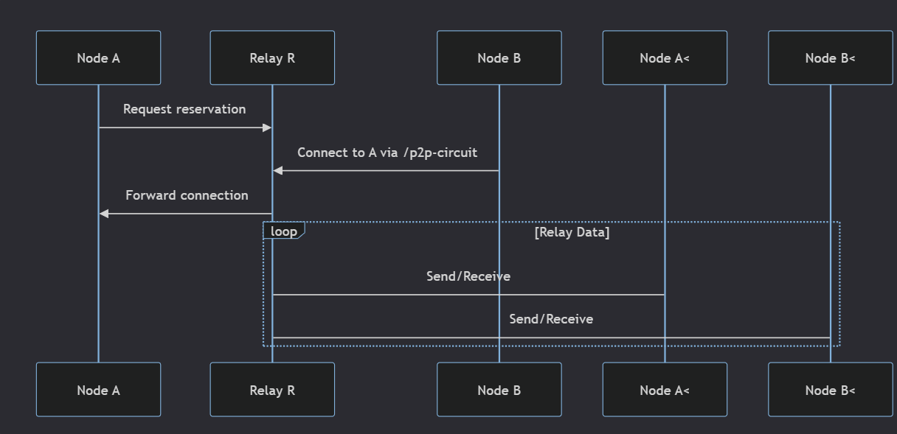

# AutoNAT in libp2p

## Overview
**AutoNAT** is a libp2p protocol that helps nodes determine if their addresses are publicly reachable, addressing NAT traversal challenges. It uses the `/libp2p/autonat/1.0.0` protocol to verify *observed addresses* provided by other peers.

## How It Works
1. **Address Verification**:
   - A node (e.g., QmAlice) sends a `DialMe` message with its presumed public address to a trusted peer (e.g., QmBob).
   - QmBob attempts to dial QmAlice’s address and responds with a `DialResponse` indicating success or failure.
2. **Confidence Scoring**:
   - Successful dials increase confidence in the address’s reachability.
   - Failed attempts decrease confidence, prompting the node to try alternative addresses.
3. **Dial-Back**:
   - Nodes periodically request dial-backs from multiple peers to confirm address reachability.
   - AutoNAT uses *exponential backoff* for retries to avoid overwhelming the network.

## Key Features
- **No Centralized Server**: Relies on other libp2p peers for validation.
- **Integration**: Works with protocols like Circuit Relay and DCUtR for robust NAT traversal.
- **Security**:
   - Encrypts messages to prevent address spoofing.
   - Limits dial-back requests to trusted peers to avoid abuse.

## Use Case
> Enables nodes behind NATs to confirm their public reachability, improving connectivity in P2P networks without manual configuration.

## Resources
- [AutoNAT Specification](https://github.com/libp2p/specs/blob/master/autonat/README.md) for detailed protocol information.


# Circuit Relay

## Overview
**Circuit Relay** enables **peer-to-peer communication** when direct connections fail due to NAT/firewalls by routing traffic through a third-party **relay peer**.  
- Peers **dial out** to relays, which maintain long-lived connections.  
- Other peers connect via `/p2p-circuit` addresses, which forward traffic to the target.  
- Inspired by **TURN** (part of ICE NAT traversal).  
- **Non-transparent**: Source, destination, and relay peer identities are visible.  

---

## Protocol Versions
- **v1** and **v2** exist; **v2 is recommended**.  
- See [specification](https://github.com/libp2p/specs) for version comparisons.  

---

## Relay Addresses
Addresses follow this structure:  
```text
<Relay Transport>/<Relay Peer ID>/p2p-circuit/p2p/<Target Peer ID>
```

### Examples
1. **Minimal**:  
   ```text
   /p2p-circuit/p2p/QmAlice
   ```  
   *Assumes discovery of a relay connected to `QmAlice`.*  

2. **Explicit Relay**:  
   ```text
   /p2p/QmRelay/p2p-circuit/p2p/QmAlice
   ```  
   *Requires prior knowledge of how to reach `QmRelay`.*  

3. **Full Transport Path**:  
   ```text
   /ip4/198.51.100.0/tcp/55555/p2p/QmRelay/p2p-circuit/p2p/QmAlice
   ```  
   *Includes relay transport details for direct connection.*  

---

## Process
1. **Node A** (behind NAT) requests a reservation from **Relay R**.  
2. **Node B** connects to **Relay R** with a request to relay to `A`.  
3. **Relay R** forwards the connection to **Node A**.  
4. **Data** is relayed between `A` and `B` via `R`.  

