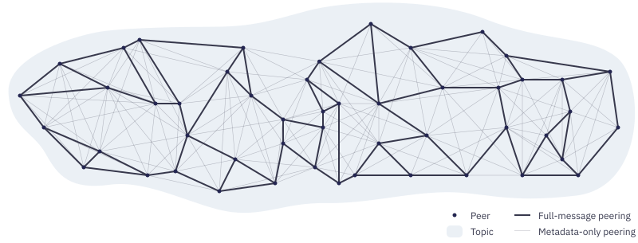

https://docs.libp2p.io/concepts/pubsub/overview/

---

### Q: *What is Publish/Subscribe in libp2p?*

**A:** It's a messaging system where peers *subscribe* to topics and *publish* messages; each message is delivered to all subscribed peers .

---

## **Example Use Cases**

### Q: *Give real-world examples of pub/sub usage.*

**A:**

* **Chat rooms**: each room = topic; posting sends to everyone in that room.
* **File sharing**: topics represent files; peers publish piece availability and coordinate downloads outside the system 

---

## **Design Goals**

### Q: *What properties are desirable in p2p pub/sub systems?*

**A:**

1. **Reliability**: all subscriber messages delivered
2. **Speed**: low latency
3. **Efficiency**: minimal duplicates
4. **Resilience**: peers can join/leave without disruption
5. **Decentralization**: no central point of failure
6. **Scale**: supports many subscribers and high throughput
7. **Simplicity**: small state per peer ([docs.libp2p.io][1]).

### Q: *Which design does libp2p use?*

**A:** Uses **gossipsub**: peers gossip recently seen messages and maintain an efficient delivery network .

---

## **Peer Discovery**

### Q: *How do peers find other pub/sub peers?*

**A:** The pub/sub framework relies on the app to discover peers (ambient discovery), e.g., DHT, local broadcasts, trackers, bootstrap lists; these peers are contacted and, if supporting pub/sub, added .

---

## **Peering Types**

### Q: *What are “full-message peerings” vs. “metadata-only peerings”?*

**A:**

* **Full-message**: sparse mesh, forwards full messages to few peers (ideal D = 6; acceptable 4–12). Efficient but limited duplicates.
* **Metadata-only**: dense network that gossips message IDs and supports mesh maintenance 

---

## **Grafting & Pruning**

### Q: *What are "grafting" and "pruning" in gossipsub?*

**A:**

* **Grafting**: upgrading a metadata-only connection to full-message when below mesh size.
* **Pruning**: downgrading full-message connections when above mesh size.
  Peers run a **heartbeat** every second, performing graft/prune steps

---

## **Subscriptions**

### Q: *How do peers track subscriptions?*

**A:** On connection, peers exchange their subscribed topics. Later, subscribe/unsubscribe messages propagate to all connected peers, regardless of their subscription status .

### Q: *How are subscriptions related to graft/prune?*

**A:** When subscribing, peers graft selected peers to full-message and send subscribe messages simultaneously. On unsubscription, they prune those peers and send unsubscribe .

---

## **Publishing & Forwarding Messages**

### Q: *Describe message sending/forwarding.*

**A:**

* **Publish**: sender sends to all full-message peers
* **Forward**: receivers send to their full-message peers
* Nodes store recently seen messages to avoid duplicates and optionally validate content (e.g., chat length <100 chars); invalid messages are dropped .

### Q: *What's the router concept in gossipsub?*

**A:** Every peer acts as a **router**, passing messages through the mesh .

---

## **Gossip**

### Q: *How does gossipsub gossip work?*

**A:** Every second, peers choose six random metadata-only peers and send them **IHAVE** messages (list of recent message IDs). If peers detect missing messages, they request them with **IWANT** .

---

## **Fan-out Mechanism**

### Q: *What is “fan-out”?*

**A:** Allows publishing to topics without being subscribed. First message: peer randomly picks 6 subscribers ("fan-out peers") and stores them. Each new message is sent to those peers. If peers leave, pick replacements. After 2 minutes of inactivity, fan-out list resets .

### Q: *What happens to fan-out peers on subscription?*

**A:** If you subscribe and have fan-out peers, they are preferred for full-message peering .

---

## **Network Packet Structure**

### Q: *How are messages encoded over the network?*

**A:** Libp2p batches different message types (app messages, IHAVE/IWANT, subscribe/unsubscribe, graft/prune) into a single packet. Protocol Buffers define the schema .

---

## **Per-Peer State**

### Q: *What state must each peer maintain?*

**A:** (`from remaining page`)

* For each topic: mesh peers, fan-out peers, subscription status
* Recently seen messages
* Gossip history
* Metadata-only peers
* Subscribe/unsubscribe pending
* Graft/prune scheduling
* Fan-out timers

*(Note: actual list structure from source)*

---

## **Glossary Reference**

### Q: *How is “pubsub” defined in libp2p glossary?*

**A:** As “publish/subscribe”, a pattern where participants subscribe to topics and publishers publish to topics; libp2p defines a spec with multiple language implementations

---

## **Interrelated Concepts**

### Q: *How does rendezvous protocols complement pub/sub?*

**A:** Rendezvous helps bootstrap pub/sub by discovering peers subscribed to topics. PubSub can even build rendezvous services via federated gossip .

----------

