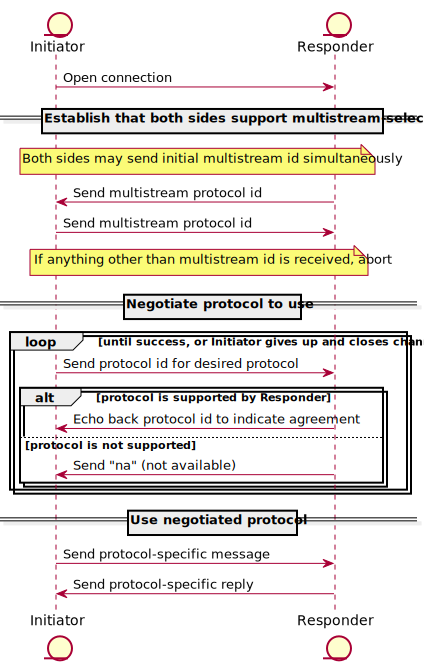

libp2p uses a protocol called multistream-select for protocol negotiation. Below
we cover the basics of multistream-select and its use in libp2p. For more
details, see [the multistream-select repository][mss].

Before engaging in the multistream-select negotiation process, it is assumed
that the peers have already established a bidirectional communication channel,
which may or may not have the security and multiplexing capabilities of a libp2p
connection. If those capabilities are missing, multistream-select is used in the
[connection upgrade process](#upgrading-connections) to determine how to provide
them.

Messages are sent encoded as UTF-8 byte strings, and they are always followed by
a `\n` newline character. Each message is also prefixed with its length in bytes
(including the newline), encoded as an unsigned variable-length integer
according to the rules of the [multiformats unsigned varint spec][uvarint].

For example, the string `"na"` is sent as the following bytes (shown here in
hex):

```
0x036e610a
```
The first byte is the varint-encoded length (`0x03`), followed by `na` (`0x6e 0x61`),
then the newline (`0x0a`).


The basic multistream-select interaction flow looks like this:



Let's walk through the diagram above. The peer initiating the connection is
called the **Initiator**, and the peer accepting the connection is the
**Responder**.

The Initiator first opens a channel to the Responder. This channel could either be a
new connection or a new stream multiplexed over an existing connection.

Next, both peers will send the multistream protocol id to establish that they
want to use multistream-select. Both sides may send the initial multistream
protocol id simultaneously, without waiting to receive data from the other side.
If either side receives anything other than the multistream protocol id as the
first message, they abort the negotiation process.

Once both peers have agreed to use multistream-select, the Initiator sends the
protocol id for the protocol they would like to use. If the Responder supports
that protocol, it will respond by echoing back the protocol id, which signals
agreement. If the protocol is not supported, the Responder will respond with the
string `"na"` to indicate that the requested protocol is Not Available.

If the peers agree on a protocol, multistream-select's job is done, and future
traffic over the channel will adhere to the rules of the agreed-upon protocol.

If a peer receives a `"na"` response to a proposed protocol id, they can either
try again with a different protocol id or close the channel.