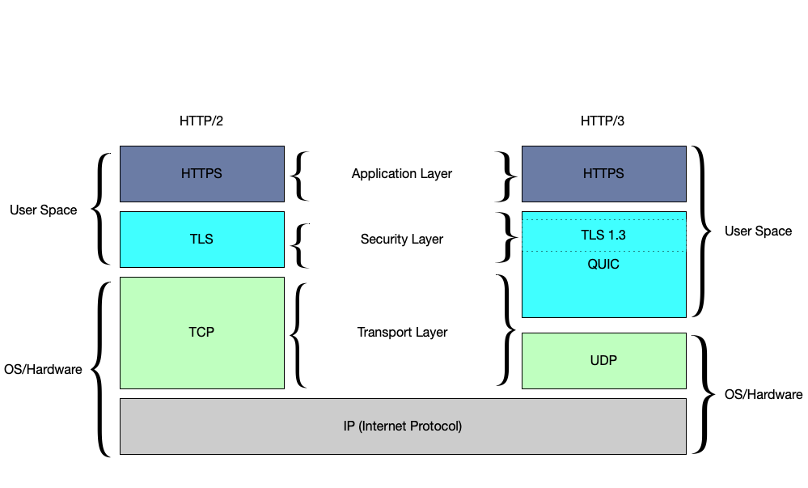

What is QUIC? 
--------------

QUIC is a new transport protocol that provides an always-encrypted, stream-multiplexed connection built on top of UDP. It started as an experiment by Google between Google services and Chrome in 2014, and was later standardized by the IETF in [RFC 9000](https://datatracker.ietf.org/doc/html/rfc9000), [RFC 9001](https://datatracker.ietf.org/doc/html/rfc9001), and [RFC 9002](https://datatracker.ietf.org/doc/html/rfc9002).

### Key challenges with TCP 

1.  Head-of-line blocking (HoL blocking): TCP is a single byte stream exposed by the kernel, so streams layered on top of TCP experience head-of-line (HoL) blocking.

    💡
    In TCP, head-of-line blocking occurs when a single packet is lost, and packets delivered after that need to wait in the kernel buffer until a retransmission for the lost packet is received.

2.  Ossification: Because the header of TCP packet is not encrypted, middleboxes can inspect and modify TCP header fields and may break unexpectedly when they encounter anything they don't understand. This makes it practically impossible to deploy any changes to the TCP protocol that change the wire format.

3.  Handshake inefficiency: TCP spends one network round-trip (RTT) on verifying the client's address. Only after this can TLS start the cryptographic handshake, consuming another RTT. Setting up an encrypted connection therefore always takes 2 RTTs.

QUIC was designed with the following goals in mind:

-   Making the transport layer aware of streams, so that packet loss doesn't cause HoL blocking between streams.
-   Reducing the latency of connection establishment to a single RTT for new connections, and to allow sending of 0 RTT application data for resumed connections.
-   Encrypting as much as possible. This eliminates the ossification risk, as middleboxes aren't able to read any encrypted fields. This allows future evolution of the protocol.

### Comparing HTTP/2 and HTTP/3 

In addition to defining the QUIC transport, the IETF also standardized a new version of HTTP that runs on top of QUIC: HTTP/3 ( [RFC 9114](https://datatracker.ietf.org/doc/html/rfc9114)). HTTP/3 combines the advantages of the existing transfer protocols HTTP/2 and HTTP over QUIC in one standard for faster and more stable data transmission.

A web browser connection typically entails the following **(TCP+TLS+HTTP/2)**:

1.  Transport layer: TCP runs on top of the IP layer to provide a reliable byte stream.
    -   TCP provides a reliable, bidirectional connection between two end systems.
2.  Security layer: A TLS handshake runs on top of TCP to establish an encrypted and authenticated connection.
    -   Standard TLS over TCP requires 3 RTT. A typical TLS 1.3 handshake takes 1 RTT.
3.  Application layer: HTTP runs on a secure transport connection to transfer information and applies a stream muxer to serve multiple requests.
    -   Application data starts to flow.

In contrast, HTTP/3 runs over [QUIC](https://docs.libp2p.io/concepts/transports/quic/#what-is-quic), where QUIC is similar to TCP+TLS+HTTP/2 and runs over UDP. Building on UDP allows HTTP/3 to bypass the challenges found in TCP and use all the advantages of HTTP/2 and HTTP over QUIC.