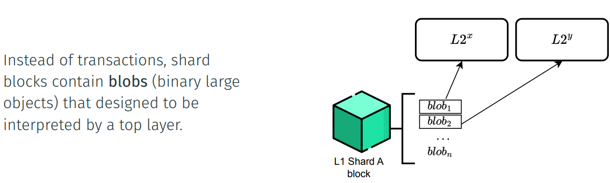
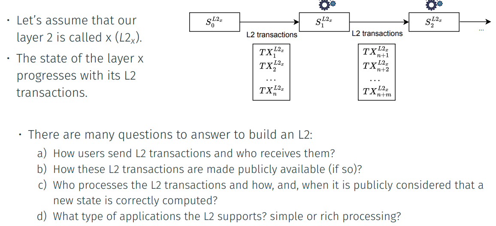

## Data Availability Sharding and a Single Execution Layer

New top layers, called L2 layers, can be created on top of this L1 machinery. 

 L2’s define how they manage the state: 

- A payment system with simple transactions. 

- A token transfer system. 

- A system with smart contracts. 

 L2’s also define how they use L1: 

- The L1 execution layer. 

- The data shards (when available1 )

Q. How are L2 transactions made **publicly** available (if so)?

· To achieve L2 data availability in Ethereum, currently, we can proceed in two ways:
· As a **validium** in which L2 data is managed by a group of trusted entities (data
managers), being this approach far cheaper than writing to L1.
. As a **rollup**, which writes L2 data in the public L1 Execution layer, meaning that the posted
data will be publicly available.
. In the future, with the introduction of the **EIP-4844**, a third option opens up with
data shards.