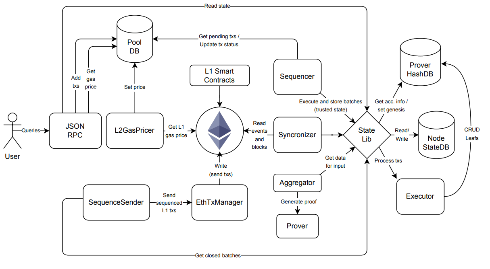

Basic zkEVM L2 Processing (Simplified Flow)

1.	The user creates a standard Ethereum transaction for the L2 (e.g. using the metamask wallet) and, sends it to the JSON RPC API of the node, which is an almost standard Ethereum JSON RPC with some extra endpoints.
2.	The JSON RPC stores the received L2 transactions in the pool database of pending L2 transactions.
3.	The sequencer creates (closes) a batch by selecting L2 transactions from the pool (with some criteria).
4.	The sequencer stores the data of the new batch in the node's StateDB.
5.	The prover queries the node's StateDB to read the data of the new batches to be proved.
6.	The prover also reads the HashDB to obtain the necessary data to proof the current L2 state (root of the L2 state and hashes for Merkle proofs).
7.	The prover generates the proof and stores it with its related data in the node’s StateDB.

8.	The sequencesender reads the node's StateDB checking for any new proved batches.
9.	The sequencesender decides when it is the best moment to create and send the LI transaction with the proof to the L1 zkEVM smart contract. The sequencesender sends the transaction through the **EthTxManager**. The EthTxManager uses an LI Ethereum node to do so (e.g. geth/prysm) and it makes sure that the transaction is included in a block (managing the LI gas fees if necessary).
10.	The L1 zkEVM smart contract processes the transaction and, if the proof is correctly verified, updates and stores the new L2 state.
11.	Finally, the synchronizer, who is monitoring events of the L1 zkEVM smart contract realizes that a new batch is consolidated and stores this information in the node's StateDB.

•	Each component in a box can be instantiated in an isolated executable.
•	The State library is imported by components (is not instantiated).
•	While the JSON RPC is devoted to external communication, the component internal communication takes place using two types of interfaces:
•	gRPCAPIs.
•	Postgre APIs with the databases.
•	However, many components are built together into a single executable that can be configured as desired when started.
•	Finally, remark that the databases can be built as databases in a single Postgre server or they can be split as desired in multiple PostgreSQL servers.