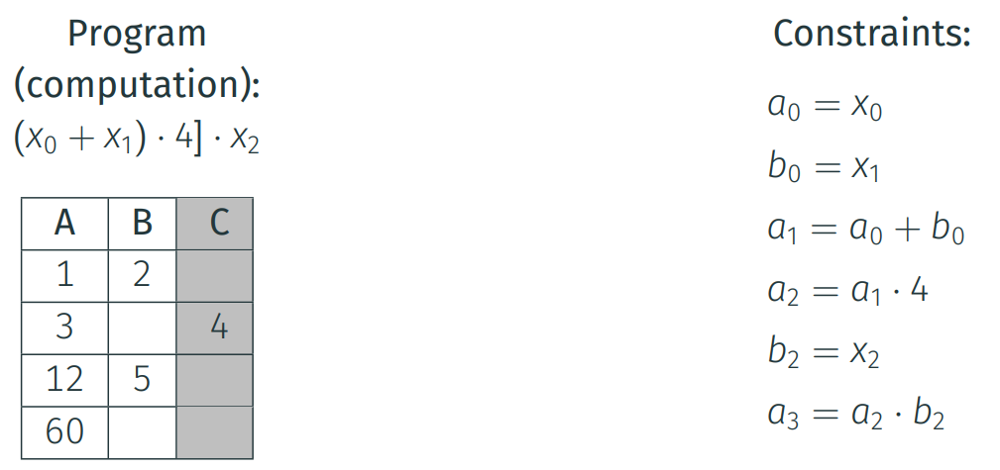
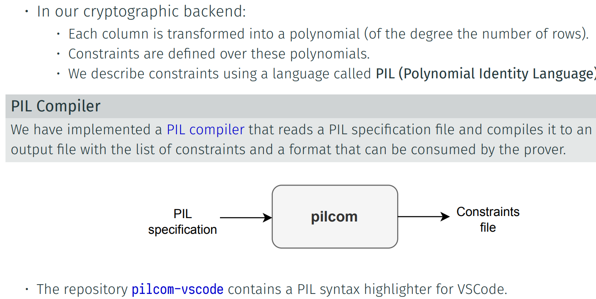
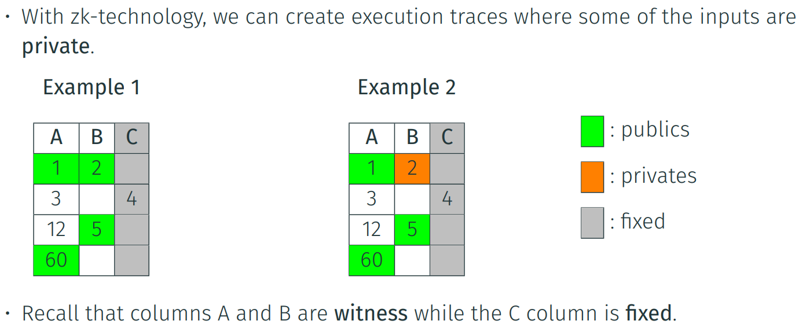
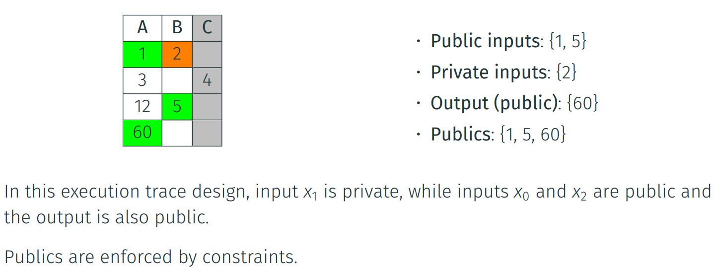
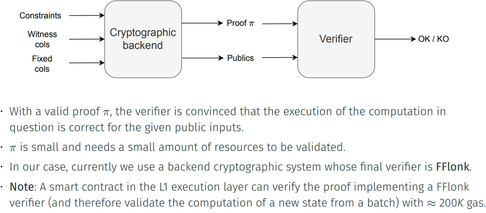
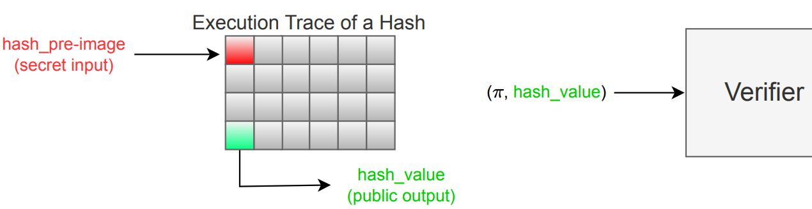

The execution correctness is enforced by a set of constraints that must be fulfilled by the
execution trace:

## The PIL Language and its Compiler

Publics and Privates

Generating and Verifying Proofs

### Example of Usage of a Private Input

A typical example of using a private input is to prove the knowledge of the pre-image of a
hash without revealing this pre-image value:

