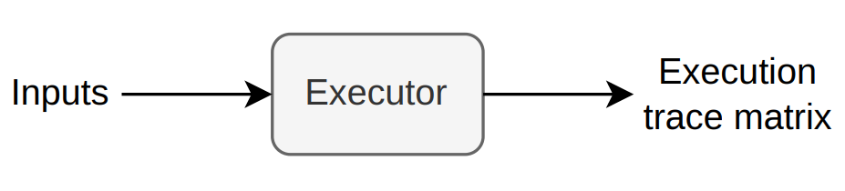
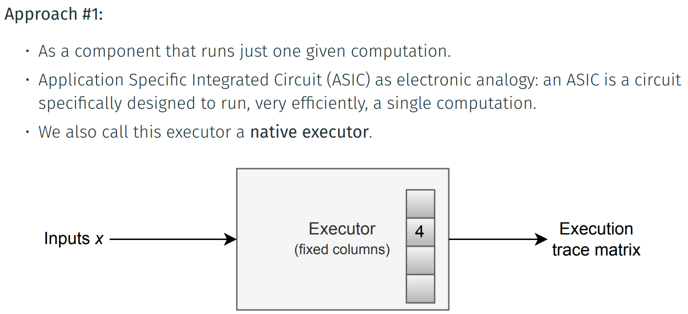
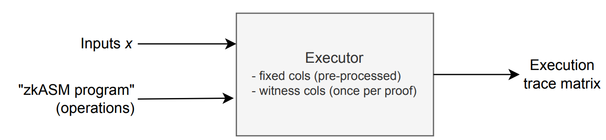
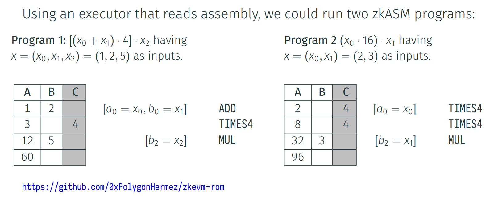
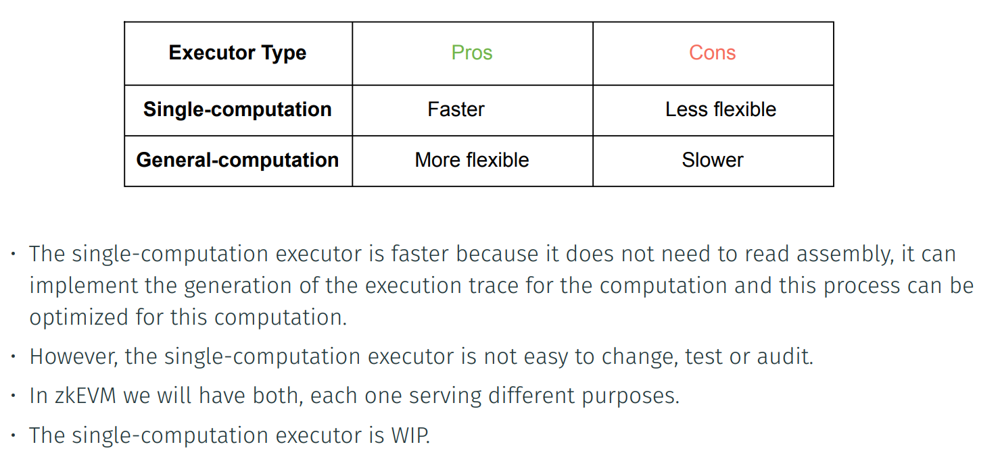

The ”Executor” is a component whose main purpose is to generate a (correct) execution
trace from a given set of inputs.

Approach #2:

• As a general purpose processor, which means as a component that can run several
computations or ”programs”.

• In this case, the executor is as follows:

Example of an Executor that Reads Assembly Programs

Single-computation vs General-computation Executor

