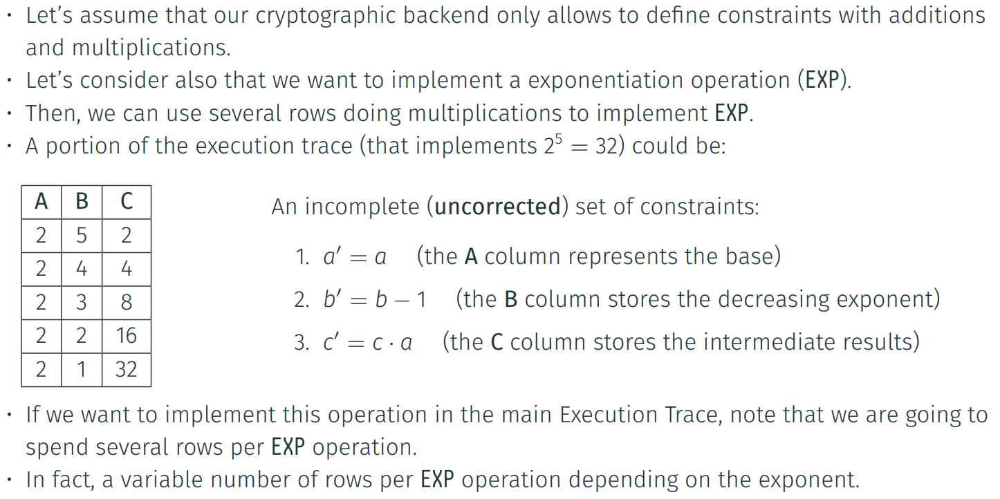
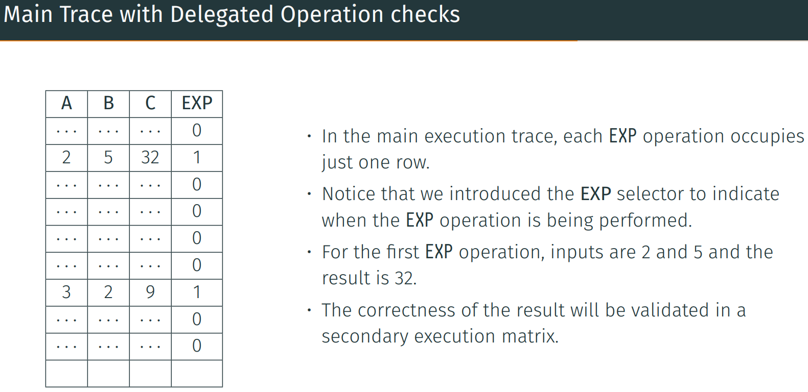
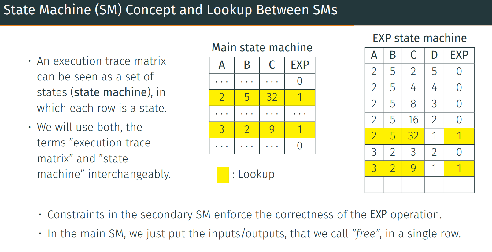

## Secondary Execution Trace Matrices and Lookup Arguments
•	The previous approach leads to a very complicated set of constraints together with a huge amount of consumed rows by operations, which is quite an unwanted scenario.
•	Another approach is to use tailor-made secondary execution traces for specific operation(s):
•	In this approach, there is a main execution trace and there are also secondary execution traces.
•	In the cryptographic back-end, we use a mechanism called lookup argument to link these execution trace matrices.
•	In particular, the lookup argument provides the constraints necessary to check that certain cells of a row in an execution trace matrix match other cells in a row of another execution trace matrix.
• So, another approach for our EXP operation is to implement it in a secondary execution trace matrix and link the main execution trace with the secondary trace with a lookup argument.

