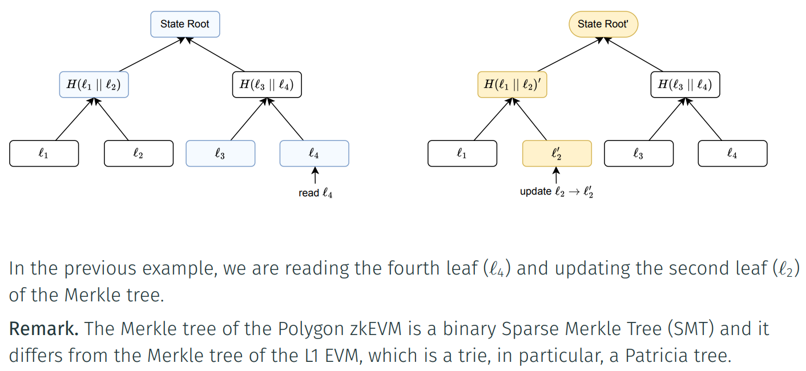
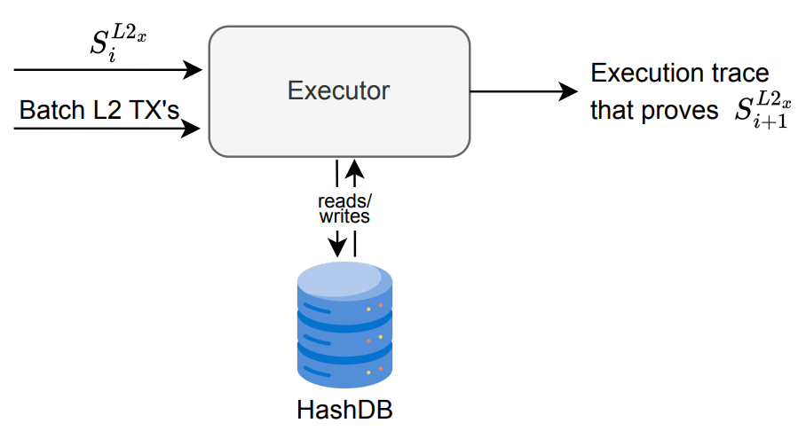

## Updating the State
•	Recall that the zkEVM ROM is zkASM program designed to prove the computations for stating correct L2 State transitions given a batch of L2 transactions.
-	We might use several zkASM instructions to implement a single zkEVM opcode (in fact, this this happens most of the times).
-	Recall that the L2 State:
1.	Is stored as a Merkle Tree.
2. The root (called State Root) of the tree is used as a cryptographic summary of the current state data.
- Hence, the ROM needs to have a way to correctly perform CRUD (Create, Read, Update and Delete) operations on the Merkle Tree representing the current state.

## Storage State Machine i

In the zkEVM, we have implemented a secondary State Machine called the Storage State
Machine that is devoted to generate the execution trace that proves L2 data state
creation, read, update and delete:

. Each time we need to read a value from the tree it is required to obtain a set of
nodes of the tree called the Merkle proof to assure that the read state value is
correct.

. Each operation that modifies the tree requires to proof that the tree modification is
correctly performed.

After processing the last L2 transaction of the batch, the remaining root will be the new
state root.

Storage State Machine ii

Storing the State: HashDB

•	All the hashes (nodes) of the Merkle tree of the L2 state are stored in a database called prover HashDB or HashDB for short.
•	The executor, when performing operations of the Storage State Machine, needs to read and write the HashDB to create appropriate execution trace that proves the L2 state reads and writes.

