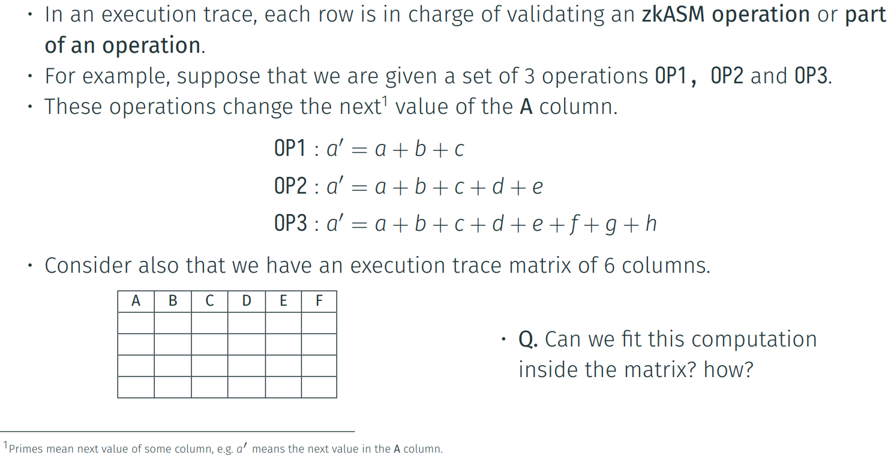
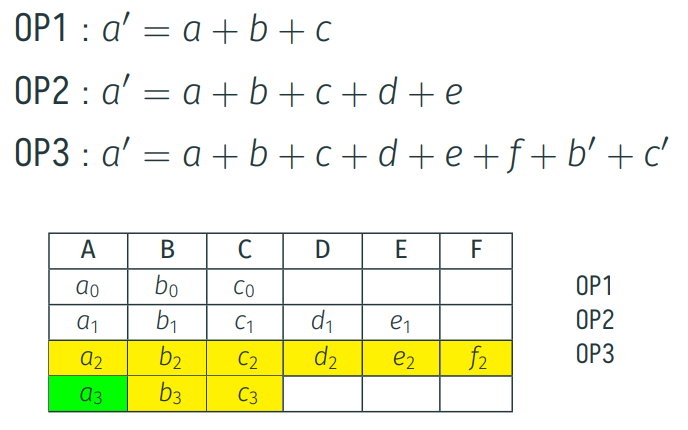
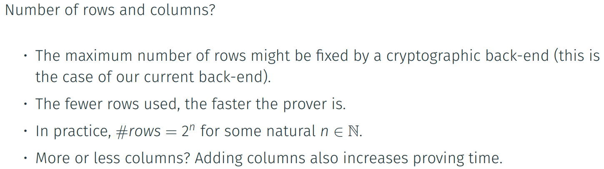
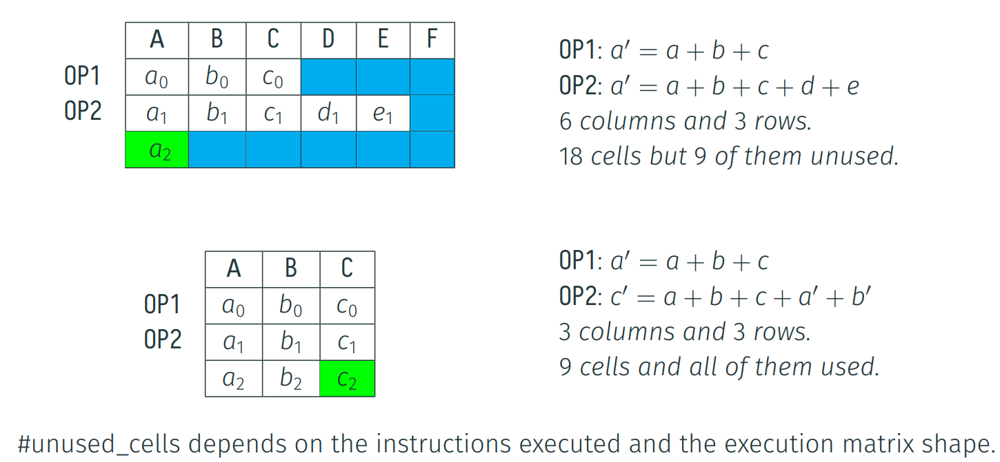

· We can adopt two straightforward strategies:
a) Increasing the number of columns so that we can fit every summand.

b) Use the next row in order to fit some of the remaining summands of the operation.

. Using the second approach, we can define an execution matrix in which 0P3 uses two
rows:

Selector Columns
