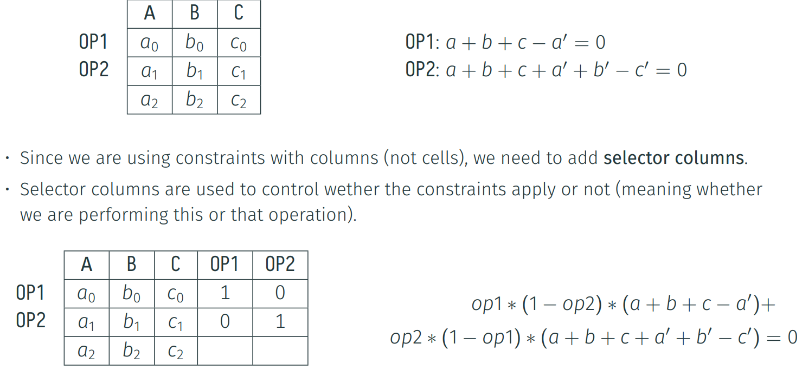
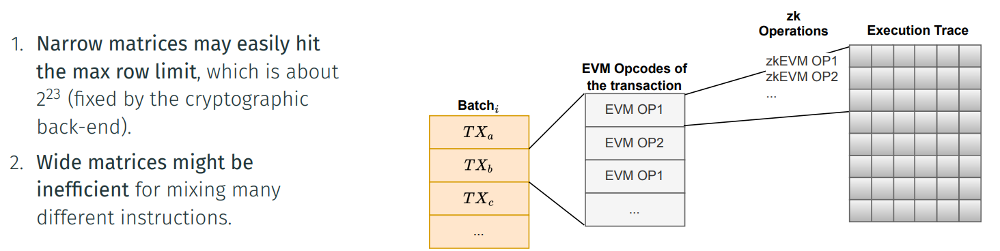

· We can adopt two straightforward strategies:
a) Increasing the number of columns so that we can fit every summand.

b) Use the next row in order to fit some of the remaining summands of the operation.

. Using the second approach, we can define an execution matrix in which 0P3 uses two
rows:

Selector Columns

The Execution Trace and the zkEVM

- In our current cryptographic backend, we have a shape that is pre-fixed for the execution trace.
- Also, we don't know exactly what EVM opcodes (and as a consequence zkEVM operations) will
be executed, since this depends on the particular transactions of the L2 batch.
- The pre-fixed shape fixes in turn the amount of computation that we can do, which in our case
is the amount and type of L2 transactions for which we can generate a proof.
- In general, it is hard to optimize the shape of a single execution trace matrix:

