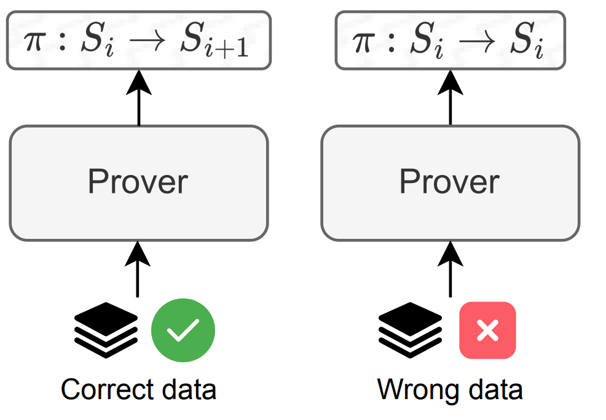
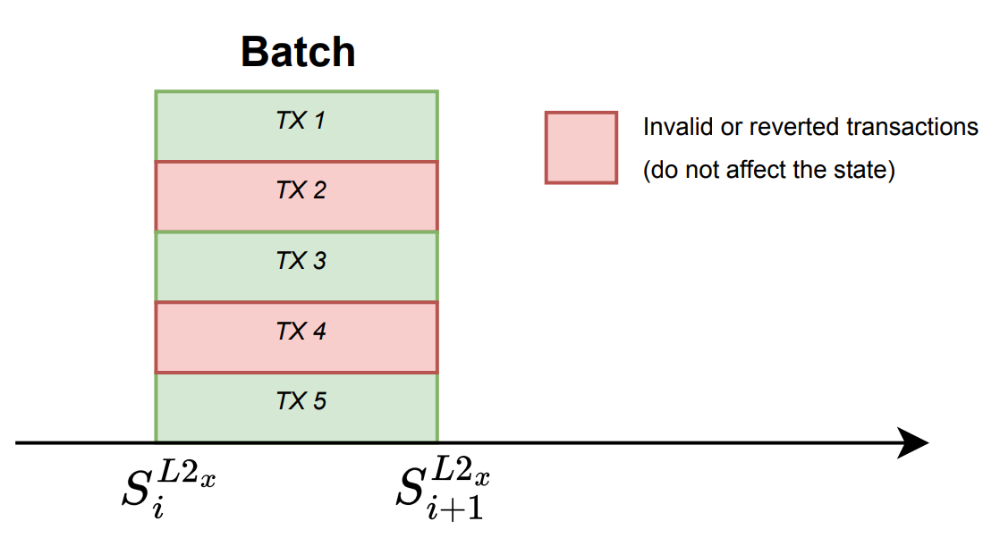
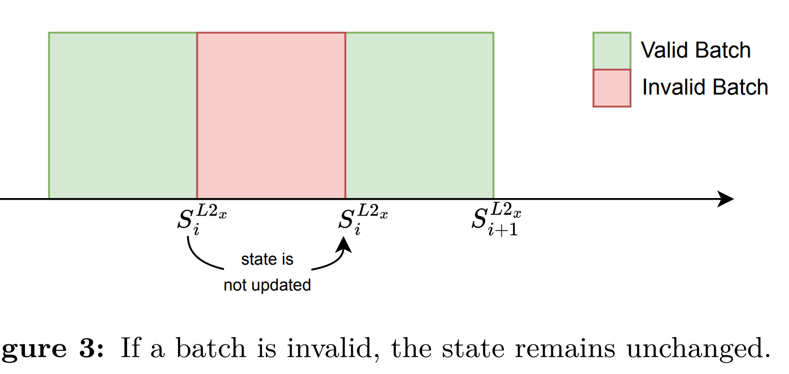
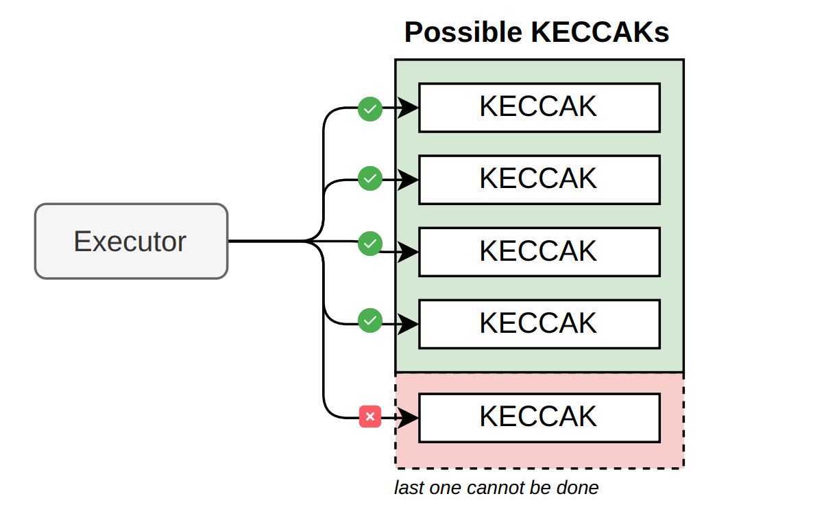
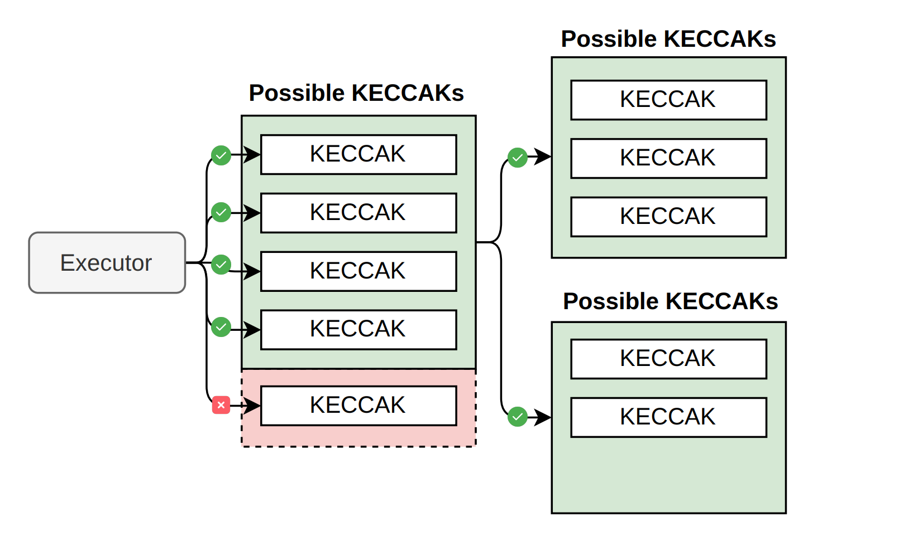
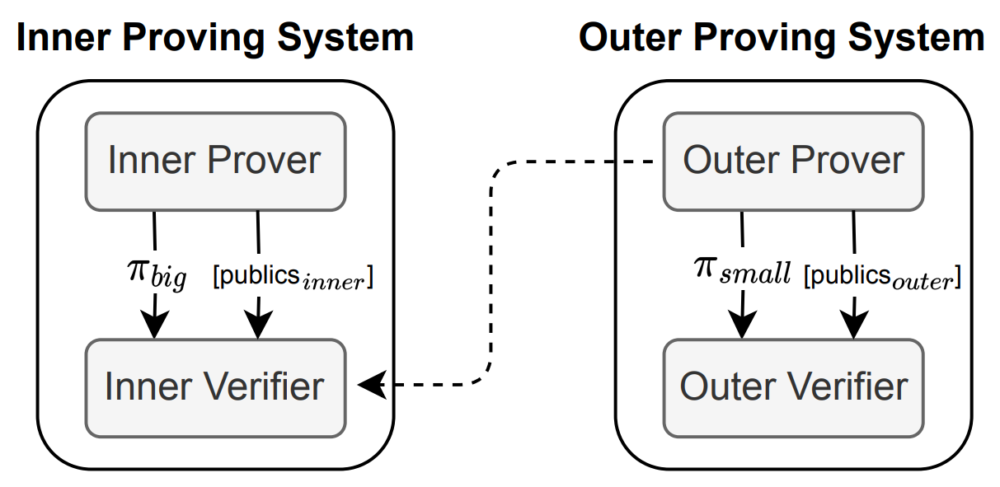

## Aggregator
the **Aggregator** is in charge of gluing several proofs stating
batch correct execution into a single one. This glued proof ensures that if it is correct,
then all the individual proofs for each batch are also accurate. The mechanisms used by
the Aggregator in order to generate such a aggregated proof are known as **proof recursion** and **proof aggregation**. 
This approach of aggregating proofs aims to **increase** the
throughput of the system. We will give some insights on how both mechanisms work.
In this document, we will also discuss topics such as the “prove anything” paradigm,
a mechanism that allows the proof of any input, regardless of whether it is **erroneous**. In
the case of an **invalid input**, instead of proving a state change, a no state change will
be proven. We will also explore zkCounters, which are a mechanism we use to prevent
our batch from fitting into the available execution traces in the system. In the event of
exceeding such length limits, an out of counters (OCC) error will occur. To conclude, we
will discuss how to eliminate zkCounters in the future by implementing a method known
as **Variable Degree Composite Proofs** (VADCOPs).

## “Prove Anything” Paradigm

To address the potential threat of byzantine (i.e., **malicious**) sequencers, we adhere to
the “prove anything’ ’ paradigm. Under this approach, the prover possesses the capability
to generate a proof of execution for any input data. The only condition is that the batch
must maintain a bounded amount of data, a requirement enforced by the smart contract
during the sequencing process. The batch execution is carried out for any input data,
resulting in the generation of a proof that either confirms a state change for correct
input data or no state change for wrong input data, as we can observe in Figure 1.
This strategy ensures robust validation of the execution outcomes, providing a reliable
mechanism to handle potential malicious behavior

## Invalid Transactions
Below we describe some errors in transactions that will cause the state to remain unchanged, as shown in **Figure 2**.

- **Reverted transaction:** A transaction may revert during execution due to many reasons such as running out of gas, having a stack that is too large, or encountering a revert call in the code. This is a common scenario in EVM processing.
- **Invalid intrinsic transaction:** It is a transaction that is unable to be processed and has no impact on the current state. Keep in mind that this transaction could have implications on network resources.

be part of a virtual batch. Example of errors in this scenario are: incorrect nonce,
insufficient balance, etc. Our trusted sequencer is unlikely to input an incorrect
nonce. However, any member of the community can submit a batch, which may
result in an error

### Invalid Batches
Errors might also occur at the batch level. Below we describe some problems in batches that will cause the state to remain unchanged, as shown in **Figure 3**.

- **Invalid Data.** We are unable to decode (RLP-encoded) transactions, so we have garbage input.

- **Prover resources exhaustion.** The zkEVM manages this via row counters, also known as zkCounters. The batch cannot be processed due to running out of counters.

Figure 3 shows that when a batch processing fails, the state remains unchanged
Si+1 = Si and a proof of this lack of state change is produced. This occurrence should be
infrequent yet it is possible.
The prove anything approach allows us to implement an anti-censorship measure **called
forced batches.** Using these approach, an user can take the role of a sequencer for getting
its L2 transactions into the **virtual state** in case the trusted sequencer is not doing so. The
main use case is to allow a user to send bridge transactions in order to withdraw assets
from L2 without the risk of censorship (which will make it impossible to withdraw the
funds). Since it is an (untrusted) user who is sending the L2 batch data, we must be sure
that we can prove anything that the user sends. The forced batches mechanism will be
explained later on (when describing the different security measures implemented in the
zkEVM).
The “prove anything” method enables the implementation of an anti-censorship measure known as forced batches. By using this method, A user may operate as a sequencer
by shifting its L2 transactions to the virtual state in case the trusted sequencer don’t sequence it. The main goal is to allow a user to submit **bridge transactions **to withdraw assets from L2 without the risk of being censored by the trusted sequencer, thereby preventing the withdrawal of user funds from the network. Take into account that we must
authenticate all information provided by the untrusted actor sending the L2 batch data.
The forced batches technique will be explained in the part that covers the security mechanisms incorporated into the zkEVM.

## zkCounters
After addressing counters before, it is crucial to highlight their significance. Counters are
used to monitor the row count in each State Machine, including the Main SM, during the
execution of a particular batch.
The management of these counters is incorporated inside the computation process. By
doing so, when the computation uses up all its assigned resources while generating the
proof, the system is able to proof that a batch does not cause a change in the state. This
issue is referred to as a **Out Of Counters** (OOC) error. This error is very specific to
our zkEVM State Machine-like design, because of having fixed number of rows. Figure 4
shows an out of counters situation.
Although at the present there exists this backend limitation in the proving system that
forces execution traces for all the States Machines to have the same amount of rows, it
is expected to be removed with the forthcoming introduction of **VADCOPs**: Variable
Degree Composite Proofs. Currently in development, VADCOPs will provide the capability to partition a large State Machine, originally comprising a high amount of rows,
into smaller execution traces with fewer rows. This will offer several advantages, with
the most notable one being the elimination of zkCounters for prover’s resource management. The main idea for VADCOPs is depicted in Figure 5. The ongoing development
of VADCOPs includes a rewriting of both the cryptographic backend and the constraint
language, which will be called **PIL2**

Figure 4: Out of counters error. Consider a scenario where our Keccak arithmetization permits only up to 4 Keccak operations before exhausting the available rows. An out of counters error will occur if the transaction involves invoking 5 (or more) Keccaks

## Discussing the Proof
The preceding section introduced VADCOPs. The concept of VADCOPs suggests that we
can somehow aggregate proofs together. This allows verification to be performed only once,
albeit with more effort on the prover’s part. However, this scenario is of interest to us as
it enables the aggregation of multiple proofs for different batches, creating a single unified
proof that enables the verification of various batches simultaneously, ensuring the correct execution of all of them at once, incrementing the throughput of the system. There are
two interesting techniques in this direction: proof recursion and proof aggregation.

Figure 5: Example of VADCOPs with KECCAKs. In this scenario, it becomes feasible to
execute 5 Keccak operations despite the limit being 4 due to the State Machine’s length. At a
high level, the solution involves splitting the proof into two parts, each containing fewer rows,
and then aggregating them to demonstrate the execution of 5 Keccak operations.

## Proof Recursion
**Recursion (also called compression)** in proof systems enables the prover to transition
from large, time-consuming proofs to smaller, quicker-to-verify proofs. Essentially, the
prover of the next stage proofs that the verification of the previous stage is correctly
performed. In general, by the succinctness property of **SNARKs**, this makes the final
proofs smaller and faster to verify. Notice that we can also change the set of public
values from one stage to the next one. The diagram shown in Figure 6 illustrates the
core principle of proof recursion. This graphic representation highlights the efficiency
improvements obtained through proof recursion, where each next proof is optimized in
size compared to the previous one.

Illustration of Proof Recursion. The Outer Prover is responsible for proving the correct
verification of the proof πbig, reducing the size of the proof due to the succinctness property of
SNARKs, which dictates that the verification time should way less than the proving time.

## Illustration of Proof Recursion. 
The Outer Prover is responsible for proving the correct
verification of the proof πbig, reducing the size of the proof due to the succinctness property of
SNARKs, which dictates that the verification time should way less than the proving time.