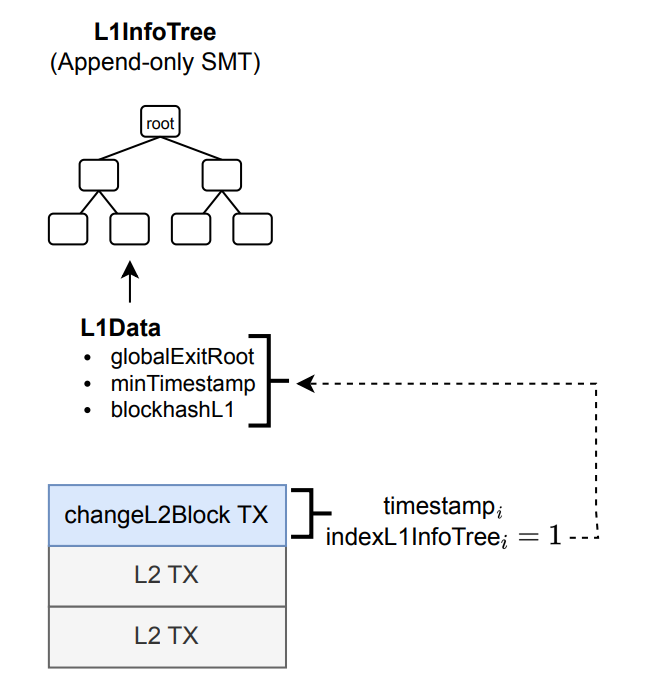
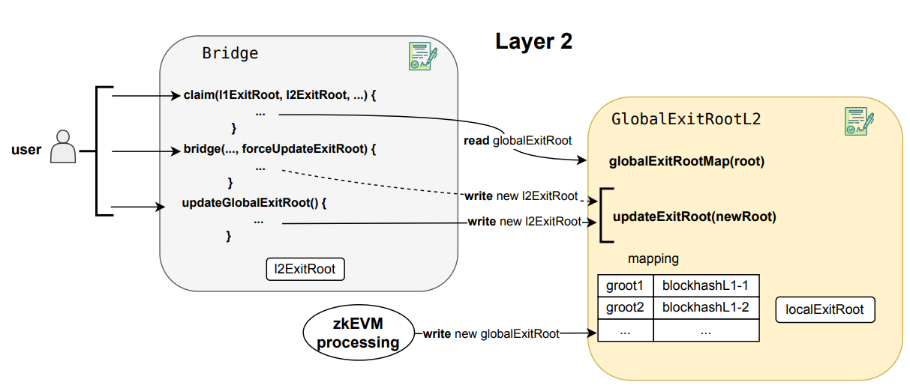
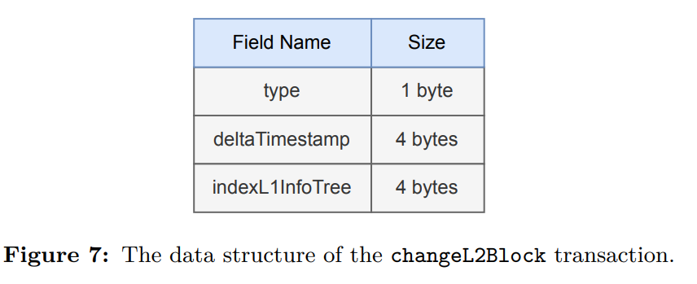
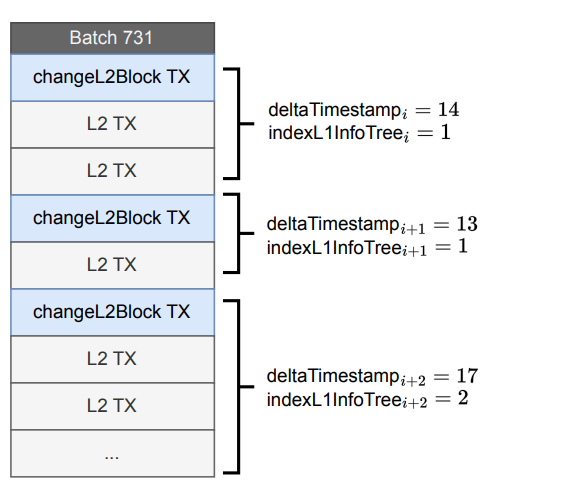
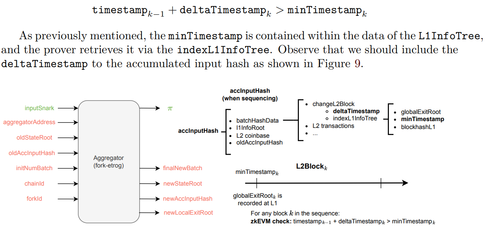
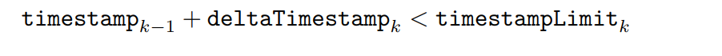
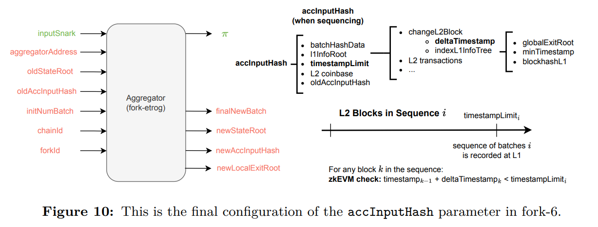

# L2 Global Exit Root Management

When a **changeL2BlockTx** is executed, the corresponding **L1InfoTree** leave is not only
populated with **globalExitRoots**, but also with two important parameters: the **minTimestamp**
and the **blockhashL1**

Up to this point, we have discussed the management of the global exit root in L1, which is
handled by the GlobalExitRoot smart contract. However, it is important to note that the
global exit root in L2 is managed by a different smart contract called GlobalExitRootL2.
This contract maintains a similar mapping structure to the one used in fork-dragonfruit to
store the global exit roots. During the zkEVM processing, the new globalExitRoot used
by a certain block is inserted in the mapping, as shown in Figure 6. However, the mapping
is not updated if the globalExitRoot is already inserted or, if the indexL1InfoTree is 0,
meaning that the first element of the tree does not contain data but its index has the special

## The changeL2Block Transaction
We’ve already introduced the changeL2Block transaction, a novel addition introduced
in etrog. Its main function is to mark the transition between blocks within a batch.
Recall that, as commented before, this transaction should provide information such as
the timestamp and the indexL1InfoTree. The data structure of the changeL2Block
transaction is illustrated in Figure 7.

To differentiate this **special transaction** from regular L2 transactions, we will introduce
a **type field** as the first byte of the transaction. Regular L2 transactions are RLP-encoded,
and their first byte is always different from 0x0B. Therefore, we will use 0x0B as the unique
identifier for this special transaction type.
Recall that the **indexL1InfoTree** field is the index of the globalExitRoot being used
by the block. The L1InfoTree has 32 levels, that is, its keys consists on 32 bits (or
equivalently, 4 bytes). Note that 0 has the special meaning of not updating in L2.
While we previously stated that the timestamp must be included in the changeL2Block
transaction, there is an alternative strategy to reduce data costs. Instead of using absolute
timestamps, we employ incremental timestamps to minimize the size of this field, thus
lowering data availability costs. A standard Unix timestamp requires 64 bits, whereas
increments are much smaller, allowing us to use just 32 bits. This incremental timestamp,
called deltaTimestamp, represents the number of seconds to be added to the timestamp
of the previous L2 block to determine the current block’s timestamp (see Figure 8). The
timestamp of the previous L2 block is accessible to the zkEVM via the system contract
0x5ca1ab1e as part of the blockhashL2. As we will later discuss, this, combined with
the minTimestamp, will be sufficient for the prover to verify timestamp bounds.

# Timestamp Checks

In the zkEVM, ensuring accurate timestamp management is crucial for maintaining the
integrity of block processing. Two critical checks are implemented to validate timestamps:
the lower timestamp bound check and the upper timestamp bound check. These checks
ensure that blocks are processed within the correct time frames, preventing inconsistencies
and potential security issues

## Lower Timestamp Bound
This check occurs when the zkEVM initiates the processing of a block. The aim of this
check is to verify that the block’s timestamp is greater than the minTimestamp, which
corresponds to the timestamp of the globalExitRoot utilized by this block.

## Upper Timestamp Bound
The aim of this check is to verify that the timestamp of each block within these batches is
earlier than the timestampLimit. In other words, we ensure that the blocks were created
before being sequenced. For this check, a new parameter, timestampLimit, is introduced
in the accInputHash, as shown in Figure 10. This parameter represents the timestamp of
the transaction calling the function sequenceBatches, which sequences multiple batches.

