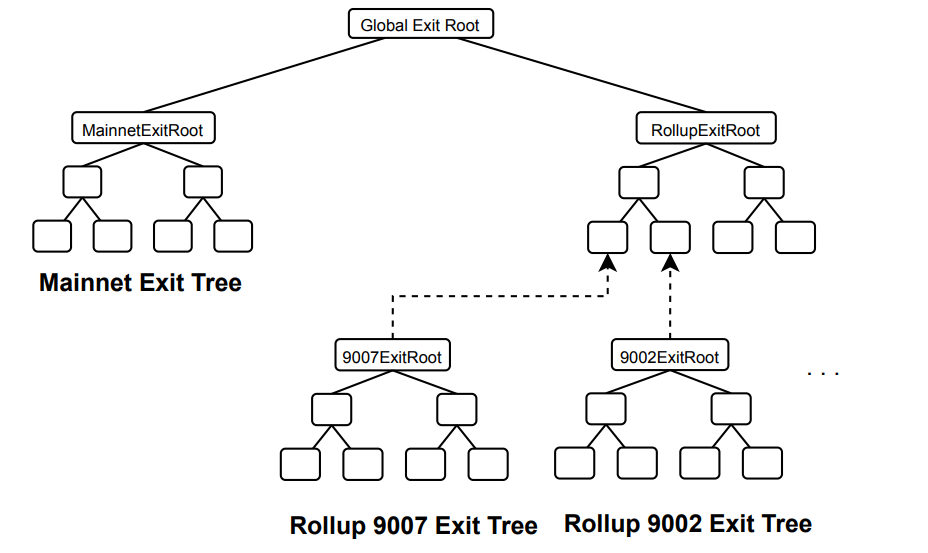
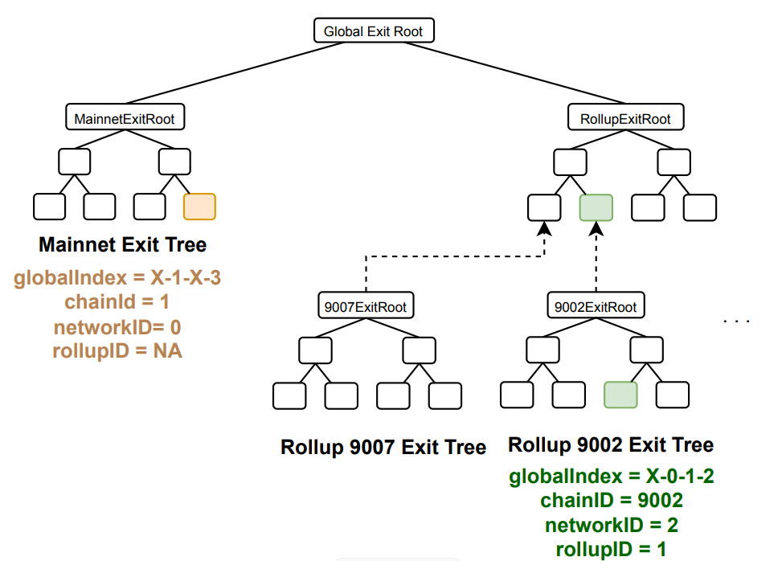

## New Global Exit Tree
In uLXLY, due to the presence of multiple layers, it becomes necessary to adjust the
global exit tree to accommodate exits across all these layers. The design of the updated
global exit tree is depicted in Figure 7

As can be observed, the global exit tree has been modified to introduce **more than
one rollup**. Now, there are two main branches, one containing the root of the mainnet exit tree
and the other containing the root summarizingthe exit trees of all the rollups, which we call the
rollup exit tree. This tree has as its leaves all the local exit roots of the different rollups.

Mainnet has a local exit tree built as an append-only tree of 32 levels.
- Each rollup, also has a local exit tree built as an append-only tree of 32 levels.
- Rollups are grouped in a **tree of rollups**, that again, is built as an append-only tree
of 32 levels.

## Rollup Identifiers.
 Every rollup has a set of distinct identifiers that are essential for its
functioning and interaction within the larger network ecosystem.
- The **chainID** is a unique identifier that distinguishes the rollup from other chains in
the Ethereum ecosystem and is crucial for preventing anti-replay attacks. See the
chainlist to see the chain Ids of the different networks.
- The networkID identifier defines the rollup in the Polygon ecosystem, allowing network participants to uniquely identify and interact with them. The networkID =
0 is used for Ethereum mainnet, while the networkID = 1 is used for the zkEVM
and so on for the rest of the networks.
- The **rollupIndex**, which is an identifier used to identify a rollup within the rollup
tree. The first rollup (the zkEVM) has rollupIndex = 0 and in general, rollupIndex
= networkID - 1.

### Global Index.
 To create and verify the proofs, we use an index called globalIndex that
allows to uniquely locate a leaf in the new global exit tree. The globalIndex consists of
a string of 256 bits, with its definition starting from the most significant bit as follows.
Figure 8 exemplifies the usage of globalIndex to locate leafs on the tree.
- Unused bits, 191 bits: These bits are unused and can be filled with any value
being the best option to fill them with zeros (since zeros are cheaper).
- Mainnet Flag, 1 bit: This single bit serves as a flag indicating whether an exit
pertains to a rollup (represented by 0) or to the mainnet (indicated by 1).
- **Rollup Index, 32 bits**: These bits indicate the specific rollup we are pointing to
within the rollup exit tree. This bits are only used whenever mainnet flag is 0.
- **Local Root Index, 32 bits**: These bits indicate the specific index we are pointing
to within each of the local exit trees of each rollup.

**Figure 8**: This figure shows how the globalIndex arranges the leaves of the tree. The
globalIndex on the left has the mainnet flag set to 1, indicating that the bits associated with
the rollup index are not utilized. Given a local root index of 3, we point the fourth leaf in the
tree. In the right example, the mainnet flag is set to 0. Therefore, we utilize the rollup index to
find the local exit tree associated with 1 as rollup index, which corresponds to the second leaf of
the tree of rollups. Subsequently, we identify the leaf with index 2, which is the third leaf within
the corresponding local exit tree

