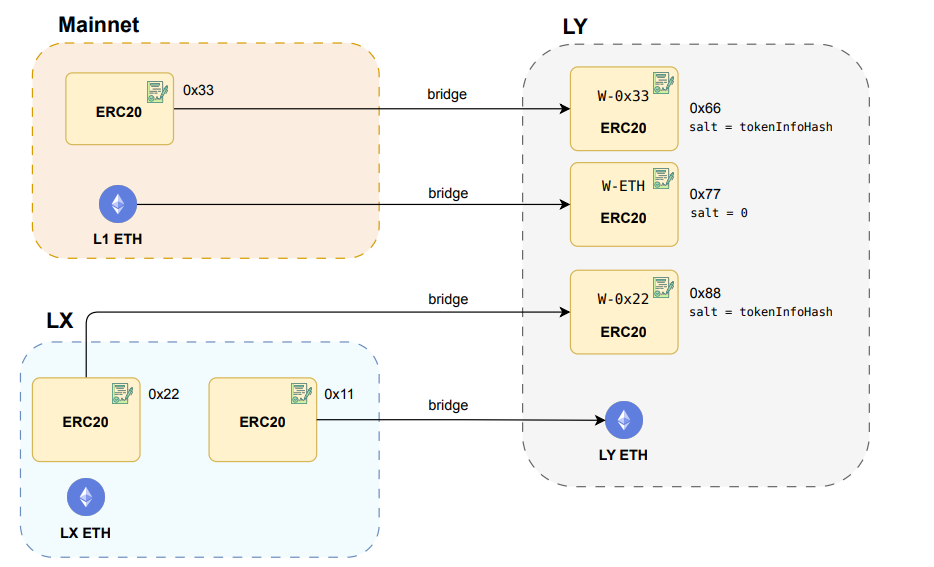

# Gas Tokens and Inter-Layer Exchanges
The native currency to pay the gas at a certain layer can be:
- Any ERC20 token instance on any other layer.
- L1 ETH.

If we use a token to pay the gas at a layer, we call this token, the **gas token** for
the layer. If we are using a gas token at a layer, it is still possible to send L1 ETH
to the layer. In this case, the ETH gets accounted in an ERC20 contract called WETH, which is just another ERC20 instance. Note that **W-ETH** is different from the
contract WETH (a contract for converting ETH into an ERC20 token that runs at L1 at

https://etherscan.io/token/0xc02aaa39b223fe8d0a0e5c4f27ead9083c756cc2#code

Regarding the creation of the ERC20 tokens with CREATE2:
- We use salt = 0 to create the W-ETH contract.
- We use salt = tokenInfoHash for the rest of the wrapped tokens of the layer with
tokenInfoHash defined as the following hash:
**tokenInfoHash** = keccak256(originNetwork, originTokenAddress).

Finally, we would like to remark that L1 ETH is the only native currency that can be used
as a native currency in another layer. Figure 10 illustrates various inter-layer exchanges
scenarios which can occur within the system.

Figure 10: Diagram illustrating the interchange of assets between layers, focusing on LY as
a layer of interest. It depicts several scenarios, such as bridging a ERC20 token from mainnet
to another ERC20 token in LY, bridging L1 ETH to the LY gas token or bridging a wrapped
ERC20 token living on LX to LY ETH.

## Issue with the Upgradable CREATE2 Factory

 Note that the Bridge contract is a factory of ERC20 token instances created with **CREATE2**. Recall that CREATE2 uses the
following formula to compute the address of the instances:

- instance_address = hash(0xFF, sender, salt, creationBytecode, [args]).
  

Recall also that in the Bridge contract, the mapping **tokenInfoToWrappedToken** stores
the addresses of all the wrapped ERC20 tokens of the layer. The problem is that if we
change the creationBytecode of the ERC20 token contract, this will change all the
addresses of the contract instances and therefore, this breaks the data of the mapping.
The **creationBytecode** will change with high probability if we compile the factory (in
our case the Bridge) with another version of the Solidity compiler. In this case, we had
to options:
 - a) Freeze the Solidity compiler version for the development of the whole Bridge contract.
- b) Freeze the creationBytecode of the ERC20 token contract.

We opted for the second solution because the ERC20 code is not prone to change so
much, while freezing the compiler (and the language) for the whole Bridge could constrain
its future development. Taking this approach, in the **BASE_INIT_BYTECODE_WRAPPED_TOKEN**
variable of the Bridge contract you can find the pre-compiled creationBytecode of our
ERC20 token contract.

