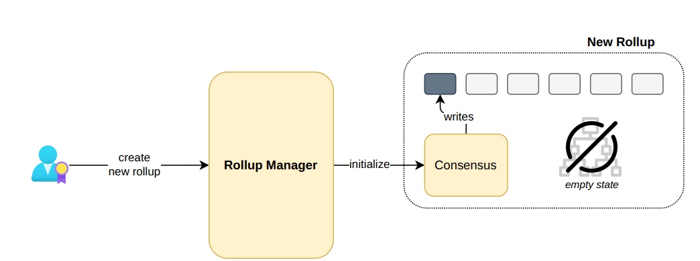
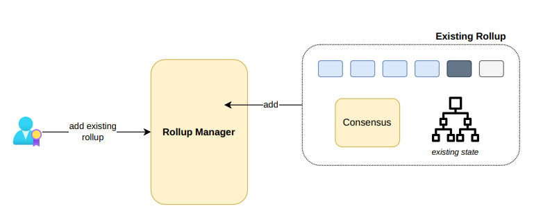
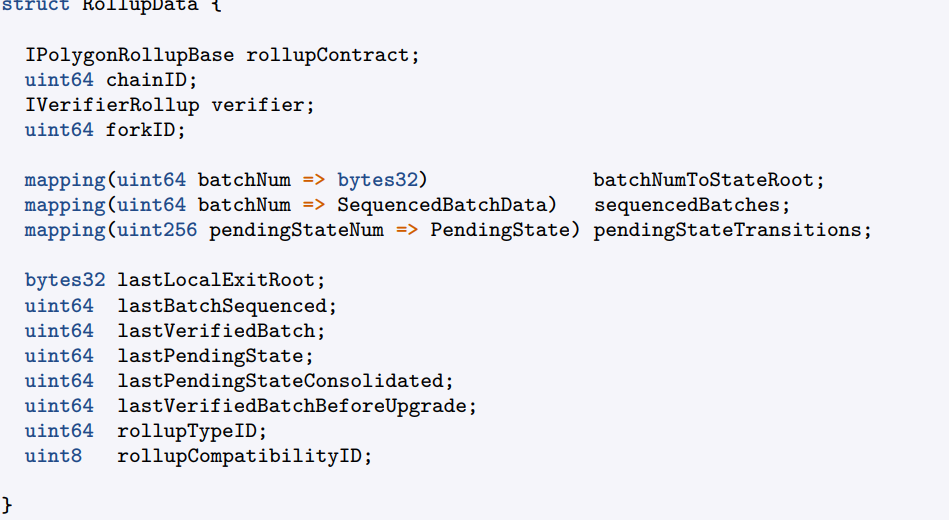
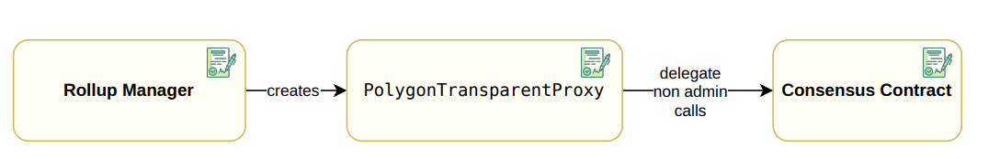

Unified **LXLY** aims to streamline the creation and management of different layers 2 within
the Polygon network, including both rollups and validiums among the Polygon network,
ensuring possible exchanges between them.

## New vs Existing Rollups
New Rollups The first scenario involves newly created rollups, which are not yet initialized and have an empty state. When a user triggers a function of the rollup manager
to create a new rollup, the rollup manager should populate the configuration parameters
and initialize the rollup by generating and writing the genesis block, altogether with the
having to sequence the transactions for initializing the Bridge contract attached to the
rollup

Existing Rollups When an operational rollup is present on the Ethereum network, a
user with the necessary rights can incorporate it into the Rollup Manager for centralized
management. In this scenario, the consensus should not be initialized as the rollup, genesis
block, and corresponding Bridge have already been established previously

## Rollup Type
 New rollups have a RollupType attached. The RollupType specifies the
following parameters:
• The **consensus** implementation address, which is the address of the contract
responsible for sequencing the batches.
• The **verifier** address, implementing the **IVerifierRollup** interface, which allows
the verification of a proof sent by the Aggregator

• A rollup compatibility identifier, which will be used to prevent compatibility
errors when willing to upgrade a rollup.
• The obsolete flag, which is a flag for indicating whether the rollup is obsolete or
not.
• The genesis block, which is the initial block of the rollup and which can include
a small initial state

Note that there can be several rollups having the same RollupType, which means
that they all share the smart contracts for **consensus** and batch verification. In the
RollupManager contract, there are functions designed to add (addNewRollupType()) and
to obsolete (obsoleteRollupType) rollup types. It is not possible to create rollups having
an obsolete rollup type.

## Rollup Data
 Each rollup, apart from having a RollupType attached, should store some
important state data, which is included in a struct called RollupData. This struct contains
information from the current state of the rollup (for example, the current batch being
sequenced or verified, the states root for each batch, etc.), information of the bridge
within the rollup (such as the current local exit root) and forced batches data, which
will be explained in another document

## Creating a Rollup
Each rollup is associated with either none or a single rollup type. In order to create a
rollup of a certain rollup type, we can use the function **createNewRollup**() by specifying:

- The associated non obsolete rollup type identifier, which should exist.
- The chainID of the rollup among the Polygon network, which should be new.
- The address of the admin of the rollup, which will be able to update several parameters of the consensus contract (such that setting a trusted sequencer or a force
batches address).
- The address of the trusted sequencer, which will be the one responsible for sending
the transaction to execute the sequenceBatches() function.
- The address of the token address that will be used to pay gas fees in the newly
created rollup (more info on this later on).
When creating a new rollup, we employ the transparent proxy pattern (See Figure 4),
by generating an instance of the PolygonTransparentProxy contract, with the consensus
contract specified by the rollup type serving as its implementation. The RollupData is partially filled (because the rollup is not currently initialized) and stored in the **rollupIDToRollupData**
mapping within the contract’s storage. To end up, the rollup creation calls the initialize()
function of the consensus, which is in charge of setting the previously specified addresses
in the consensus contract.

