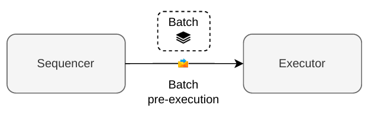
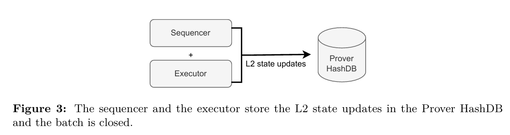
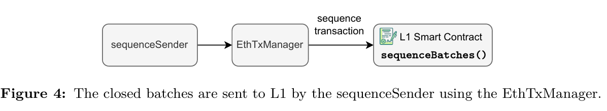
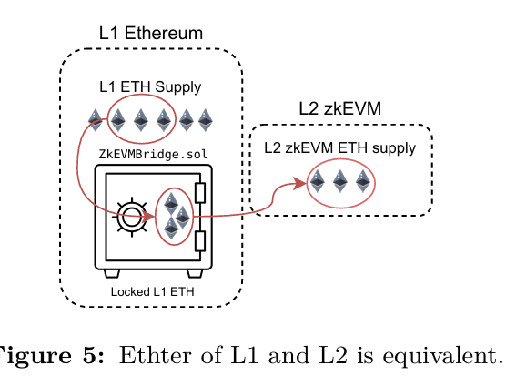
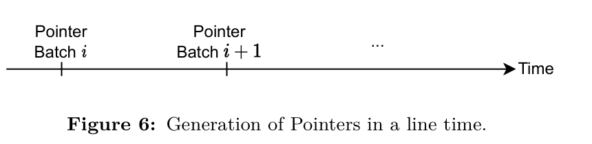
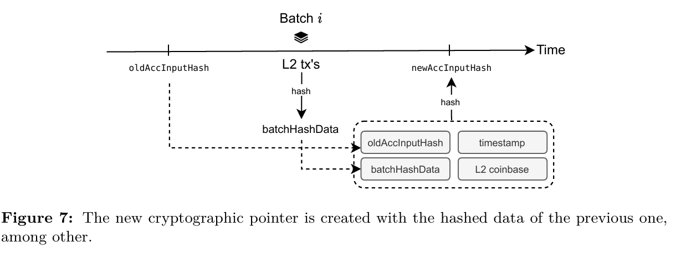

## Current Design

In our current design, the central entity responsible for assembling batches for sequencing is a **trusted sequencer**, which is built and managed by Polygon (implemented by us). However, it is prudent to consider the possibility that this sequencer may omit our Layer 2 transactions. In light of this concern, we have implemented additional mechanisms which will be discussed in more detail later on.

Figure 1 shows how the Sequence System works.

!Sequence System Workflow

- The user initiates L2 transactions via JSON RPCs.
- These are directed to a database known as `the pool`.
- The Sequencer aggregates these transactions.
- Specific criteria are applied to select pending L2 transactions.
- These selected transactions are engaged by the Sequencer.
- A batch is generated to be sequenced and then proved.

## 2 Batch pre-Execution

 The initial step in creating a batch involves verifying that the chosen transactions align
 with the available execution traces and do not surpass the gas limit. This procedure,
 known as batch pre-execution, is carried out by the sequencer through an executor as
 depicted in Figure 2. While no proof is generated during this stage, it ensures that the
 subsequent proof generation process by the prover can be successfully accomplished.

 

 **The objective** is to expedite the sequencing of batches to enhance the user's perception of speed. Therefore, a **fast executor** (single-computer executor) is employed, capable of executing within **the blocktime**. The sequencer communicates with this executor to perform pre-execution batch processing swiftly. Upon pre-execution, the sequencer records rectify till a specific point through successful batch determination transactions that correlate the batch in the node's StateDB as a **closed batch**. Closure may occur when the maximum number of execution trace rows is reached, the maximum gas limit is attained, or if allocated time expires.

During the batch pre-execution, for closing both the sequencer and executor also update **the Merkle tree** of **the zkEVM that is stored in Prover HashDB with L2 state changes**, as shown in Figure 3.

## performance problems 

The throughput of the zkEVM highly depends on the speed at which we are able
 to close batches which is highly impacted by the batch **pre-execution process**. So, those
 involved are the **Sequencer**, the **Executor** and the **Prover HashDB**. In fact, here occur most
 of the performance problems because interacting to much with the HashDB is inefficient.
 Currently, efforts are underway to optimize this process by accumulating all changes made
 to a transaction and updating the HashDB only at the conclusion of the transaction,
 aiming to mitigate the time spent on frequent updates during transaction processing.

 ## Send the Sequenced Batch to L1

 The next step is to send a transaction to the **Smart Contract** to sequence this batch. After
 the batch is closed, the sequencer stores the data of the batch into the **node’s StateDB**.
 Then, the sequenceSender looks for closed batches and sends them to **L1 Smart contract**
 using the **EthTxManager**, who makes sure that the transaction is included in a batch. This
 process is depicted in Figure 4

 

 To sequence the batch, the sequencer calls the `sequenceBatches()` function in the L1 Smart Contract. The name of the function is in plural because we can **sequence several batches** in a single transaction. This step provides L2 data availability in the L1 execution layer, because we are registering in L1 all the bytes of the L2 transactions.

The calldata for the L1 `sequenceBatches()` function needs to include the following information: the L2 transactions' data, which is an array containing data for each batch, which encompasses all transactions within the batch along with a timestamp indicating its closure time. Additionally, the L2 **coinbase address**, representing the Ethereum address for receiving user fees. Lastly, a timestamp indicating when the L2 transactions were sequenced.

## coinbase address

The L2 coinbase address serves as a critical destination for rewards earned by the sequencer in the Layer 2 environment. The sequencer undertakes the responsibility of paying for data availability in Layer 1 using L1 Ether. When the sequencer successfully closes a batch and executes transactions, they receive a reward for their services. This reward, denominated in L2 Ether, is routed to the L2 coinbase address.

Crucially, the L2 coinbase address is situated **within Layer 2** because users compensate the sequencer with L2 Ether. **This L2 Ether**, representing the reward, is a reflection of the Ether in L1 that users have previously transferred to L2 through transactions via the Bridge. Importantly, there exists a direct and **fixed 1:1** correspondence between L1 ETH and L2 ETH, as we can observe in Figure 5.

## Accumulated Input Hash Pointers

Examining the sequencing process in more detail, when the Smart Contract receives a
 transaction for sequencing, it initiates the creation of cryptographic pointers for each batch.
 These pointers play a crucial role in uniquely identifying a batch, specifying its position,
 and encapsulating its data. Subsequently, provers utilize these pointers as references
 during the proofing process, allowing them to precisely identify and retrieve the batch
 being proved along with its associated data. This systematic use of cryptographic pointers
 ensures a robust and unambiguous linkage between the sequencing transaction and the
 corresponding batch data for subsequent verification.

 

 

  Indeed, as depicted in Figure 6, pointers are generated by executing a KECCAK
 hash on several components, including the previous pointer, the transactions encompassed
 within the L2 batch, the batch timestamp and the L2 coinbase. Due to the interconnected
 nature of their creation, with each pointer encapsulating the previous one in the input of
 the hash, they are aptly referred to as accumulated input hash or accInputHash. This
 linked construction is imperative to guarantee that the data of batches is proven in the
 correct sequential order.

 Upon the completion of the sequencing process, the batch enters a state of being
 virtualized, residing within the previously discussed Virtual State