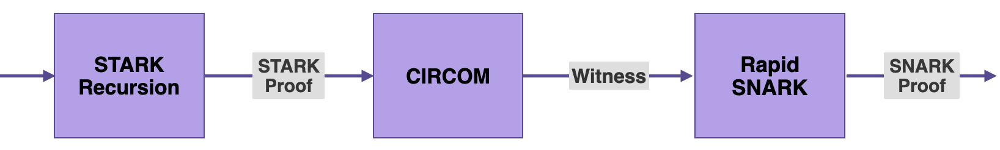

In this document, we describe the CIRCOM component of the zkProver. It is one of the four main components of the zkProver, as outlined [here](https://docs.polygon.technology/zkEVM/architecture/zkprover/). These principal components are; the Executor or Main SM, STARK Recursion, CIRCOM, and Rapid SNARK.

You may refer to the original [CIRCOM paper](https://www.techrxiv.org/articles/preprint/CIRCOM_A_Robust_and_Scalable_Language_for_Building_Complex_Zero-Knowledge_Circuits/19374986/1) for more details.

As seen in the [zkProver overview](https://docs.polygon.technology/zkEVM/architecture/zkprover/) document, the output of the STARK recursion component is a STARK proof.

The next step in the zkProver's process of providing validity proof is to produce the witness similar to the output of the STARK Recursion.

Although the zkProver is designed as a state machine emulating the EVM, in order to generate this witness, it makes use of a tool based on the Arithmetic circuits model, called CIRCOM.

CIRCOM takes the output of the STARK Recursion as input, so as to create its corresponding witness.

The witness is in turn taken as an input to the Rapid SNARK, which is used to generate a SNARK proof published as the validity proof.

Circuit context
-----------------------------------------------------------------------------------------------------------------------------

Arithmetic circuits are mostly used as standard models for studying the complexity of computations.

In the context of ZK-proof protocols, a prover can use an Arithmetic circuit to prove knowledge of a valid assignment to all wires of the circuit.

And if the proof is correct, the verifier is convinced that the computation expressed as the Arithmetic circuit is valid, but learns nothing about the wires' assigned values.

Arithmetic circuits are commonly encoded in the form of R1CS.

Once obtained, the R1CS can later be used by a zk-SNARK protocol to generate verifiable proof.

A valid proof attests to the fact that the prover knows an assignment to all wires of the circuit that fulfills all the constraints of the R1CS.

An issue that arises, when applying zero-knowledge protocols to complex computations such as a circuit describing the logic of a ZK-rollup, is that the number of constraints to be verified can be extremely large.

CIRCOM was developed for the very purpose of scaling complex Arithmetic circuits by realizing them as combined instantiations of smaller Arithmetic circuits.

### CIRCOM as a DSL

As described in the title of its [specifications paper](https://www.techrxiv.org/articles/preprint/CIRCOM_A_Robust_and_Scalable_Language_for_Building_Complex_Zero-Knowledge_Circuits/19374986/1), CIRCOM is a language for building complex zero-knowledge circuits.

It is designed as a low-level circuit language, mimicking the design of electronic circuits, for naturally defining Arithmetic circuits.

As a DSL, it allows programmers to design and create Arithmetic circuits of their own choice, and later on apply these circuits to ZK tools.

One of the main peculiarities of CIRCOM is its modularity as a language. It allows the definition of parameterizable small circuits called *templates*, which can be instantiated to form part of larger circuits.

In this regard, CIRCOM users can use templates to create their own custom circuits with varied complexity.

However, CIRCOM users can also use templates from [CIRCOMLIB](https://github.com/iden3/circomlib), which is a publicly available library that contains hundreds of circuits such as; comparators, hash functions, digital signatures, binary and decimal converters.

### Circuit compiler

In addition to being a DSL used to define and create Arithmetic circuits, CIRCOM has a special compiler of Arithmetic circuits into their equivalent R1CS.

The term "CIRCOM" is in fact short for Circuit Compiler, implying that the CIRCOM compiler takes an Arithmetic circuit as input and outputs the following:

-   A file with the R1CS description, containing the set of associated R1CS constraints, and
-   A program written either in C++ or WebAssembly, for efficiently computing a valid assignment to all wires of the circuit (the witness).

The CIRCOM compiler is mainly written in Rust and it is open source.