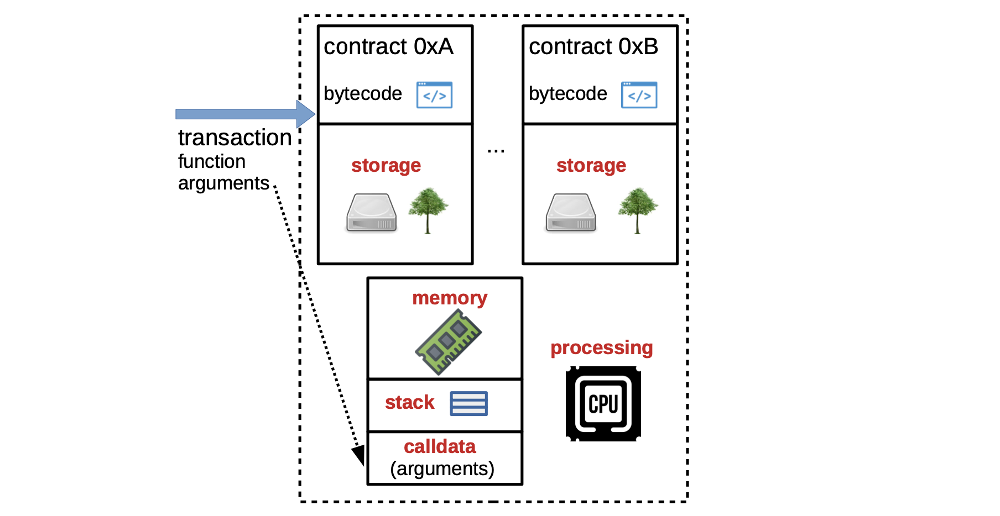

The terms **state machine** and **virtual machine** are used interchangeably in this documentation.

## Basics of EVM

 In addition to recording transactions, the EVM can store and execute smart contracts. These smart contracts are low-level codes that can perform a variety of tasks and operations on the network.

The EVM is therefore the computational engine of the Ethereum blockchain responsible for **smart contract deployment** and **execution**.

---
The EVM is categorized as a **quasi–Turing-complete** state machine because it can handle all execution processes except that, due to the gas limit set in every smart contract, it is limited to computations with a finite number of steps.

At any given point in time, the current state of the Ethereum blockchain is defined by a collection of the blockchain data. An **Ethereum state** therefore includes **account balances**, **smart contract code**, **smart contract storage**, and other information relevant to the operation of the network.

Since Ethereum is a distributed digital ledger, its state is maintained by each of the network’s **full-nodes**.

Key features of EVM
--------------------------------------------

In terms of how it operates, the EVM is described as; deterministic, sandboxed, and stack-based.

**Deterministic**: For any given input, it always produces the exact same output. This feature is critical for ensuring dependability and predictability of smart contract execution, as well as enabling reliable verification of execution.

**Sandboxed**: Transactions processed by smart contracts run in an environment that is isolated from the rest of the system, making it impossible for transactions to access or modify data outside this environment. This contributes towards network security by preventing unauthorized access to sensitive data.

**Stack-based:** It employs a _last-in-first-out_ (LIFO) memory data structure for processing operations, with data being pushed onto a stack and popped off as needed

Components of EVM
----------------------------------------

The EVM is made up of several components that work together to execute smart contracts on the Ethereum blockchain and provide the above-mentioned features.

The main components of the EVM involved in the processing of a transaction are:

- **Smart contract bytecode**, which is the low-level code executed by the EVM.

Each bytecode is a sequence of opcodes (machine-level instructions). And each opcode in an EVM bytecode corresponds to a specific operation, such as arithmetic, conditional branching or memory manipulation. The EVM executes bytecode in a step-by-step fashion, with each opcode being processed in a given sequence.

In general, smart contracts are written in a high-level programming language, such as Solidity or Vyper, and then compiled into an EVM bytecode.

- **Processing environment** refers to the component responsible for executing smart contracts. It provides a runtime environment for the smart contract bytecode to execute in and manage the memory and storage used by smart contract.

- **Stack** is the LIFO data structure used to execute the EVM’s operations, and thus turning the EVM into a stack-based machine.

- **Memory** is the component that allows smart contracts to store and retrieve data. It is organized as a linear array of bytes, while data is accessed by specifying its location in memory.

- **calldata** refers to the set of parameters & values required for a smart contract to perform its function.

- The transaction that invokes a particular smart contract must contain the right calldata, and thus pass the calldata to that smart contract. calldata is read-only and therefore smart contracts cannot modify it during execution.

- **The smart contract’s input data** is part of the transaction which is stored on the blockchain, and therefore any changes to the input data would result in a different transaction-hash and hence a different state of the blockchain.

- **Storage** is the EVM’s storage component where smart contracts can also store data. It is a persistent key-value store that is associated with each smart contract, and it can be used to store state information.

The EVM is a variant of the **Von Neumann architecture**
which means it uses a single shared memory for both **data** and **instructions**.

-   The **smart contract’s bytecode** is stored in memory in the EVM, and the  _program counter_  (**PC**) keeps track of the current instruction being executed.
    
-   **Stack** is used for storing small values, such as integers and booleans, values needed for immediate use, such as function parameters, local variables, and return values.
    
-   **Memory** is used for storing large data structures, such as arrays and strings.
