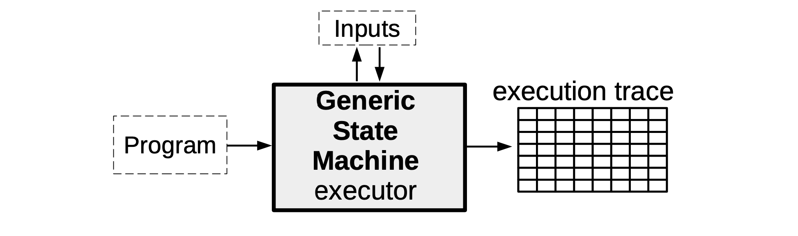
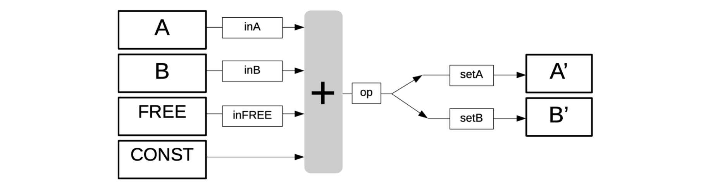
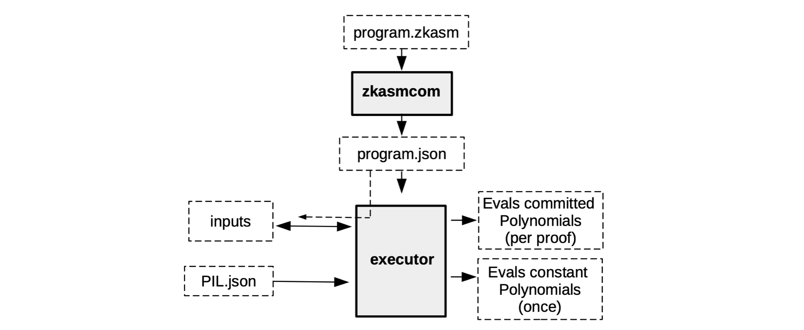

Unlike the mFibonacci state machine, which is an implementation of one specific computation, we now describe a generic state machine that can be instantiated with various computations of the user’s choice.

The idea here is to create a state machine that behaves like a **processor** of sorts. In as much as a processor has **registries** and a **clock**, so is our generic state machine. It receives instructions in the form of programs written in Assembly, and makes state transitions at each clock in accordance with these instructions.

Think of our state machine as being composed of two parts; the part that has to do with generating the execution trace, while the other part is focused on verifying that the executions were correctly executed.

-   The former part is more like the 'software' of the state machine, as it is concerned with interpreting program instructions and correctly generating the execution trace. A novel language dubbed the zero-knowledge Assembly (zkASM) language is used in this part.

-   But the latter part is more like the 'hardware' as it consists of a set of arithmetic constraints (or their equivalent, polynomial identities) that every correctly generated execution trace must satisfy. Since these arithmetic constraints are transformed into polynomial identities (via an interpolation process), they are described in a novel language called the Polynomial Identity Language (PIL).

So then, instead of programming the SM executor ourselves with a specific set of instructions as we did with the mFibonacci SM, the executor of a Generic SM is programmed to read arbitrary instructions encapsulated in some program (depending on the capacity of the SM or the SM's context of application). As mentioned above, each of these programs is initially written, not in a language like Javascript, but in the zkASM language.

Execution trace
===============

In this document we discuss how the correctness of the execution trace is ensured.

The first step is to build a mechanism for verifying correctness of the execution trace. This requires creating a set of arithmetic constraints that only hold true when the execution trace is correct. These arithmetic constraints are equations that registry values in any two consecutive rows of the correct execution trace, must satisfy.

Similar to the mFibonacci SM, where each state had to conform to polynomial identities, the arithmetic constraints of the generic state machine are translated into polynomial identities and ultimately into the PIL language.

Checking sequence of instructions
------------------------------------------------------------------------------------------------------------------------------------------------------------------------------------

In order to keep track of which line of the program is currently being executed, a new registry called "program counter" is added to the state machine.

We denote it by zkPC because it is verified in a zero-knowledge manner.

The zkPC is therefore a new column of the execution trace and it contains, at each clock, the line in the zkASM program of the instruction being executed.