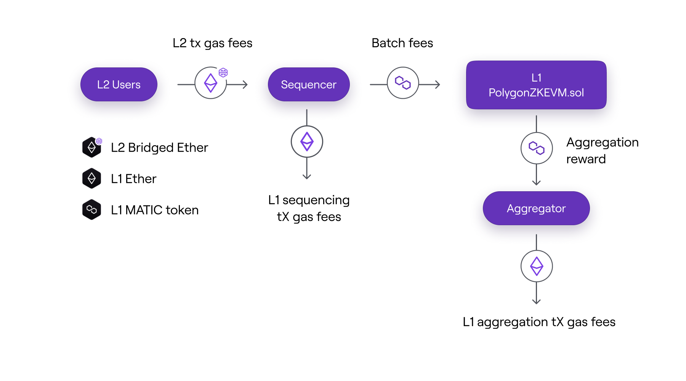
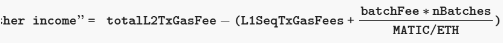

Incentive mechanism
===================

In order to ensure the system's sustainability, actors must be compensated for correctly performing their roles and giving the protocol finality.

Unless otherwise specified, the measures and rules presented here apply to cases in which the Sequencer and Aggregator roles are decentralised (i.e., when there are no trusted sequencer and no trusted aggregator).

L2 transaction fees and sequencing fees
-------------------------------------------------------------------------------------------------------------------------------------------------------------------------------------------

The **native currency used in L2 is `Bridged Ether`**, which originates from L1. This is the currency that is used to pay L2 transaction fees. **It can be transferred at a 1:1 exchange ratio from L1 to L2 and vice versa**.

The **Sequencer** earns the transaction fees paid by L2 users for submitting transactions, and thus gets paid directly in `Bridged Ether`. The amount of fees paid depends on the gas price, which is set by users based on how much they are willing to pay for the execution of their transactions.

To incentivize the **Aggregator** for each batch sequenced, the Sequencer must lock a number of MATIC tokens in the L1 `PolygonZkEVM.sol` Contract proportional to the number of batches in the sequence. The number of MATIC tokens **locked per batch** sequenced is saved in the variable `batchFee`.

The net Ether value earned by the Sequencer for sequencing a batch sequence is represented by the following expression:

-   `totalL2TxGasFees` is the total sum of fees gathered from all L2 transactions included in the sequence of batches,
-   `L1SeqTxGasFee` is the Sequencing transaction gas fee paid in L1,
-   `batchFee` is the storage variable in **PolygonZkEVM.sol** contract,
-   `nBatches` is the number of batches in the sequence,
-   `MATIC/ETH` is the price of MATIC token expressed in ETH.