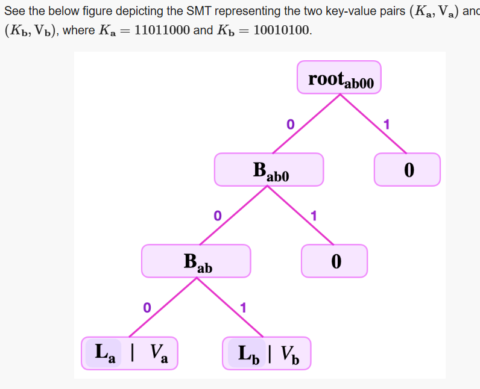

# Constructing simple SMTs

https://docs.polygon.technology/zkEVM/concepts/sparse-merkle-trees/simple-smt/

Understanding the finer details of how the Storage state machine operates requires a good grasp of the way the zkProver’s sparse Merkle trees (SMTs) are constructed. This document explains how these SMTs are built.

Consider key-value pair based binary SMTs. The focus here is on explaining how to construct an SMT that represents a given set of key-value pairs. And, for the sake of simplicity, we assume 8-bit key-lengths.

A NULL or empty SMT has a zero root. That is, it has no key and no value recorded in it. Similarly, a zero node or NULL node refers to a node that carries no value.

## Solution to the Fake-leaf attack

https://docs.polygon.technology/zkEVM/concepts/sparse-merkle-trees/detailed-smt/#scenario-fake-smt-leaf
