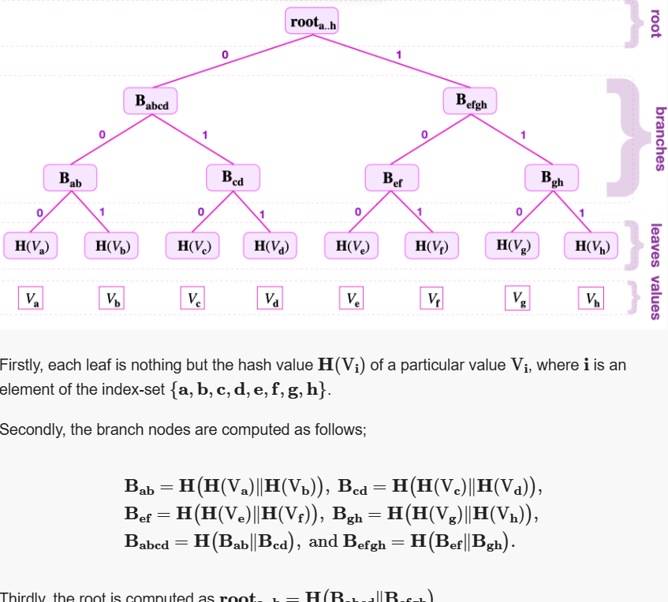

Merkle trees
-----
**zkProver’s data** is stored in the form of a special sparse Merkle tree (SMT), which is a tree that combines the concept of a Merkle tree and that of a **Patricia trie**. The design is based on how the sparse Merkle trees are constructed and how they store keys and values.

## Keys and navigating a Merkle tree

Note the bits used to label edges in figure above. The strings of these bits are called  _keys_, and they indicated where a node is located in a Merkle tree. Since keys uniquely locate nodes, they are used to navigate from the root to the leaves, and backwards.

Suppose one is given the key-value pair  (Kd,Vd), where the key is  Kd=10010110.

In order to locate the key-value pair  (Kd,Vd)  in the Merkle depicted in the figure above, the key  Kd  is read bit-by-bit from the right-most bit to the left-most bit. While traversing the tree from the root downwards,

-   a zero-key-bit “0” means “follow the edge going to the **left**”,
    
-   a key-bit “1” means “follow the edge going to the **right**”.
    

Since  Kd=10010110, as follows:

1.  Read the least-significant bit of  Kd, which is  0, hence traverse the tree to the left, and reach  Babcd.
2.  Then read the second significant key-bit, which is “1” in this case. So take the edge going to the right, reaching  Bcd.
3.  Again, read the next key-bit, which is “1”, hence follow the edge going to the right, reaching the leaf  H(Vd).

Since  H(Vd)  is a leaf and not a branch, and the navigation was correctly done with respect to the given key  Kd, the  H(Vd)  must be the leaf storing the value  Vd.

One can similarly  _climb_  the tree, going in the reverse direction, by using the key-bits of the given key in the reverse order. That is, starting with the last key-bit used to reach the leaf and ending with the least-significant bit of the key.

The  _tree-address_  of the value  Vx, herein refers to the position of the leaf  Lx:=H(Vx), denoted by the key-bits used to reach  Ld  but in the reverse order.

In the above example, the **tree-address** of  Vd  is 011.